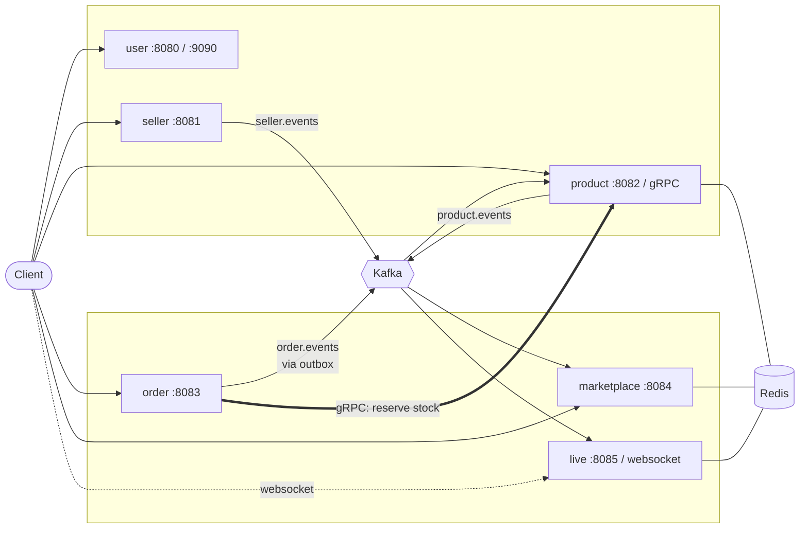

# Domains

What exists, what each service owns, and how they reach each other. Three of the
seven planned domains are built.

## Topology



**The thick arrow is the only synchronous call in the system.** Order asks
Product to reserve stock and waits, because a buyer cannot be told their order
exists until the stock is secured. Everything else is an event, because
everything else can wait.

Each service owns a **separate MongoDB instance** — not a separate database on
a shared server. Connection limits, cache, lock contention, backups, version
upgrades and failures are all things a shared instance keeps shared regardless
of how the databases are named.

The arrows that are **not** there matter as much as the ones that are. No
service calls another to serve a request, and no service reaches another's
database. The only line between them is the event stream, and it points one way.

## Built

### User — `internal/user`, `cmd/user`

Identity, credentials, and the accounts everything else refers to.

| | |
|---|---|
| Storage | `ecommerce_user`, unique index on email |
| Driving adapters | `handler/` (REST), `gapi/` (gRPC: `CreateUser`, `GetUser`) |
| Driven adapters | `mongodb/` |
| Ports it declares | `Repository`, `Hasher`, `TokenIssuer` |
| Background work | logs the user count every ten seconds |

It is the only service that issues tokens. The others verify them with the same
secret — which is exactly where an asymmetric key pair would earn its keep in
production, so that only the issuer can mint.

### Seller — `internal/seller`, `cmd/seller`

The shops that own products. The **publisher** in this system.

| | |
|---|---|
| Storage | `ecommerce_seller`; unique on `user_id` (one shop per account) and on a case-folded shop name |
| Driving adapters | `handler/` (REST) |
| Driven adapters | `mongodb/`, plus the `EventPublisher` port |
| Publishes | `seller.registered`, `seller.updated` on `seller.events` |

Nothing calls it to ask who a seller is. It announces changes and the services
that care keep their own copy — which is why adding a fourth consumer later
costs nothing here.

### Product — `internal/product`, `cmd/product`

The things sellers list. The **consumer**, and the only service with a cache.

| | |
|---|---|
| Storage | `ecommerce_product`: products, plus a `seller_directory` read model |
| Driving adapters | `handler/` (REST — reads public, writes authenticated) |
| Driven adapters | `mongodb/`, `rediscache/`, `events/` |
| Ports it declares | `Repository`, `SellerDirectory` |
| Consumes | `seller.events`, in group `product-service` |

### Order — `internal/order`, `cmd/order`

What a buyer has committed to buy. The only service that calls another.

| | |
|---|---|
| Storage | `mongo-order`; unique index on the idempotency key |
| Driving adapters | `handler/` (REST) |
| Driven adapters | `mongodb/` with a **transactional outbox**, `grpcstock/` |
| Publishes | `order.placed`, `order.paid`, `order.cancelled` |

Placing an order is a **saga**, not a transaction — stock lives in another
service with another database, so no transaction could span both:

1. Reserve stock over gRPC. All lines or none, idempotent under the caller's key.
2. Write the order and its event in one local transaction.
3. If step 2 fails, release the reservation.

The window that remains is a crash between 1 and 2, leaving stock held against
no order. A reaper that releases reservations with no matching order is the
first thing this needs before it carries real money, and it is not built.

**Every publisher uses the outbox** — order, seller and product all write their
events into the same transaction as the change, and a relay publishes them
afterwards. `live` is the deliberate exception: it publishes to Redis pub/sub,
where a guarantee would be machinery in service of an event that is worthless
once stale. Reasoning in [transactional-outbox.md](transactional-outbox.md).

### Marketplace — `internal/marketplace`, `cmd/marketplace`

One searchable view of what every shop is selling. Owns no truth and has **no
write API** — every row arrived as an event.

| | |
|---|---|
| Storage | `mongo-marketplace`; a MongoDB text index, weighted toward the name |
| Driving adapters | `handler/` (REST, public) |
| Driven adapters | `mongodb/`, `rediscache/`, `events/` |
| Consumes | `product.events`, `seller.events`, `order.events` — three separate consumer groups |

It answers questions none of its sources can answer alone: *best-selling mugs
under 300 baht from shops that are still trading* spans all three streams.
Popularity is accumulated from paid orders — counted once per order ID, because
at-least-once delivery would otherwise inflate every ranking on redelivery.

Three groups rather than one, so a backlog on orders cannot stop new products
from appearing in search.

### Live Commerce — `internal/live`, `cmd/live`

A seller broadcasting, viewers watching, products selling while it happens.

| | |
|---|---|
| Storage | `mongo-live` |
| Driving adapters | `handler/` — REST for the host, **WebSocket** for viewers |
| Driven adapters | `mongodb/`, `redisbus/`, `events/` |
| Consumes | `seller.events`, `order.events` |

This is the only domain whose difficulty is not in its data. A WebSocket lives
on **exactly one instance**, which makes two things impossible to do in process
memory:

- **Viewer count.** A map per instance gives every viewer a number that is wrong
  by however many people are connected elsewhere.
- **Broadcast.** A purchase handled by instance B has to reach a socket held by
  instance A.

Redis carries both: a sorted set every instance can count, and a pub/sub channel
every instance can listen on. Presence is scored by timestamp and pruned on
read, because nobody sends a goodbye when a laptop lid closes and an instance
that crashes sends none for anyone it was holding.

Pub/sub is deliberately not Kafka. It has no replay: a subscriber that was not
listening never sees the message. For a live feed that is correct — a purchase
notification from thirty seconds ago is not worth showing — and for an order it
would be a disaster, which is why the two use different transports.

Watching is public, and that is a security decision as much as a product one: a
browser cannot set headers on a WebSocket handshake, so an authenticated socket
ends up with the token in the query string, which is the one place credentials
are guaranteed to reach somebody's access log.

## Where Kafka earns its place

A product carries its seller's shop name. It could instead hold only a seller ID
and ask the Seller service for the name — but a listing page renders hundreds of
products, so rendering one page would become hundreds of calls, each of which
can be slow or fail.

Holding a copy removes those calls and creates one problem: the copy goes stale
when a shop is renamed. That is what the event fixes.

```mermaid
sequenceDiagram
    autonumber
    actor Owner
    participant S as seller service
    participant K as Kafka<br/>seller.events
    participant P as product service
    participant DB as product database

    Owner->>S: PATCH /sellers/{id} {"shop_name": "New Name"}
    S->>S: write, then announce
    S->>K: publish, keyed by seller ID
    S-->>Owner: 200

    Note over S,P: the request is already finished;<br/>nothing waits for the consumer

    K->>P: seller.updated
    P->>DB: upsert seller_directory
    P->>DB: set seller_name on that seller's products
    P->>P: drop those products from the cache
```

Three properties this buys, in order of how much they matter:

1. **The write path makes no outbound call.** Creating a product reads the shop
   name from Product's own database. The Seller service being down slows nothing
   and fails nothing.
2. **Adding a consumer needs no change to the publisher.** When Order and
   Marketplace need seller names, they subscribe. Seller does not learn they exist.
3. **Ordering is preserved per shop.** Events are keyed by seller ID, so two
   renames of the same shop cannot be applied backwards.

The costs, stated plainly:

- **The copy is eventually consistent.** A product created in the second after a
  shop is registered can fail with "no shop registered for this account yet".
  The API says so and asks the caller to retry rather than inventing a value.
- **A publish that fails after a successful write loses the event.** The write is
  already committed, so failing the request would report a success as a failure.
  The fix is a transactional outbox — write the event to the same database in
  the same transaction and relay it — and that is the first thing to add.
- **Handlers must be idempotent**, because at-least-once delivery guarantees a
  repeat. Both steps of the handler are upserts, and the rename skips products
  that already carry the new name, so a replay costs one indexed query.

## Where Redis earns its place

`GET /products/{id}` is the hottest read in a catalogue and the one that changes
least often. It is served by a decorator that implements the same
`product.Repository` the service already depends on:

```
product.Service ──▶ product.Repository ◀── rediscache ──▶ mongodb
```

The service is written as if no cache exists. Consequences worth naming:

- **Turning the cache off is deleting one line in `main.go`** — with `REDIS_ADDR`
  unset the service wires the Mongo repository directly and behaves identically,
  only slower.
- **Redis failures fall through to MongoDB rather than being returned.** A cache
  that makes the service fail when it is unavailable has stopped being an
  optimisation and become a dependency, which makes availability worse.
- **Redis is a readiness check, never a liveness one.** Losing it must not
  restart a process that is still serving every request correctly.
- **Writes invalidate rather than rewrite.** Rewriting lets two racing writers
  leave the older of two values in the cache indefinitely; deleting means the
  next read repopulates from the source of truth.
- **A seller rename invalidates exactly the affected products**, because the
  repository returns their IDs. Scanning Redis for keys that might belong to a
  seller is `O(keyspace)` and the usual cause of a cache falling over.
- **Lists are not cached.** A paged, filtered list has a different key per filter
  and page, and every write would have to invalidate an unknown number of them.

`product_cache_lookups_total{result="hit|miss|error"}` is on the admin port. A
cache whose hit rate nobody can see is a guess.

## Known gaps

Stated because they are real, in rough priority order:

1. **Single-node replica sets and a single Kafka broker.** The only remaining
   item from the original list, and the only one that is a deployment decision
   rather than code. Each service's MongoDB is a one-member set — enough for
   transactions and change streams, no redundancy at all — and Kafka runs one
   broker at `replicationFactor: 1`. The code is already written for more:
   connection strings name replica sets, the driver is set to `majority` reads
   and writes, and topics are created with three partitions.
2. **No dead-letter topic.** A message a consumer cannot handle is retried
   forever and blocks its partition behind it.
3. **No rate limiting or circuit breaking.** The Order → Product call has a
   five-second timeout but no breaker, so a Product service that is slow rather
   than down is absorbed one checkout at a time.
4. **Nothing watches the outbox depth.** `outbox.PendingCount` is the number to
   alert on — a relay that has stopped looks exactly like an idle one until it
   climbs — and no alert exists.

Closed since the first version of this list: the reservation reaper,
distributed tracing, per-service JWT keys, and mutual TLS on the stock port.

## Adding the next one

Copy an existing domain's shape rather than inventing a variation:

1. `internal/<domain>/` — entity and errors, service, `Repository` port.
2. `internal/<domain>/mongodb/` — the driven adapter, owning its own indexes.
3. `internal/<domain>/handler/` — REST. Add `gapi/` only when something calls it
   over gRPC.
4. `cmd/<domain>/main.go` — wiring only; `internal/appserver` has the rest.
5. A compose service, a CI matrix entry, and its own database.

If it needs facts from another domain, subscribe to that domain's events and
keep a local read model. Do not add a call, and do not read its collections.

## Diagrams

Every endpoint in every domain is drawn in
[sequence-diagrams/](sequence-diagrams/), in English and Thai. The topology on
this page says which service talks to which; those say exactly how, including
the parts that happen after the response has already been returned.

- [The order saga](sequence-diagrams/order.md#-place-an-order--the-saga) — reserve, write, compensate
- [The outbox and its relay](sequence-diagrams/cross-cutting.md#-the-outbox-and-its-relay)
- [Reserving stock over gRPC and mutual TLS](sequence-diagrams/product.md#-reserve-stock-grpc--mutual-tls)
- [A trace that survives the outbox](sequence-diagrams/cross-cutting.md#-a-trace-that-survives-the-outbox)
