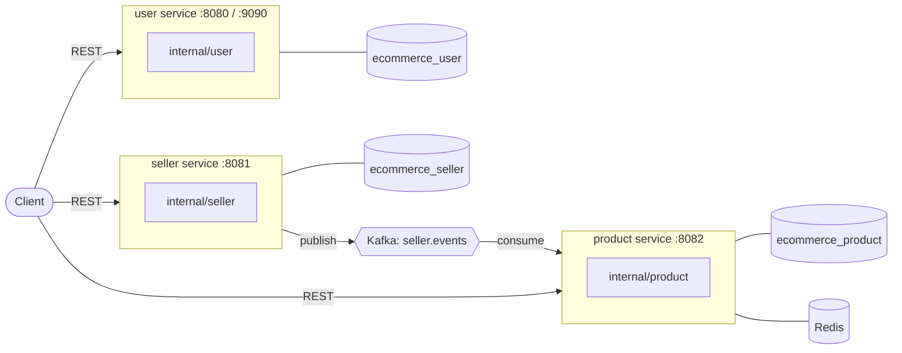

# Domains

What exists, what each service owns, and how they reach each other. Three of the
seven planned domains are built.

## Topology



The arrows that are **not** there matter as much as the ones that are. No
service calls another to serve a request, and no service reaches another's
database. The only line between them is the event stream, and it points one way.

## Built

### User — `internal/user`, `cmd/user`

Identity, credentials, and the accounts everything else refers to.

| | |
|---|---|
| Storage | `ecommerce_user`, unique index on email |
| Driving adapters | `handler/` (REST), `gapi/` (gRPC: `CreateUser`, `GetUser`) |
| Driven adapters | `mongodb/` |
| Ports it declares | `Repository`, `Hasher`, `TokenIssuer` |
| Background work | logs the user count every ten seconds |

It is the only service that issues tokens. The others verify them with the same
secret — which is exactly where an asymmetric key pair would earn its keep in
production, so that only the issuer can mint.

### Seller — `internal/seller`, `cmd/seller`

The shops that own products. The **publisher** in this system.

| | |
|---|---|
| Storage | `ecommerce_seller`; unique on `user_id` (one shop per account) and on a case-folded shop name |
| Driving adapters | `handler/` (REST) |
| Driven adapters | `mongodb/`, plus the `EventPublisher` port |
| Publishes | `seller.registered`, `seller.updated` on `seller.events` |

Nothing calls it to ask who a seller is. It announces changes and the services
that care keep their own copy — which is why adding a fourth consumer later
costs nothing here.

### Product — `internal/product`, `cmd/product`

The things sellers list. The **consumer**, and the only service with a cache.

| | |
|---|---|
| Storage | `ecommerce_product`: products, plus a `seller_directory` read model |
| Driving adapters | `handler/` (REST — reads public, writes authenticated) |
| Driven adapters | `mongodb/`, `rediscache/`, `events/` |
| Ports it declares | `Repository`, `SellerDirectory` |
| Consumes | `seller.events`, in group `product-service` |

## Where Kafka earns its place

A product carries its seller's shop name. It could instead hold only a seller ID
and ask the Seller service for the name — but a listing page renders hundreds of
products, so rendering one page would become hundreds of calls, each of which
can be slow or fail.

Holding a copy removes those calls and creates one problem: the copy goes stale
when a shop is renamed. That is what the event fixes.

```mermaid
sequenceDiagram
    autonumber
    actor Owner
    participant S as seller service
    participant K as Kafka<br/>seller.events
    participant P as product service
    participant DB as product database

    Owner->>S: PATCH /sellers/{id} {"shop_name": "New Name"}
    S->>S: write, then announce
    S->>K: publish, keyed by seller ID
    S-->>Owner: 200

    Note over S,P: the request is already finished;<br/>nothing waits for the consumer

    K->>P: seller.updated
    P->>DB: upsert seller_directory
    P->>DB: set seller_name on that seller's products
    P->>P: drop those products from the cache
```

Three properties this buys, in order of how much they matter:

1. **The write path makes no outbound call.** Creating a product reads the shop
   name from Product's own database. The Seller service being down slows nothing
   and fails nothing.
2. **Adding a consumer needs no change to the publisher.** When Order and
   Marketplace need seller names, they subscribe. Seller does not learn they exist.
3. **Ordering is preserved per shop.** Events are keyed by seller ID, so two
   renames of the same shop cannot be applied backwards.

The costs, stated plainly:

- **The copy is eventually consistent.** A product created in the second after a
  shop is registered can fail with "no shop registered for this account yet".
  The API says so and asks the caller to retry rather than inventing a value.
- **A publish that fails after a successful write loses the event.** The write is
  already committed, so failing the request would report a success as a failure.
  The fix is a transactional outbox — write the event to the same database in
  the same transaction and relay it — and that is the first thing to add.
- **Handlers must be idempotent**, because at-least-once delivery guarantees a
  repeat. Both steps of the handler are upserts, and the rename skips products
  that already carry the new name, so a replay costs one indexed query.

## Where Redis earns its place

`GET /products/{id}` is the hottest read in a catalogue and the one that changes
least often. It is served by a decorator that implements the same
`product.Repository` the service already depends on:

```
product.Service ──▶ product.Repository ◀── rediscache ──▶ mongodb
```

The service is written as if no cache exists. Consequences worth naming:

- **Turning the cache off is deleting one line in `main.go`** — with `REDIS_ADDR`
  unset the service wires the Mongo repository directly and behaves identically,
  only slower.
- **Redis failures fall through to MongoDB rather than being returned.** A cache
  that makes the service fail when it is unavailable has stopped being an
  optimisation and become a dependency, which makes availability worse.
- **Redis is a readiness check, never a liveness one.** Losing it must not
  restart a process that is still serving every request correctly.
- **Writes invalidate rather than rewrite.** Rewriting lets two racing writers
  leave the older of two values in the cache indefinitely; deleting means the
  next read repopulates from the source of truth.
- **A seller rename invalidates exactly the affected products**, because the
  repository returns their IDs. Scanning Redis for keys that might belong to a
  seller is `O(keyspace)` and the usual cause of a cache falling over.
- **Lists are not cached.** A paged, filtered list has a different key per filter
  and page, and every write would have to invalidate an unknown number of them.

`product_cache_lookups_total{result="hit|miss|error"}` is on the admin port. A
cache whose hit rate nobody can see is a guess.

## Not built

| Domain | Depends on | Note |
|---|---|---|
| Order | User, Product, Seller | **Blocked**: decrementing stock and writing an order atomically needs a MongoDB replica set, and compose runs a standalone node |
| Marketplace | Product, Seller | Read side: search and browse across shops |
| Live Commerce | all of the above | Needs realtime on top of the order flow |

Order is the one with the most engineering in it — inventory reservation under
concurrency is the same problem as the lottery allocation design in
`lottery-search-design.md`, and the same primitives solve it.

## Adding the next one

Copy an existing domain's shape rather than inventing a variation:

1. `internal/<domain>/` — entity and errors, service, `Repository` port.
2. `internal/<domain>/mongodb/` — the driven adapter, owning its own indexes.
3. `internal/<domain>/handler/` — REST. Add `gapi/` only when something calls it
   over gRPC.
4. `cmd/<domain>/main.go` — wiring only; `internal/appserver` has the rest.
5. A compose service, a CI matrix entry, and its own database.

If it needs facts from another domain, subscribe to that domain's events and
keep a local read model. Do not add a call, and do not read its collections.
