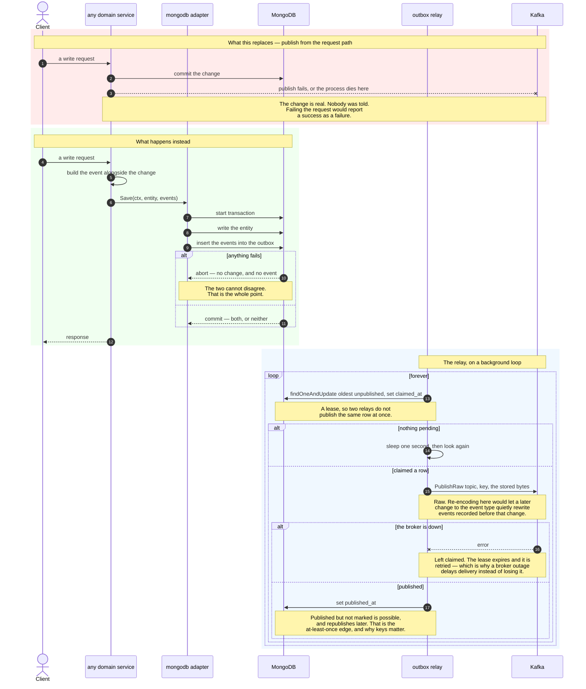
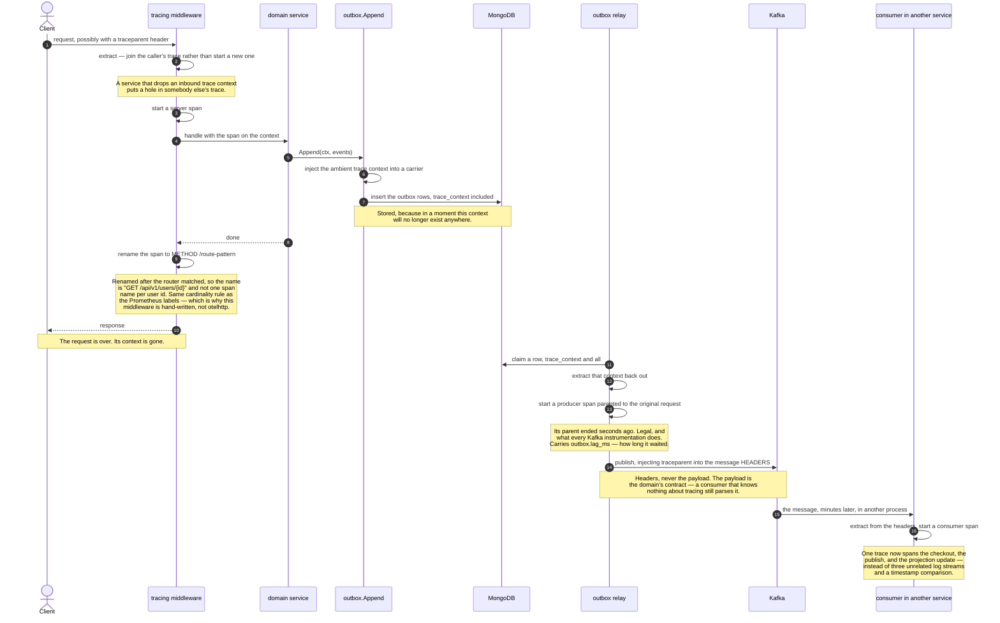
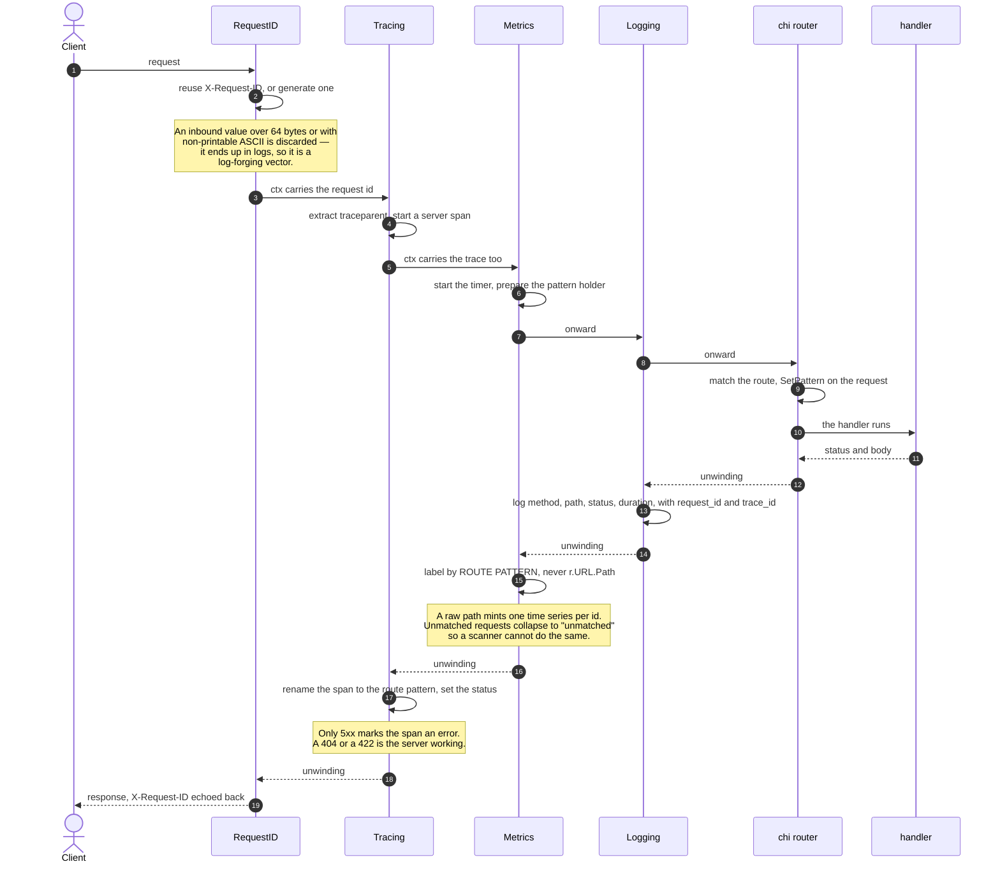
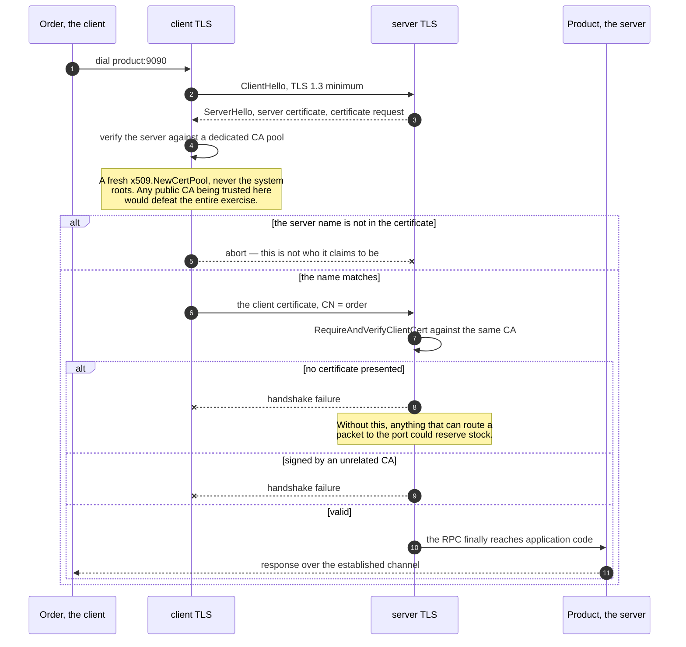
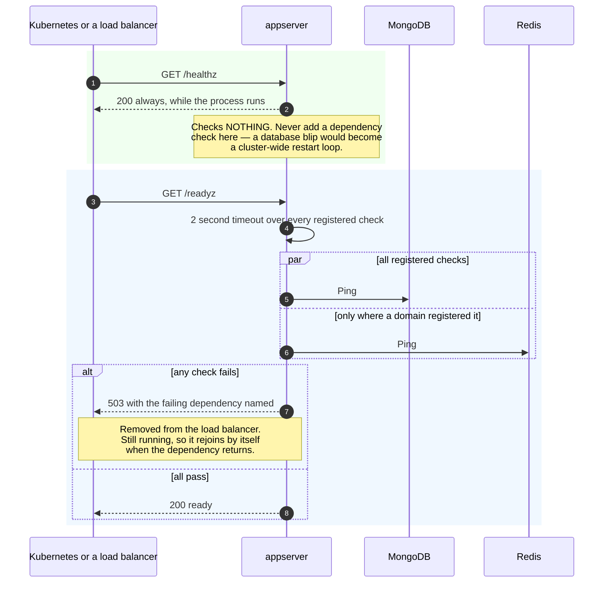
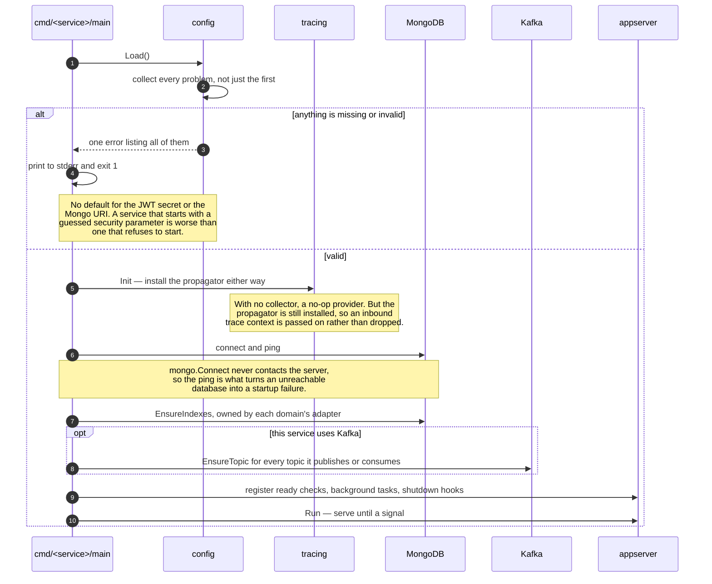
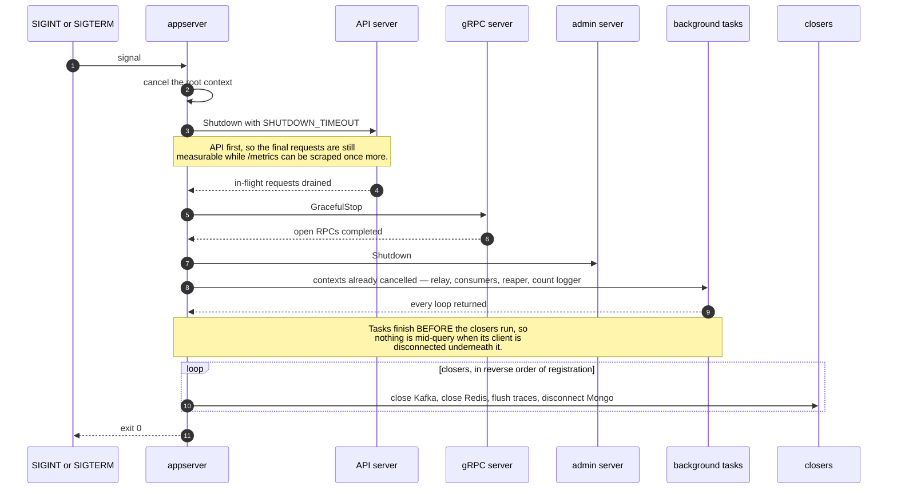

# Cross-cutting — sequence diagrams

*ภาษาไทย: [cross-cutting.th.md](cross-cutting.th.md) · Index: [README.md](README.md)*

The machinery every service shares. None of it belongs to a domain, and all of it
is the reason the domains can stay as simple as they are.

| Flow | Where |
|---|---|
| ⭐⭐ [The outbox and its relay](#-the-outbox-and-its-relay) | `internal/outbox` |
| ⭐⭐ [A trace that survives the outbox](#-a-trace-that-survives-the-outbox) | `internal/tracing` |
| ⭐ [The middleware chain](#-the-middleware-chain) | `internal/middleware` |
| ⭐ [The mutual TLS handshake](#-the-mutual-tls-handshake) | `internal/servicetls` |
| [Liveness and readiness](#liveness-and-readiness) | `internal/appserver` |
| [Startup](#startup) | `internal/appserver` |
| [Graceful shutdown](#graceful-shutdown) | `internal/appserver` |

---

## ⭐⭐ The outbox and its relay

*In prose: [transactional-outbox.md](../transactional-outbox.md)*

The problem this exists to remove, drawn as the top half of the diagram: a
service that writes and then publishes has a **window**. Crash in it, or have the
broker refuse, and the change is real while nobody was told. Returning an error
does not help — the write has committed — so the event is simply lost, and the
systems that needed it drift apart with nothing to indicate it happened.

Writing the event into the same transaction removes the window entirely. What
remains is publishing it afterwards, which is allowed to be slow, retried, and
duplicated. The trade is **at-least-once instead of at-most-once**, which is the
right way round: consumers must cope with a repeat anyway, because Kafka gives
them the same guarantee.

## ⭐⭐ A trace that survives the outbox

A request ID correlates log lines **within** one process. It does not survive a
gRPC call, and it certainly does not survive an event written during a request
and published a second after that request returned.

This is the diagram of the hard part. The span that wrote the event has already
ended by the time the relay runs, so the trace context is **stored in the outbox
row** and replayed. Parenting to an ended span is deliberate and legal: a trace
is a causal chain, not a call stack.

## ⭐ The middleware chain

Order is not arbitrary. **RequestID must be first**, or everything downstream
records uncorrelated lines. **Tracing must precede Logging**, so `trace_id` is on
the context before anything logs.

Correlation happens in the **slog handler**, not at call sites: any code that
logs with the request context is correlated for free, including domain code that
knows nothing about HTTP. Threading a logger through function arguments to
achieve the same thing is the alternative, and it is worse.

## ⭐ The mutual TLS handshake

Service-to-service authentication is not the same problem as user
authentication, and a user's bearer token is the wrong tool for it: there is no
user when Order reserves stock, and borrowing somebody's token would mean a
compromised Order service can act as whichever buyer happened to be checking out.

## Liveness and readiness

The distinction matters more than it looks. A failing Kubernetes **liveness**
probe restarts the pod, so a dependency check there turns a brief MongoDB blip
into a restart loop across every instance at once — an outage where there was
only degradation. A failing **readiness** probe removes the instance from the
load balancer and leaves it running to recover.

## Startup

Fail fast, and report **every** problem at once — a misconfigured deployment
should not have to be fixed one variable per restart.

## Graceful shutdown

The ordering is deliberate: the API drains first so the last requests are still
measurable while the metrics endpoint is up to be scraped one final time, and
background tasks finish before their clients are disconnected underneath them.

