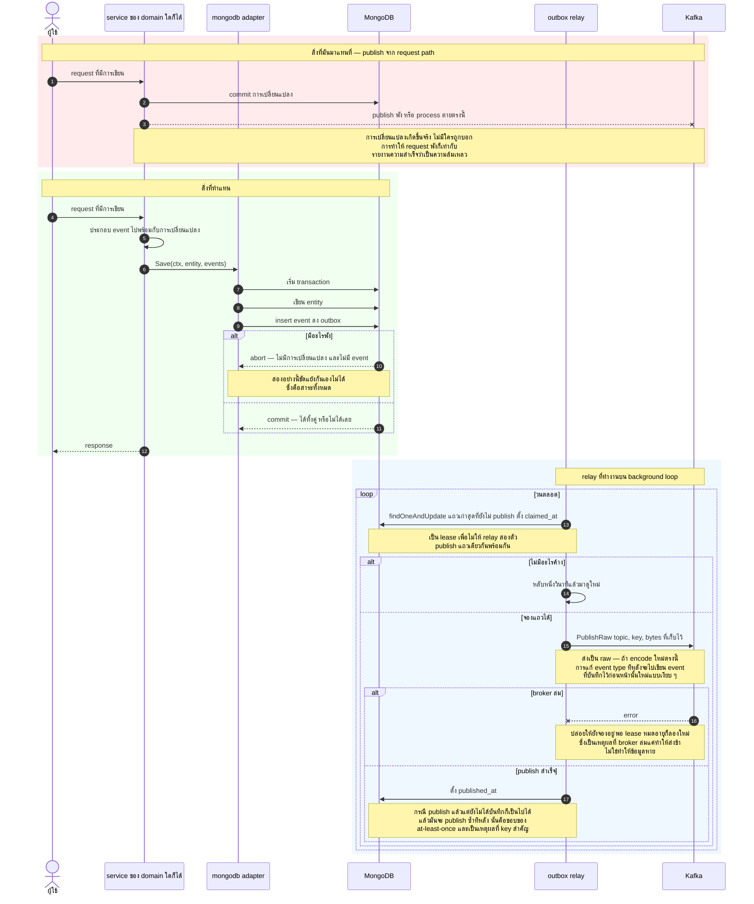
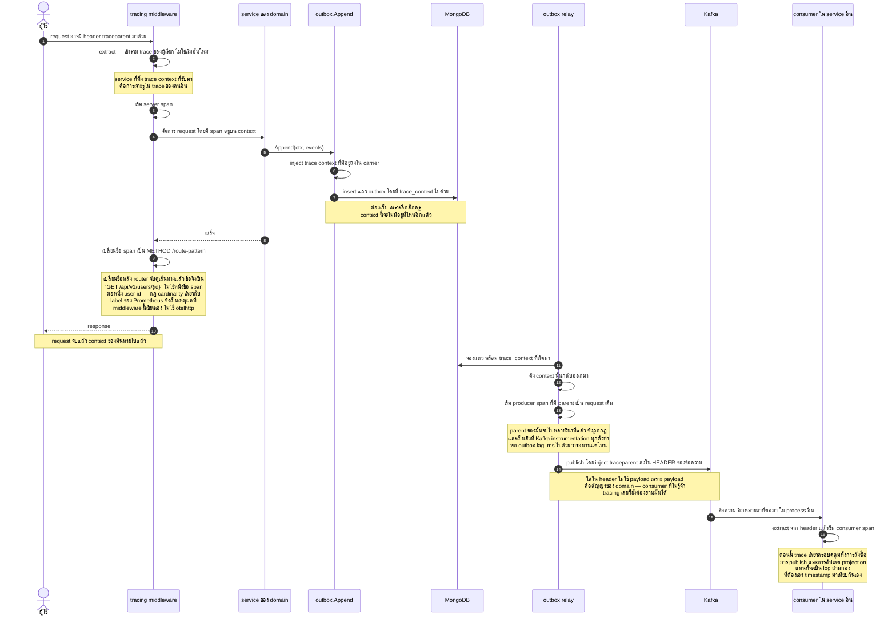
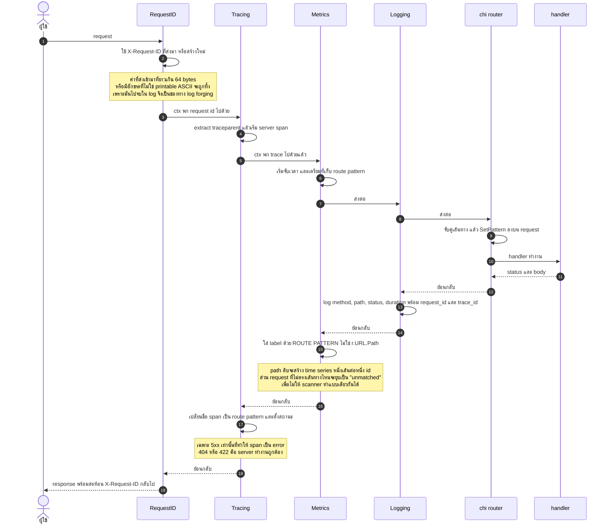
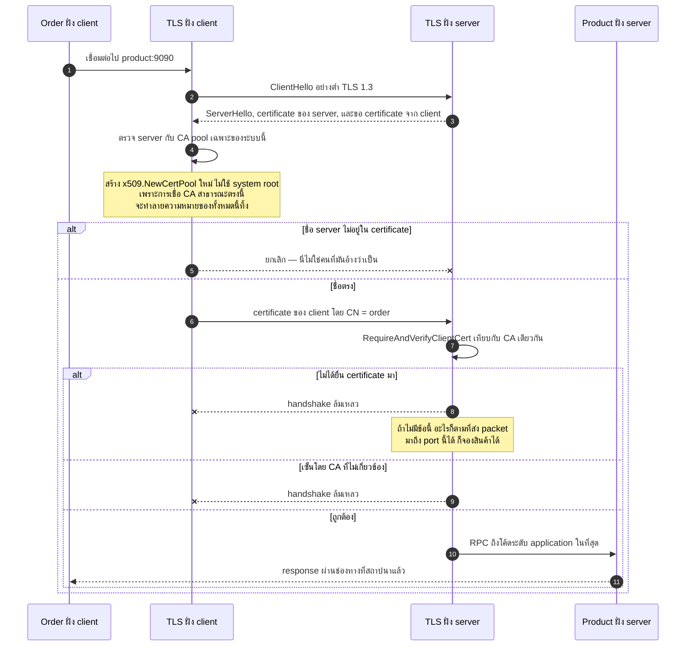
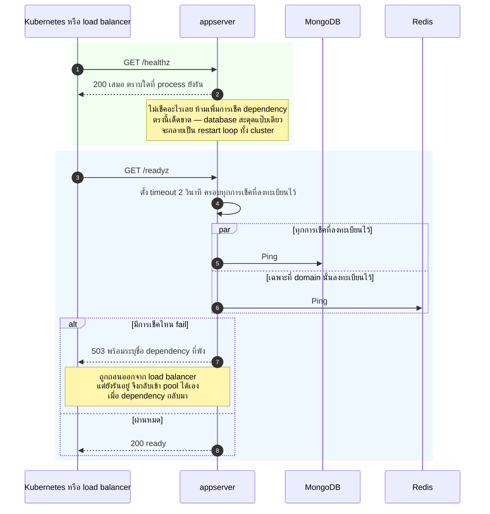
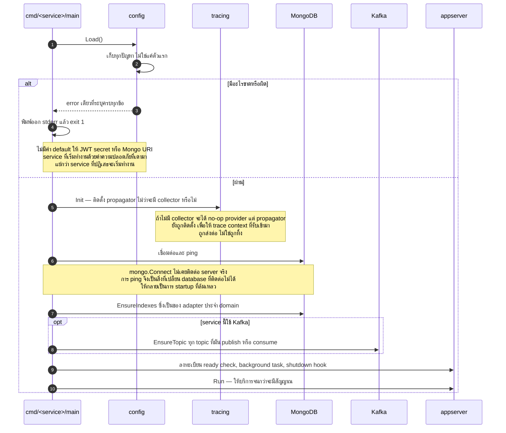
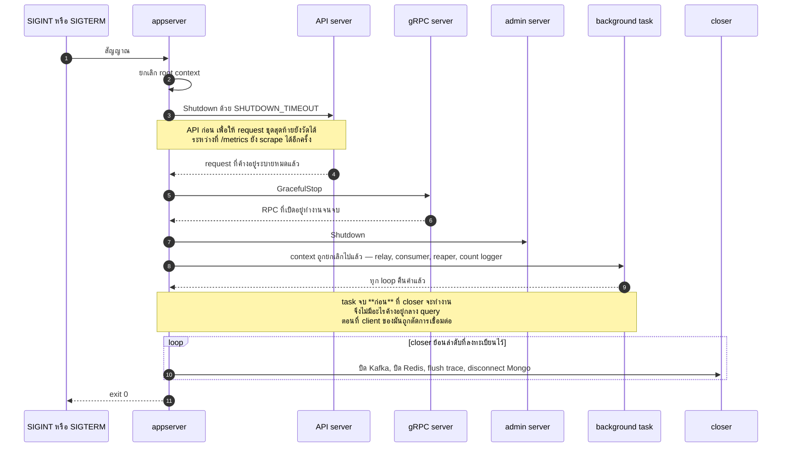

# ส่วนที่ตัดขวางทุก domain — UML Sequence Diagram

*English: [cross-cutting.md](cross-cutting.md) · สารบัญ: [README.th.md](README.th.md)*

กลไกที่ทุก service ใช้ร่วมกัน ไม่มีอันไหนเป็นของ domain ใด domain หนึ่ง
และทั้งหมดนี้คือเหตุผลที่ domain ต่าง ๆ เรียบง่ายได้ขนาดนั้น

| Flow | อยู่ที่ |
|---|---|
| ⭐⭐ [outbox และ relay ของมัน](#-outbox-และ-relay-ของมัน) | `internal/outbox` |
| ⭐⭐ [trace ที่รอดข้าม outbox](#-trace-ที่รอดข้าม-outbox) | `internal/tracing` |
| ⭐ [ลำดับ middleware](#-ลำดับ-middleware) | `internal/middleware` |
| ⭐ [การจับมือของ mutual TLS](#-การจับมือของ-mutual-tls) | `internal/servicetls` |
| [liveness กับ readiness](#liveness-กับ-readiness) | `internal/appserver` |
| [การเริ่มระบบ](#การเริ่มระบบ) | `internal/appserver` |
| [การปิดระบบอย่างนุ่มนวล](#การปิดระบบอย่างนุ่มนวล) | `internal/appserver` |

---

## ⭐⭐ outbox และ relay ของมัน

*คำอธิบายแบบร้อยแก้ว: [transactional-outbox.th.md](../transactional-outbox.th.md)*

ปัญหาที่มันเกิดมาเพื่อกำจัด วาดไว้เป็นครึ่งบนของรูป: service ที่เขียนเสร็จแล้วค่อย publish
จะมี **ช่องว่าง** ถ้า crash ตรงนั้น หรือ broker ปฏิเสธ การเปลี่ยนแปลงเกิดขึ้นจริง
แต่ไม่มีใครถูกบอก และการคืน error ก็ไม่ช่วย เพราะ write commit ไปแล้ว
event จึงหายไปเฉย ๆ และระบบที่ต้องใช้มันก็ค่อย ๆ เพี้ยนออกจากกันโดยไม่มีอะไรบ่งบอก

การเขียน event ลงใน transaction เดียวกันกำจัดช่องว่างนั้นทิ้งทั้งหมด
เหลือแค่การ publish ทีหลัง ซึ่งอนุญาตให้ช้าได้ retry ได้ และซ้ำได้
สิ่งที่แลกคือ **at-least-once แทน at-most-once** ซึ่งถูกด้านกว่า
เพราะ consumer ต้องรับมือกับการซ้ำอยู่แล้ว ในเมื่อ Kafka ก็ให้การรับประกันแบบเดียวกัน

## ⭐⭐ trace ที่รอดข้าม outbox

request ID เชื่อมโยง log **ภายใน** process เดียว มันข้าม gRPC call ไม่ได้
และยิ่งข้าม event ที่เขียนตอน request แล้ว publish หลัง request จบไปแล้วหนึ่งวินาทีไม่ได้เลย

นี่คือรูปของส่วนที่ยากที่สุด span ที่เขียน event จบไปแล้วตอนที่ relay ทำงาน
trace context จึงถูก **เก็บไว้ใน outbox row** แล้วเอากลับมาใช้
การให้ parent เป็น span ที่จบไปแล้วเป็นเรื่องตั้งใจและถูกกฎ:
trace คือสายเหตุ-ผล ไม่ใช่ call stack

## ⭐ ลำดับ middleware

ลำดับไม่ได้สุ่มมา **RequestID ต้องมาก่อน** ไม่งั้นทุกอย่างที่อยู่ถัดไปจะบันทึกบรรทัด
ที่เชื่อมโยงอะไรไม่ได้ และ **Tracing ต้องมาก่อน Logging** เพื่อให้ `trace_id`
อยู่บน context ก่อนที่อะไรจะเริ่ม log

การเชื่อมโยงเกิดขึ้นใน **slog handler** ไม่ใช่ที่จุดเรียกแต่ละจุด
โค้ดใดก็ตามที่ log ด้วย request context จะถูกเชื่อมโยงให้ฟรี รวมถึงโค้ดใน domain
ที่ไม่รู้จัก HTTP เลย ทางเลือกอีกทางคือส่ง logger ผ่าน argument ไปเรื่อย ๆ ซึ่งแย่กว่า

## ⭐ การจับมือของ mutual TLS

การยืนยันตัวตนระหว่าง service ไม่ใช่ปัญหาเดียวกับการยืนยันตัวตนผู้ใช้
และ bearer token ของผู้ใช้เป็นเครื่องมือที่ผิดสำหรับงานนี้ เพราะตอน Order จองสต็อก
ไม่มี user อยู่เลย และการยืม token ของใครมาใช้ แปลว่า Order service ที่ถูกเจาะ
จะกระทำการในนามของผู้ซื้อคนไหนก็ได้ที่บังเอิญกำลังเช็คเอาต์อยู่

## liveness กับ readiness

ความต่างสำคัญกว่าที่เห็น — **liveness** probe ของ Kubernetes ที่ fail จะ restart pod ทิ้ง
การเช็ค dependency ตรงนั้นจึงเปลี่ยน MongoDB ที่สะดุดแป๊บเดียว
ให้กลายเป็น restart loop พร้อมกันทุก instance — จากแค่ช้าลง กลายเป็นล่มทั้งระบบ
ส่วน **readiness** probe ที่ fail จะถอน instance ออกจาก load balancer
แต่ปล่อยให้รันต่อเพื่อฟื้นตัว

## การเริ่มระบบ

fail ให้เร็ว และรายงาน **ทุก** ปัญหาพร้อมกัน — deployment ที่ตั้งค่าผิด
ไม่ควรต้องแก้ทีละตัวแปรต่อการ restart หนึ่งครั้ง

## การปิดระบบอย่างนุ่มนวล

ลำดับเป็นเรื่องตั้งใจ: API ระบายก่อน เพื่อให้ request ชุดสุดท้ายยังวัดได้
ในขณะที่ endpoint metrics ยังเปิดให้ scrape ได้อีกรอบสุดท้าย
และ background task ต้องจบก่อนที่ client ของมันจะถูกตัดออกจากใต้เท้า

