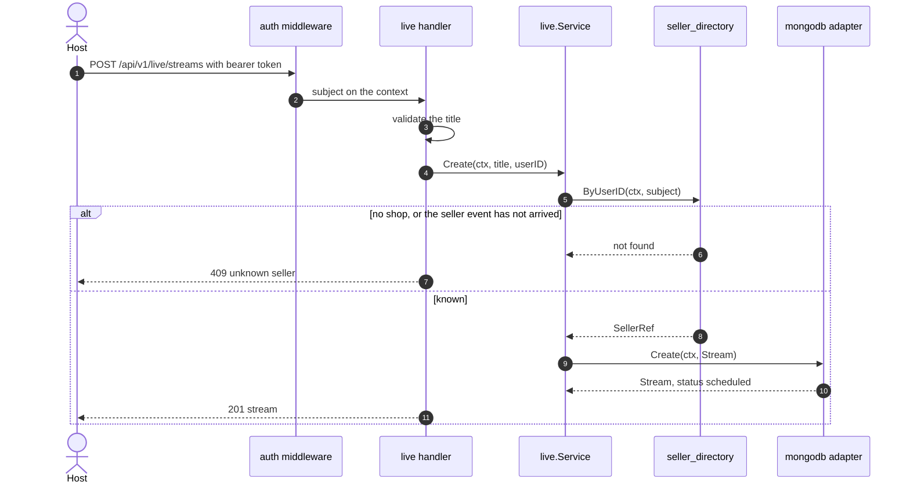
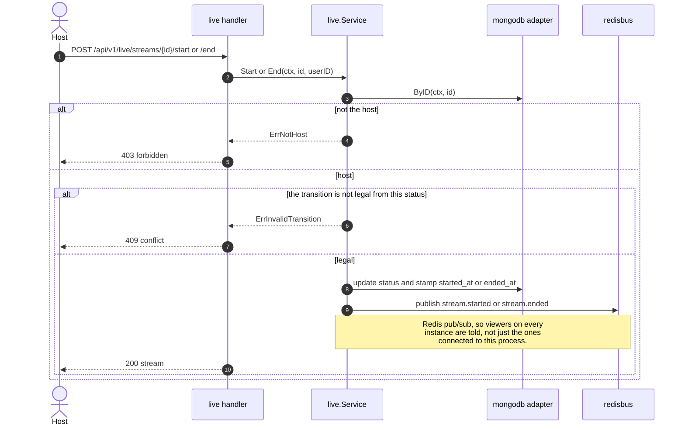
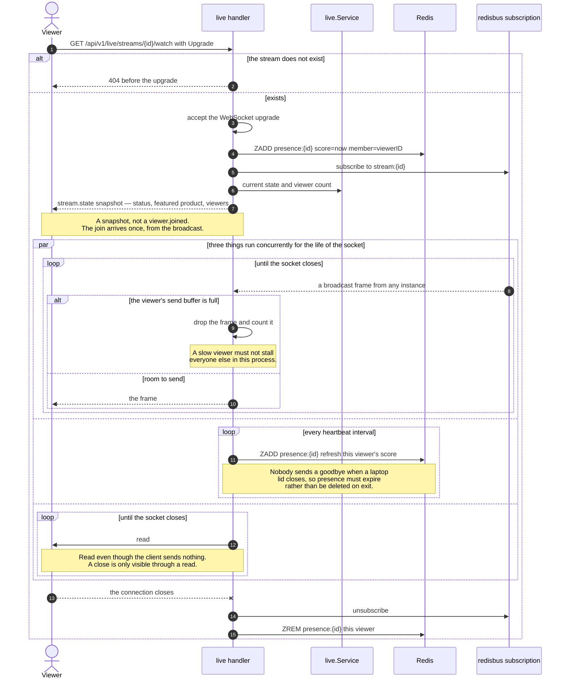
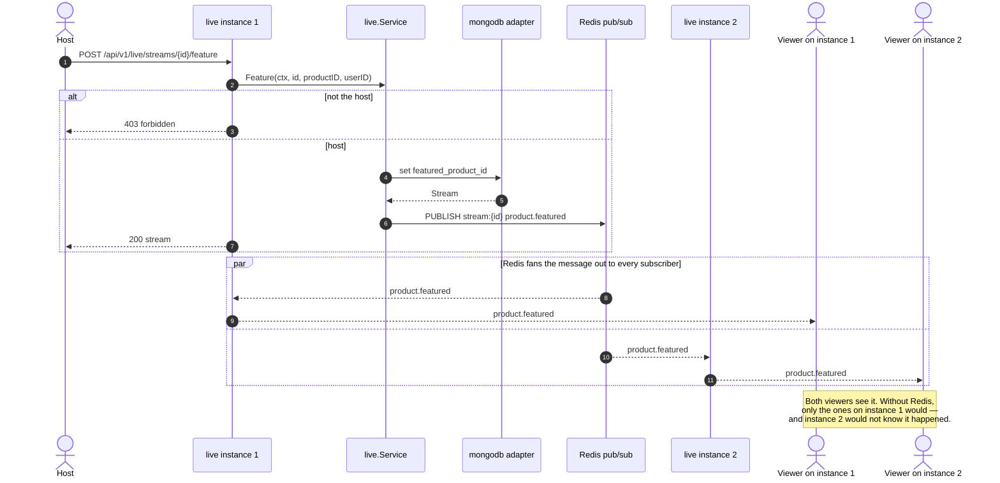
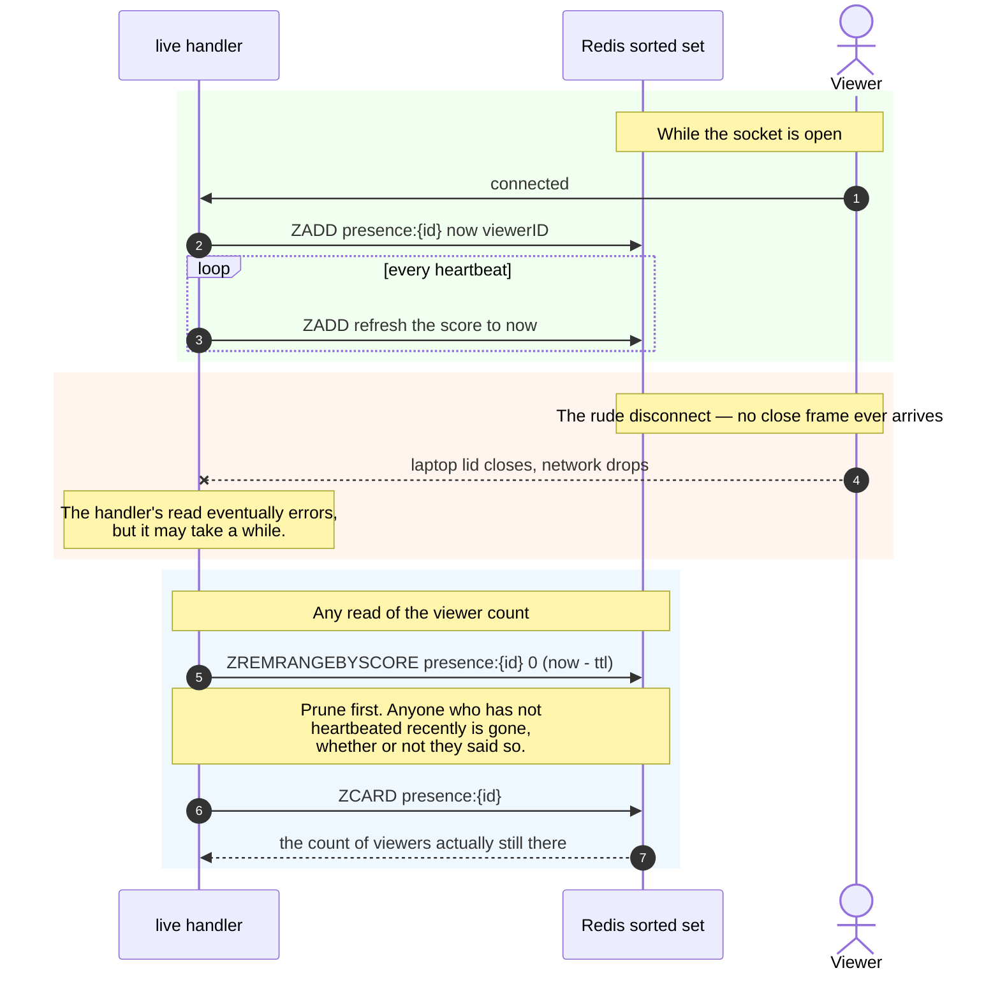
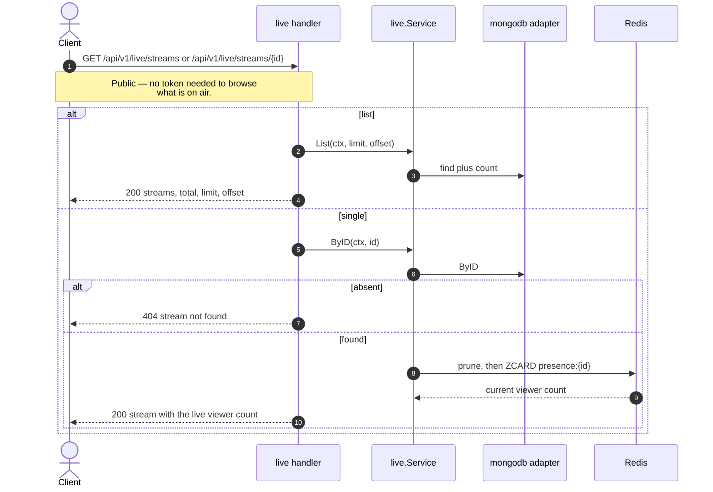

# Live Commerce — sequence diagrams

*ภาษาไทย: [live.th.md](live.th.md) · Index: [README.md](README.md)*

Live selling, and every design decision in it follows from one fact: **a
WebSocket lives on exactly one instance**. Anything that has to be true for all
viewers therefore cannot live in process memory.

Redis is **required** here, unlike in Product where it is only a cache. Two
instances without it would each have their own idea of the audience, and both
would be wrong.

| Flow | Endpoint |
|---|---|
| [Create a stream](#create-a-stream) | `POST /api/v1/live/streams` |
| [Start and end](#start-and-end) | `POST .../start`, `POST .../end` |
| ⭐⭐ [Watch — the WebSocket](#-watch--the-websocket) | `GET .../watch` |
| ⭐ [Feature a product](#-feature-a-product--cross-instance-broadcast) | `POST .../feature` |
| ⭐ [Presence that expires](#-presence-that-expires) | background |
| [List and get](#list-and-get) | `GET /api/v1/live/streams`, `GET .../{id}` |

---

## Create a stream

## Start and end

## ⭐⭐ Watch — the WebSocket

The densest diagram here, and three of its details are the kind that only show up
once a real client connects.

**Read from the socket even when the client sends nothing.** A WebSocket close
only surfaces through a read — a handler that never reads never learns the viewer
left, and the presence entry lingers until it expires.

**Send a snapshot, not a join event.** The first version sent `viewer.joined`
directly to the new socket *and* let it arrive again from the broadcast it had
just subscribed to. Every viewer saw the message twice. It is now a `stream.state`
snapshot, which is both more useful and not a duplicate.

**Drop frames for a slow viewer rather than blocking.** One stalled connection
must not hold up everyone sharing the process.

## ⭐ Feature a product — cross-instance broadcast

This is the diagram that shows why Redis is required rather than optional. The
host is connected to one instance; the viewers are spread across all of them.

**Redis pub/sub, not Kafka**, and deliberately: it has no replay, which is
correct for a feed whose value decays in seconds and wrong for anything durable.
This is also the one publisher in the system with **no outbox**, for the same
reason — a delivery guarantee for a notification that is worthless when stale is
machinery in service of nothing.

## ⭐ Presence that expires

Viewer counts are a sorted set scored by timestamp, pruned on read. The reason is
blunt: **nobody sends a goodbye when a laptop lid closes.** A design that deletes
on disconnect counts a viewer forever the first time a connection dies rudely,
and connections die rudely all the time.

## List and get

