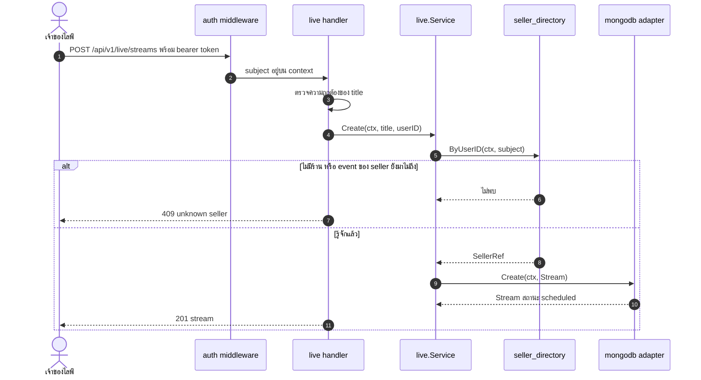
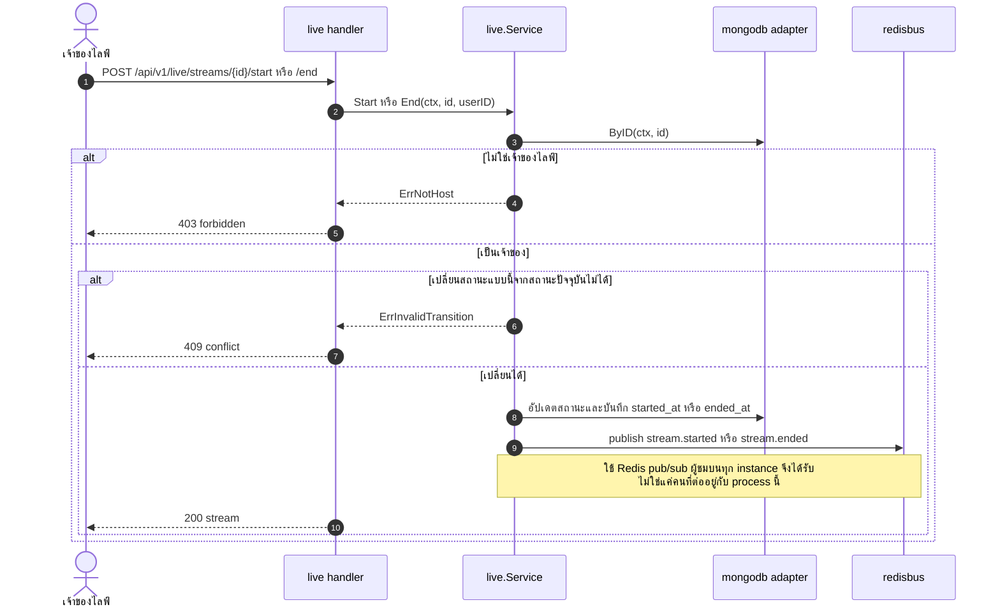
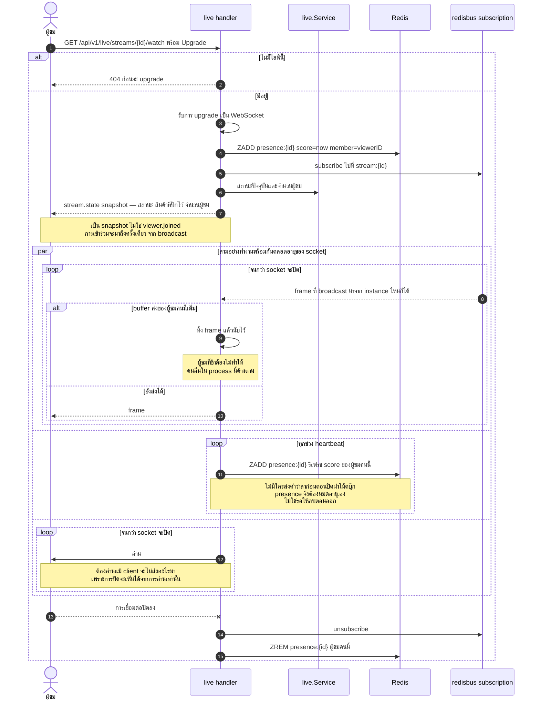
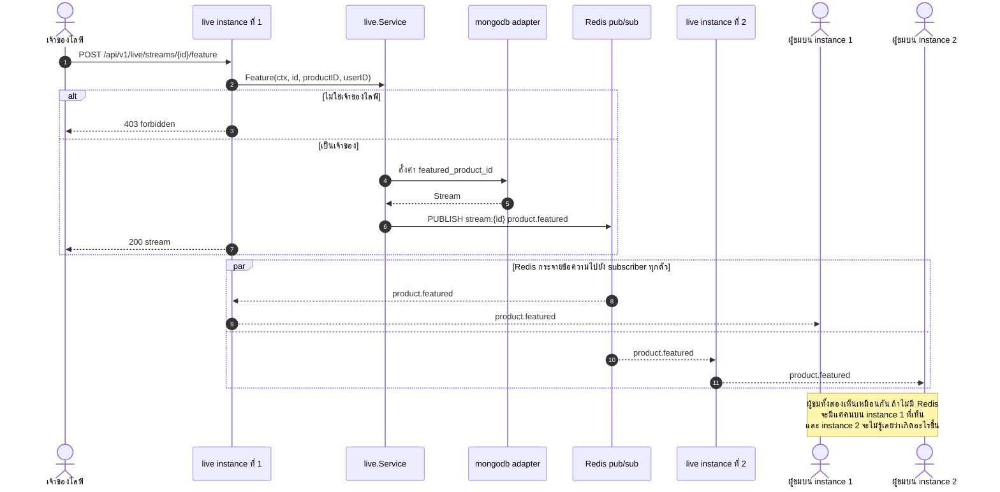
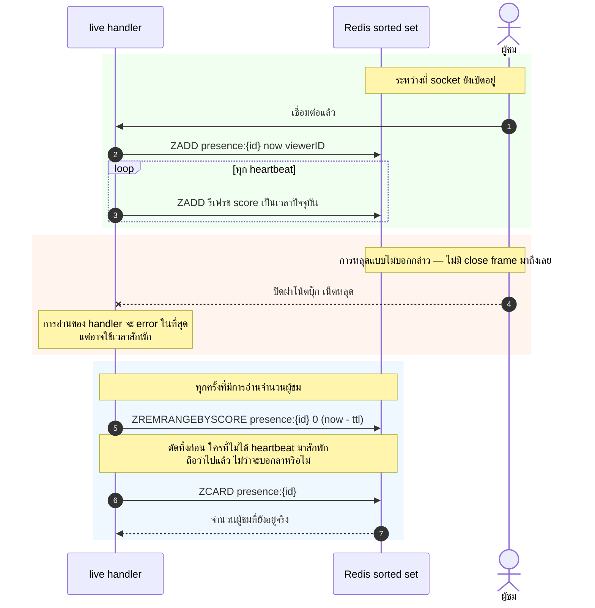
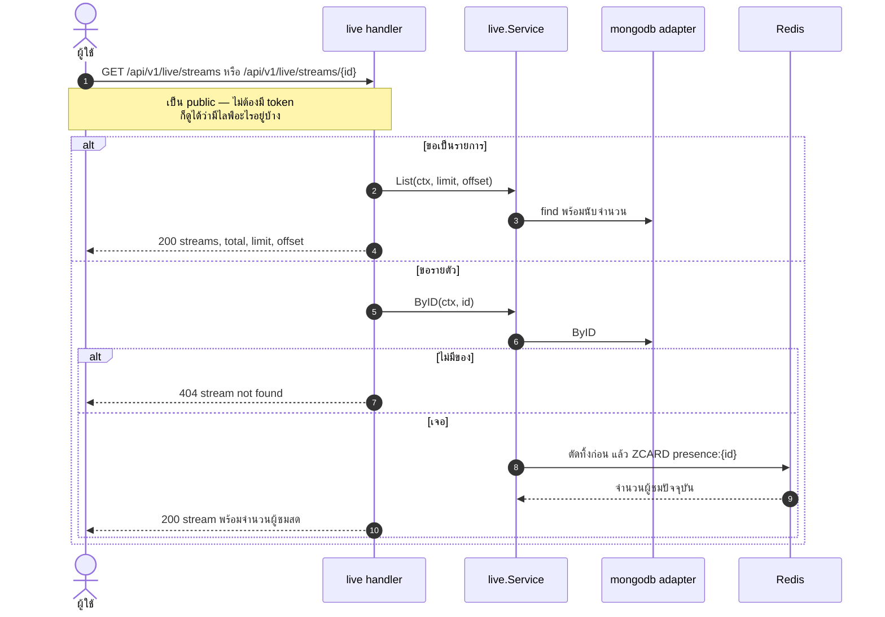

# Live Commerce — UML Sequence Diagram

*English: [live.md](live.md) · สารบัญ: [README.th.md](README.th.md)*

ไลฟ์ขายของ และทุกการตัดสินใจในการออกแบบมาจากข้อเท็จจริงข้อเดียว:
**WebSocket หนึ่งเส้นอยู่บน instance เดียวเท่านั้น** อะไรก็ตามที่ต้องเป็นจริงสำหรับผู้ชมทุกคน
จึงอยู่ใน memory ของ process ไม่ได้

Redis ที่นี่เป็น **ของบังคับ** ต่างจากใน Product ที่เป็นแค่ cache
ถ้าไม่มี Redis สอง instance จะต่างคนต่างจำว่าใครดูอยู่บ้าง และจะผิดทั้งคู่

| Flow | Endpoint |
|---|---|
| [สร้างไลฟ์](#สร้างไลฟ์) | `POST /api/v1/live/streams` |
| [เริ่มและจบ](#เริ่มและจบ) | `POST .../start`, `POST .../end` |
| ⭐⭐ [เข้าดู — WebSocket](#-เข้าดู--websocket) | `GET .../watch` |
| ⭐ [ปักสินค้า](#-ปักสินค้า--กระจายข้ามอินสแตนซ์) | `POST .../feature` |
| ⭐ [presence ที่ต้องหมดอายุได้](#-presence-ที่ต้องหมดอายุได้) | เบื้องหลัง |
| [รายการและรายตัว](#รายการและรายตัว) | `GET /api/v1/live/streams`, `GET .../{id}` |

---

## สร้างไลฟ์

## เริ่มและจบ

## ⭐⭐ เข้าดู — WebSocket

รูปที่แน่นที่สุดในไฟล์นี้ และสามรายละเอียดของมันเป็นแบบที่จะเห็นก็ต่อเมื่อมี client จริงมาต่อ

**ต้องอ่านจาก socket แม้ client จะไม่ส่งอะไรมาเลย** เพราะการปิด WebSocket
จะรู้ได้จากการอ่านเท่านั้น handler ที่ไม่เคยอ่านจะไม่มีวันรู้ว่าผู้ชมออกไปแล้ว
และรายการ presence จะค้างอยู่จนกว่าจะหมดอายุ

**ส่ง snapshot ไม่ใช่ event การเข้าร่วม** เวอร์ชันแรกส่ง `viewer.joined`
ตรงไปยัง socket ใหม่ *และ* ปล่อยให้มันมาถึงอีกรอบจาก broadcast ที่เพิ่ง subscribe ไป
ผู้ชมทุกคนจึงเห็นข้อความซ้ำสองครั้ง ตอนนี้เปลี่ยนเป็น `stream.state` snapshot
ซึ่งมีประโยชน์กว่า และไม่ซ้ำ

**ถ้าผู้ชมคนไหนช้า ให้ทิ้ง frame แทนที่จะ block** การเชื่อมต่อที่ค้างอยู่หนึ่งเส้น
ต้องไม่ฉุดทุกคนที่ใช้ process เดียวกัน

## ⭐ ปักสินค้า — กระจายข้ามอินสแตนซ์

นี่คือรูปที่แสดงว่าทำไม Redis ถึงเป็นของบังคับ ไม่ใช่ของเสริม
เจ้าของไลฟ์ต่ออยู่กับ instance เดียว ส่วนผู้ชมกระจายอยู่ทุก instance

**ใช้ Redis pub/sub ไม่ใช่ Kafka** และตั้งใจแบบนั้น เพราะมันไม่มี replay
ซึ่งถูกต้องสำหรับ feed ที่มูลค่าหมดไปในไม่กี่วินาที และผิดสำหรับอะไรที่ต้องคงทน
นี่ยังเป็น publisher เดียวในระบบที่ **ไม่มี outbox** ด้วยเหตุผลเดียวกัน —
การรับประกันการส่งมอบ ของการแจ้งเตือนที่ไร้ค่าเมื่อมันเก่า คือกลไกที่สร้างมาเพื่อความว่างเปล่า

## ⭐ presence ที่ต้องหมดอายุได้

จำนวนผู้ชมเก็บใน sorted set ที่ให้คะแนนด้วย timestamp และตัดทิ้งตอนอ่าน
เหตุผลตรงไปตรงมา: **ไม่มีใครส่งคำว่าลาก่อนตอนปิดฝาโน้ตบุ๊ก**
ดีไซน์ที่ลบตอน disconnect จะนับผู้ชมคนนั้นไปตลอดกาลตั้งแต่ครั้งแรกที่การเชื่อมต่อตายแบบไม่บอกกล่าว
และการเชื่อมต่อตายแบบนั้นตลอดเวลา

## รายการและรายตัว

