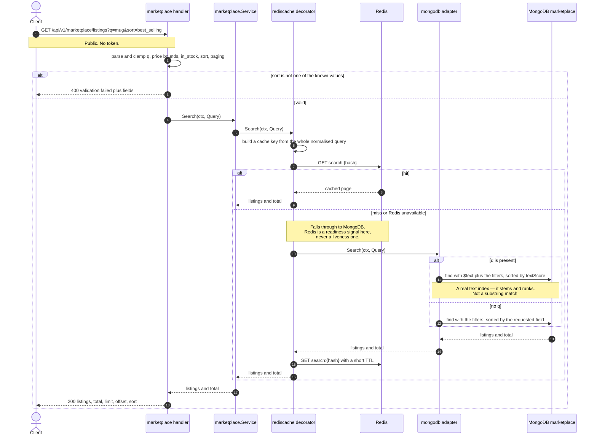
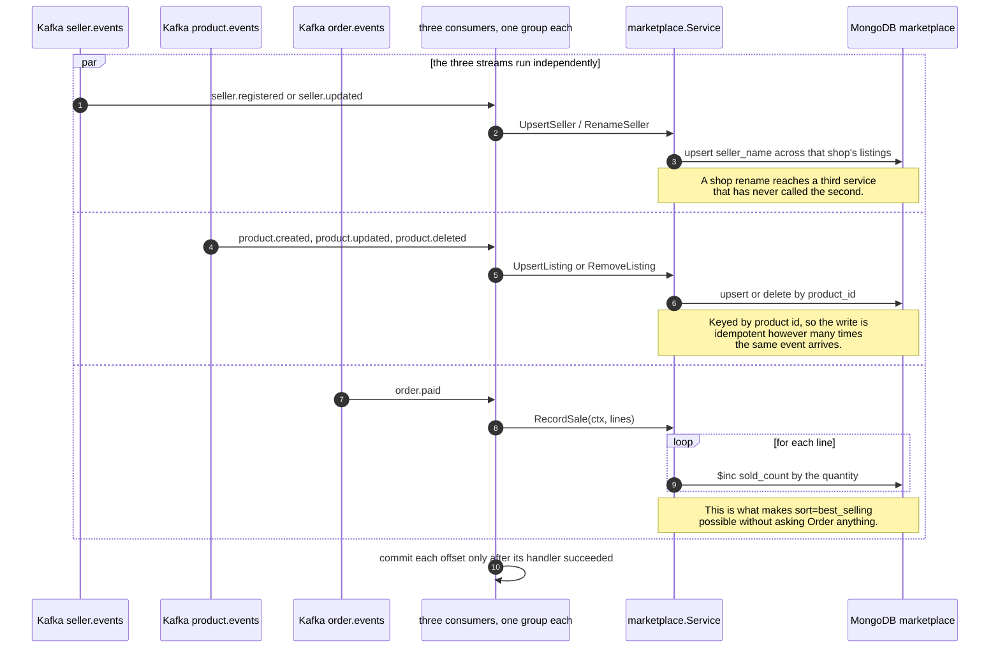
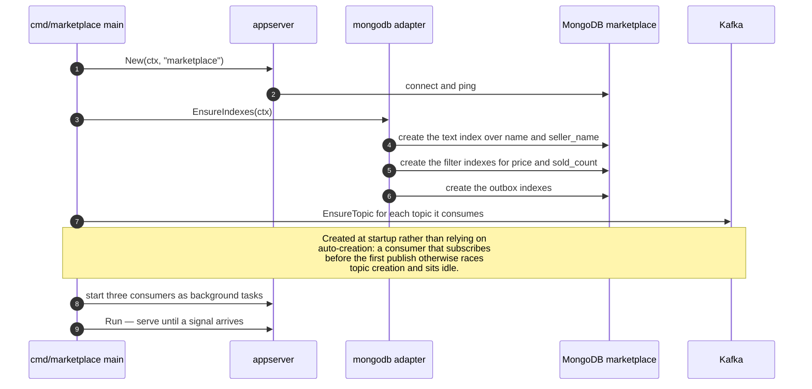

# Marketplace — sequence diagrams

*ภาษาไทย: [marketplace.th.md](marketplace.th.md) · Index: [README.md](README.md)*

A search projection fed by **three** event streams. It owns no writes at all:
every row is the result of an event somebody else published, which is why it has
exactly one endpoint and three consumers.

| Flow | Endpoint |
|---|---|
| ⭐ [Search](#-search--projection-plus-ttl-cache) | `GET /api/v1/marketplace/listings` |
| ⭐ [Three streams, one projection](#-three-streams-one-projection) | Kafka |
| [Building the text index](#building-the-text-index) | startup |

---

## ⭐ Search — projection plus TTL cache

Two things are worth noticing.

**The projection is why this is one query.** Answering "mugs under ฿500 from
active shops, best selling first" from the source data would mean joining three
services. Here it is a single indexed find, because the joining already happened
when the events arrived.

**The cache is a TTL, not an invalidation scheme.** A search cache is a ceiling
on staleness rather than a correctness mechanism: nobody minds a listing
appearing a few seconds late, and the alternative — invalidating every query that
might match a changed product — is not computable.

## ⭐ Three streams, one projection

Nothing in Seller, Product or Order knows the Marketplace exists. They publish
what happened; whoever cares subscribes. That is the difference between an event
and a call: adding a seventh consumer requires no change to any publisher.

Every handler is idempotent, because at-least-once delivery makes a repeat
certain rather than possible.

## Building the text index

Index creation belongs to the domain's own adapter, not to a shared database
package — so adding a domain never means editing `internal/database`.

