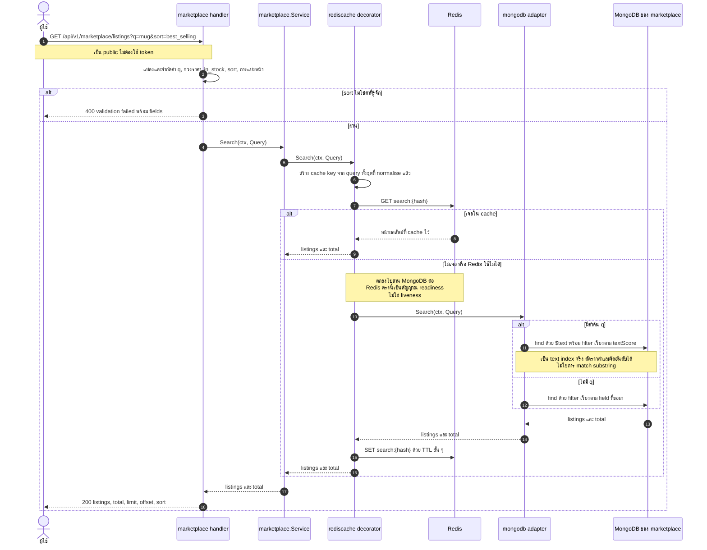
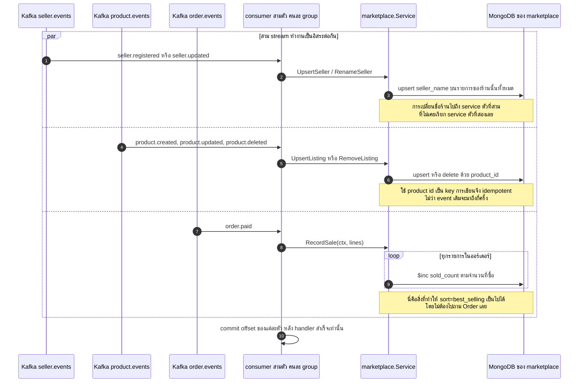
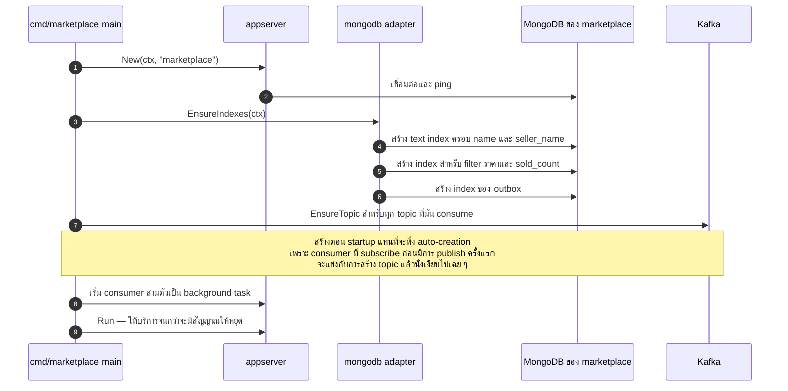

# Marketplace — UML Sequence Diagram

*English: [marketplace.md](marketplace.md) · สารบัญ: [README.th.md](README.th.md)*

projection สำหรับค้นหา ที่ถูกป้อนด้วย event **สามสาย** service นี้ไม่มีการเขียน
เป็นของตัวเองเลย ทุก row เกิดจาก event ที่คนอื่น publish ซึ่งเป็นเหตุผลว่าทำไม
มันมี endpoint เดียวแต่มี consumer สามตัว

| Flow | Endpoint |
|---|---|
| ⭐ [ค้นหา](#-ค้นหา--projection-บวก-ttl-cache) | `GET /api/v1/marketplace/listings` |
| ⭐ [สาม stream หนึ่ง projection](#-สาม-stream-หนึ่ง-projection) | Kafka |
| [การสร้าง text index](#การสร้าง-text-index) | ตอน startup |

---

## ⭐ ค้นหา — projection บวก TTL cache

มีสองอย่างที่ควรสังเกต

**projection คือเหตุผลที่อันนี้เป็น query เดียว** ถ้าจะตอบว่า "แก้วราคาต่ำกว่า ฿500
จากร้านที่ยัง active เรียงตามยอดขาย" จากข้อมูลต้นทาง จะต้อง join สาม service
แต่ตรงนี้เป็น find ที่มี index รองรับครั้งเดียว เพราะการ join เกิดไปแล้วตอน event มาถึง

**cache เป็น TTL ไม่ใช่กลไกล้างข้อมูล** search cache คือเพดานของความเก่า
ไม่ใช่กลไกความถูกต้อง เพราะไม่มีใครเดือดร้อนถ้าสินค้าโผล่ช้าไปไม่กี่วินาที
และทางเลือกอีกทาง คือการล้างทุก query ที่อาจตรงกับสินค้าที่เปลี่ยน ซึ่งคำนวณไม่ได้

## ⭐ สาม stream หนึ่ง projection

โค้ดใน Seller, Product และ Order ไม่รู้จัก Marketplace เลยสักตัว
พวกมันแค่ประกาศว่ามีอะไรเกิดขึ้น ใครสนใจก็มา subscribe เอง
นี่คือความต่างระหว่าง event กับการเรียกตรง ๆ: ถ้าจะเพิ่ม consumer ตัวที่เจ็ด
ไม่ต้องแก้ publisher เลยสักตัว

ทุก handler เป็น idempotent เพราะการส่งแบบ at-least-once ทำให้การได้รับซ้ำ
เป็นเรื่องที่ต้องเกิดแน่ ไม่ใช่แค่อาจเกิด

## การสร้าง text index

การสร้าง index เป็นหน้าที่ของ adapter ประจำ domain ไม่ใช่ของ package database ที่ใช้ร่วมกัน
การเพิ่ม domain ใหม่จึงไม่เคยต้องไปแก้ `internal/database`

