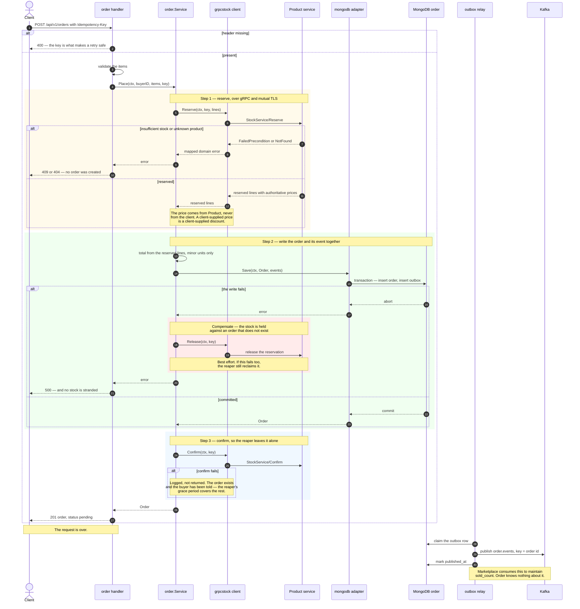
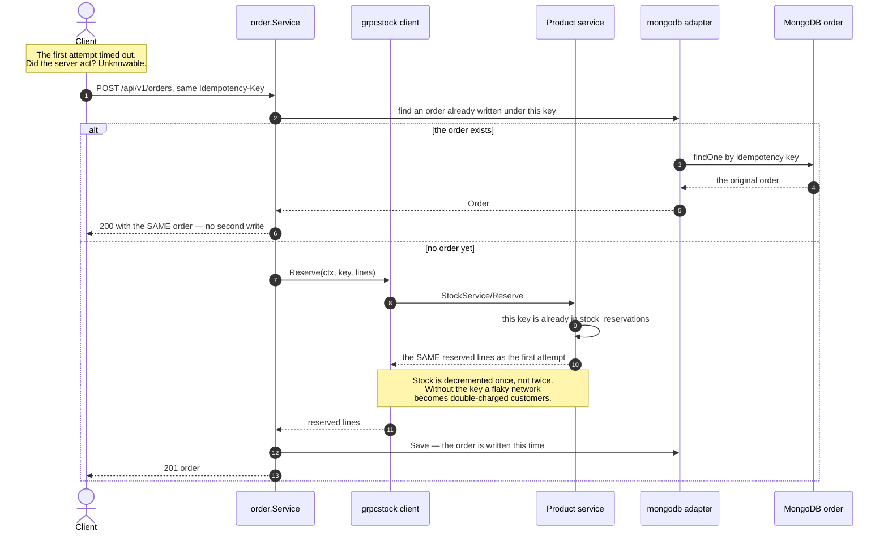
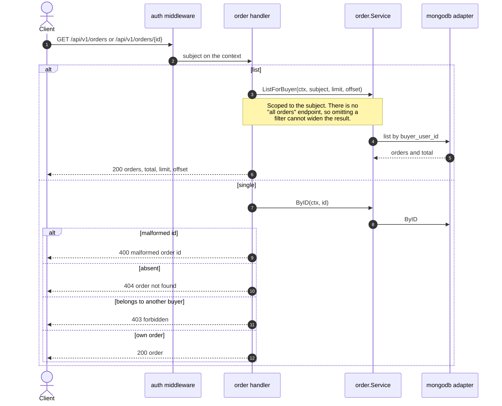
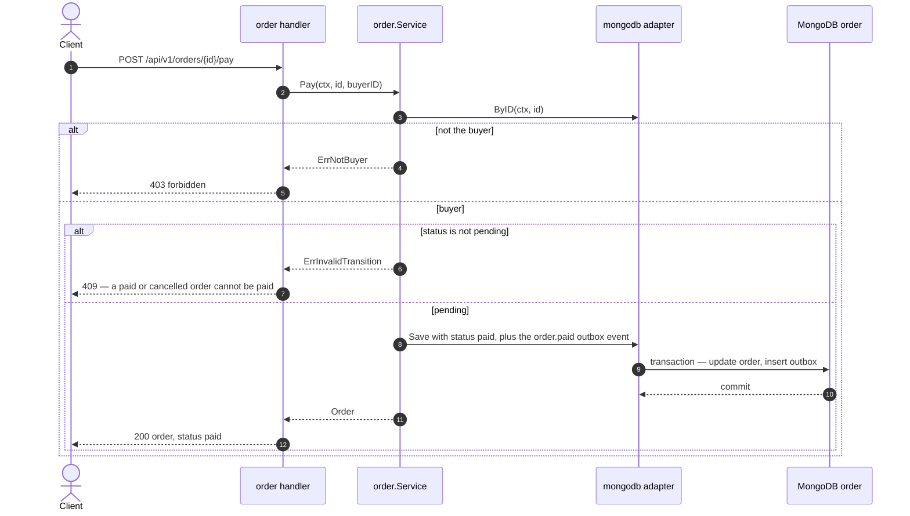
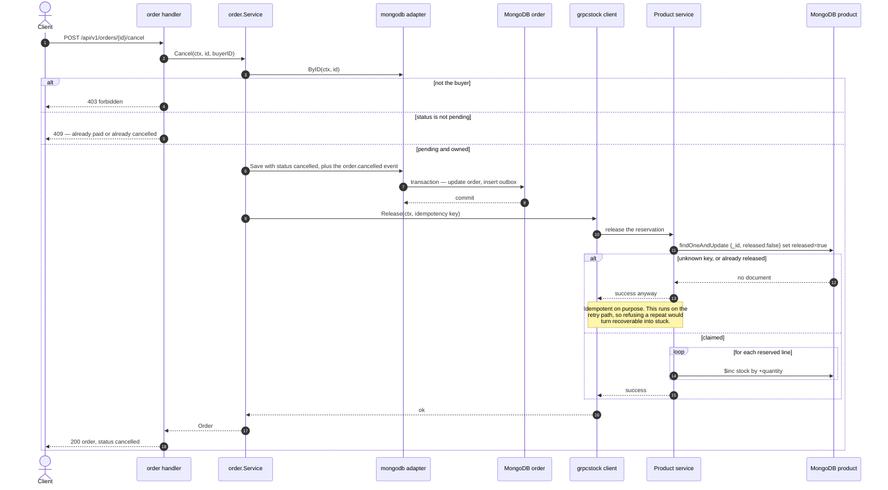

# Order — sequence diagrams

*ภาษาไทย: [order.th.md](order.th.md) · Index: [README.md](README.md)*

The saga. Placing an order spans two services with two separate databases, so
there is **no transaction available** — anything spanning both is a sequence of
local steps plus a compensating action for when a later one fails.

| Flow | Endpoint |
|---|---|
| ⭐⭐ [Place an order](#-place-an-order--the-saga) | `POST /api/v1/orders` |
| ⭐ [Replaying an idempotency key](#-replaying-an-idempotency-key) | `POST /api/v1/orders` |
| [List and get](#list-and-get) | `GET /api/v1/orders`, `GET /api/v1/orders/{id}` |
| [Pay](#pay) | `POST /api/v1/orders/{id}/pay` |
| ⭐ [Cancel](#-cancel--the-compensating-action) | `POST /api/v1/orders/{id}/cancel` |

---

## ⭐⭐ Place an order — the saga

The whole system in one request, and the diagram worth reading twice.

**Why this one call is synchronous.** Every other cross-service interaction here
is an event, because every other one can wait. This one cannot: a buyer must not
be told their order exists until the stock is actually secured.

**Why `Confirm` failing does not fail the request.** By then the order is
written and the buyer has been told. The reservation is merely left unconfirmed,
and the reaper's grace period is long enough that a retry or a restart fixes it.
Failing the request here would report a success as a failure.

**Why the compensation is best-effort.** If `Release` also fails, the reaper
still reclaims the stock. Two independent mechanisms cover the same gap because
the expensive failure — stock held against nothing, forever — is worth covering
twice.

## ⭐ Replaying an idempotency key

What a retrying client does after a timeout. The caller cannot tell whether the
server acted, so it will retry — and the key is what makes that retry safe rather
than turning "reserve stock" into "reserve stock twice".

## List and get

## Pay

The reserved stock stays reserved — the sale completed. A state machine guards
the transition, so paying a cancelled order is a conflict rather than a
correction.

## ⭐ Cancel — the compensating action

The other end of the saga. Cancelling releases the reservation and the stock
returns.

**A compensating action must be safe to call repeatedly**, because it runs on
exactly the path where retries happen. Releasing an unknown key, or one already
released, returns success rather than an error — refusing a repeat here would
turn a recoverable situation into a stuck one.

