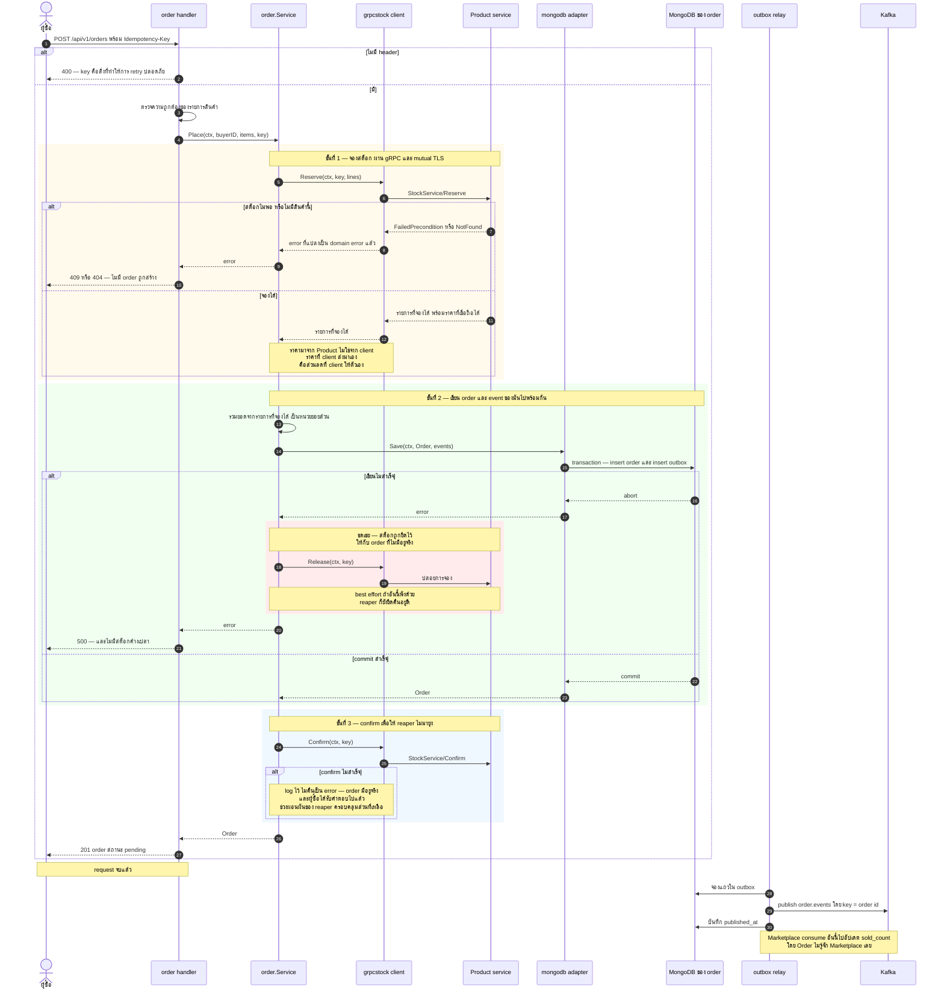
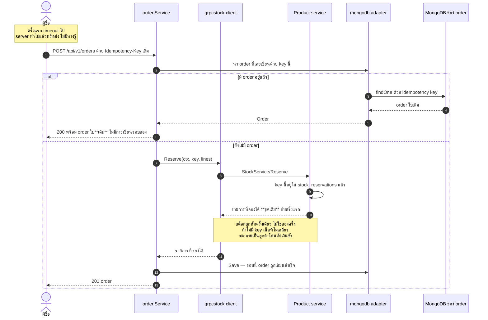
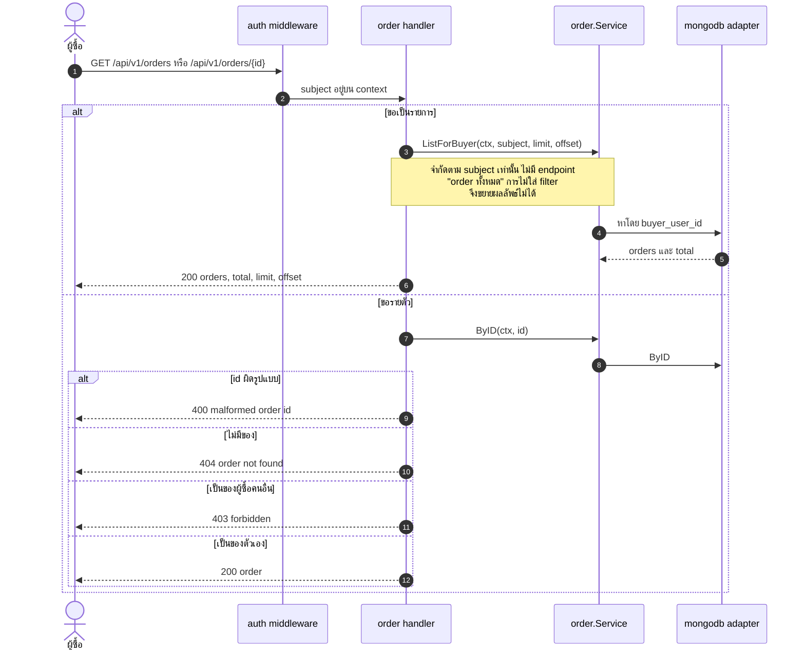
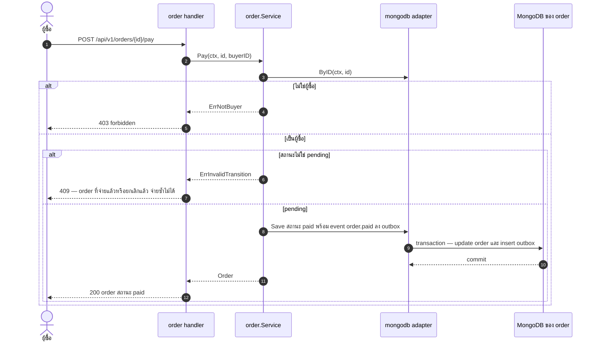
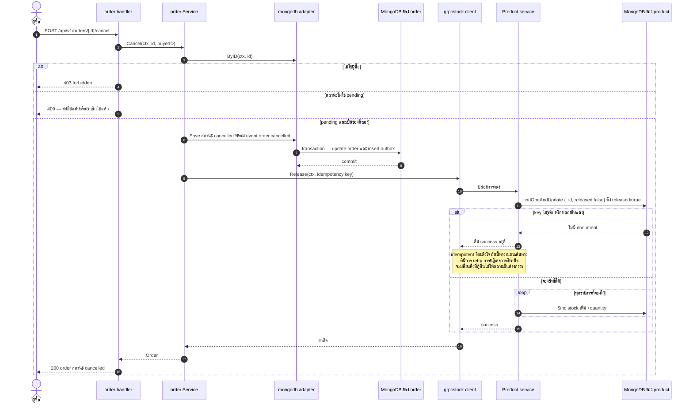

# Order — UML Sequence Diagram

*English: [order.md](order.md) · สารบัญ: [README.th.md](README.th.md)*

Saga — การสั่งซื้อพาดผ่านสอง service ที่มีคนละ database จึง **ไม่มี transaction ให้ใช้**
อะไรก็ตามที่พาดผ่านทั้งสองตัว จะเป็นลำดับของขั้นตอนในเครื่องแต่ละตัว
บวกกับการชดเชยไว้เผื่อขั้นตอนหลังพัง

| Flow | Endpoint |
|---|---|
| ⭐⭐ [การสั่งซื้อ](#-การสั่งซื้อ--saga) | `POST /api/v1/orders` |
| ⭐ [การส่ง idempotency key ซ้ำ](#-การส่ง-idempotency-key-ซ้ำ) | `POST /api/v1/orders` |
| [รายการและรายตัว](#รายการและรายตัว) | `GET /api/v1/orders`, `GET /api/v1/orders/{id}` |
| [ชำระเงิน](#ชำระเงิน) | `POST /api/v1/orders/{id}/pay` |
| ⭐ [ยกเลิก](#-ยกเลิก--compensating-action) | `POST /api/v1/orders/{id}/cancel` |

---

## ⭐⭐ การสั่งซื้อ — saga

ทั้งระบบอยู่ใน request เดียว และเป็นรูปที่ควรอ่านสองรอบ

**ทำไม call นี้ถึงต้อง synchronous** ทุกการติดต่อข้าม service ที่เหลือในระบบนี้เป็น event
เพราะที่เหลือรอได้ แต่อันนี้รอไม่ได้ — จะบอกผู้ซื้อว่า order สำเร็จไม่ได้
จนกว่าจะจอง stock ได้จริง

**ทำไม `Confirm` พังแล้วไม่ทำให้ request พัง** เพราะถึงตอนนั้น order ถูกเขียนแล้ว
และผู้ซื้อได้รับคำตอบไปแล้ว การจองแค่ยังไม่ถูก confirm เท่านั้น
และช่วงผ่อนผันของ reaper นานพอที่การ retry หรือการ restart จะแก้ได้
ถ้าทำให้ request พังตรงนี้ เท่ากับรายงานความสำเร็จว่าเป็นความล้มเหลว

**ทำไมการชดเชยเป็นแบบ best-effort** เพราะถ้า `Release` พังด้วย reaper
ก็ยังยึดสต็อกคืนอยู่ดี กลไกสองอันที่เป็นอิสระจากกันคุ้มครองช่องว่างเดียวกัน
เพราะความล้มเหลวที่แพงที่สุด — สต็อกถูกยึดไว้โดยไม่มี order ตลอดกาล — คุ้มที่จะกันสองชั้น

## ⭐ การส่ง idempotency key ซ้ำ

คือสิ่งที่ client ทำเวลา retry หลัง timeout — caller ไม่มีทางรู้ว่า server ทำไปแล้วหรือยัง
มันจึงจะ retry และ key คือสิ่งที่ทำให้การ retry นั้นปลอดภัย ไม่ให้ "จอง stock"
กลายเป็น "จอง stock สองรอบ"

## รายการและรายตัว

## ชำระเงิน

สต็อกที่จองไว้ยังคงถูกจองต่อไป เพราะการขายสำเร็จแล้ว มี state machine คุมการเปลี่ยนสถานะ
การจ่ายเงินให้ order ที่ยกเลิกไปแล้วจึงเป็น conflict ไม่ใช่การแก้ไขให้

## ⭐ ยกเลิก — compensating action

ปลายอีกด้านของ saga การยกเลิกจะปล่อยการจอง แล้วสต็อกกลับคืน

**การชดเชยต้องเรียกซ้ำได้อย่างปลอดภัย** เพราะมันทำงานบนเส้นทางที่มีการ retry อยู่แล้ว
การปล่อย key ที่ไม่รู้จัก หรือ key ที่ปล่อยไปแล้ว จะคืน success ไม่ใช่ error
ถ้าปฏิเสธการเรียกซ้ำตรงนี้ สถานการณ์ที่กู้คืนได้จะกลายเป็นค้างถาวร

