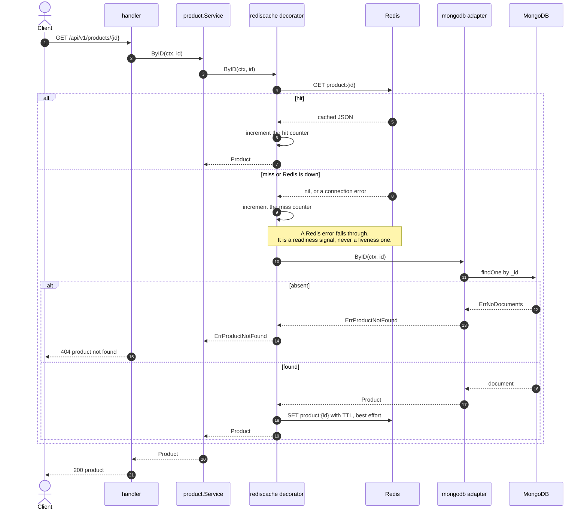
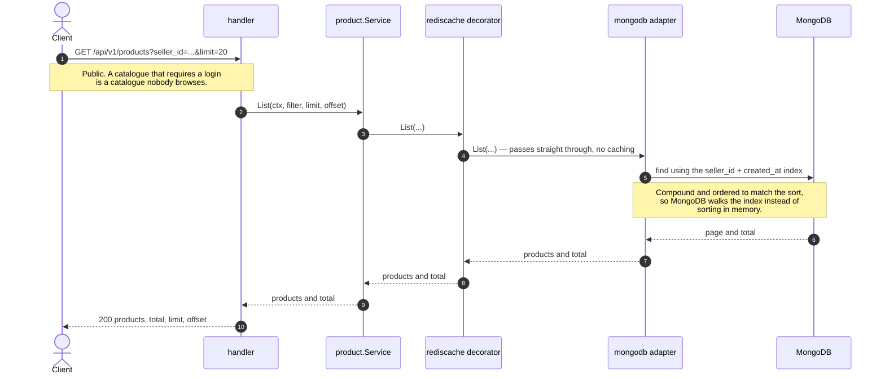
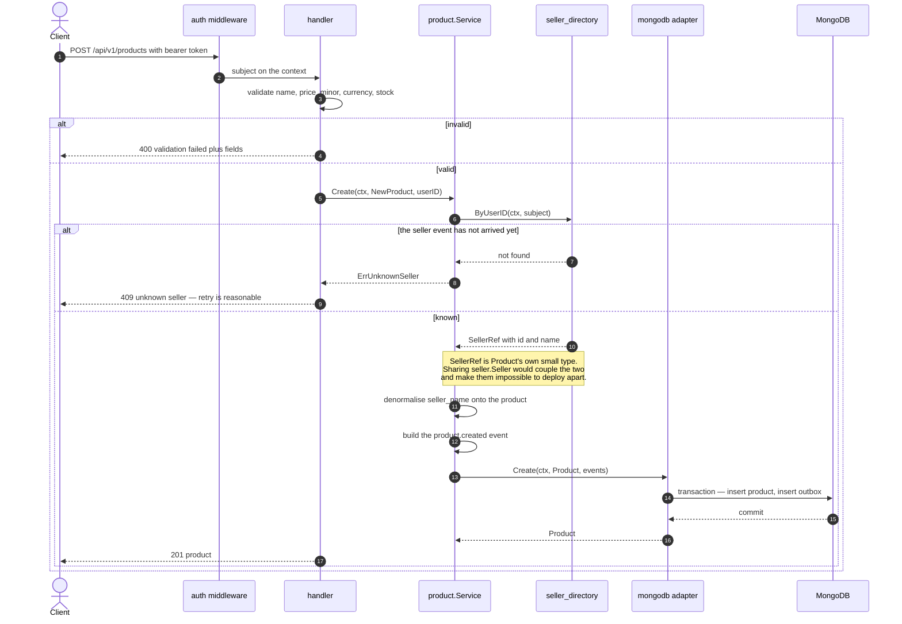
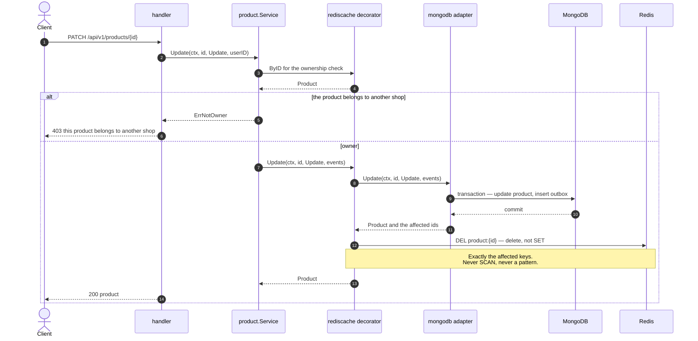
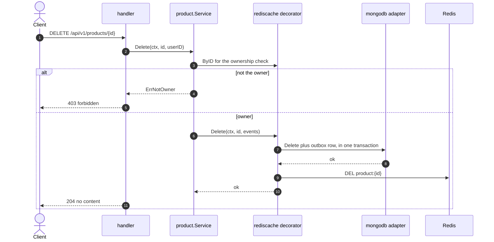
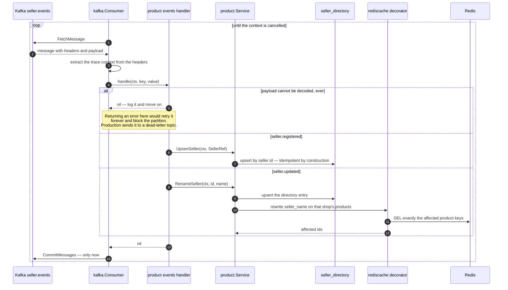
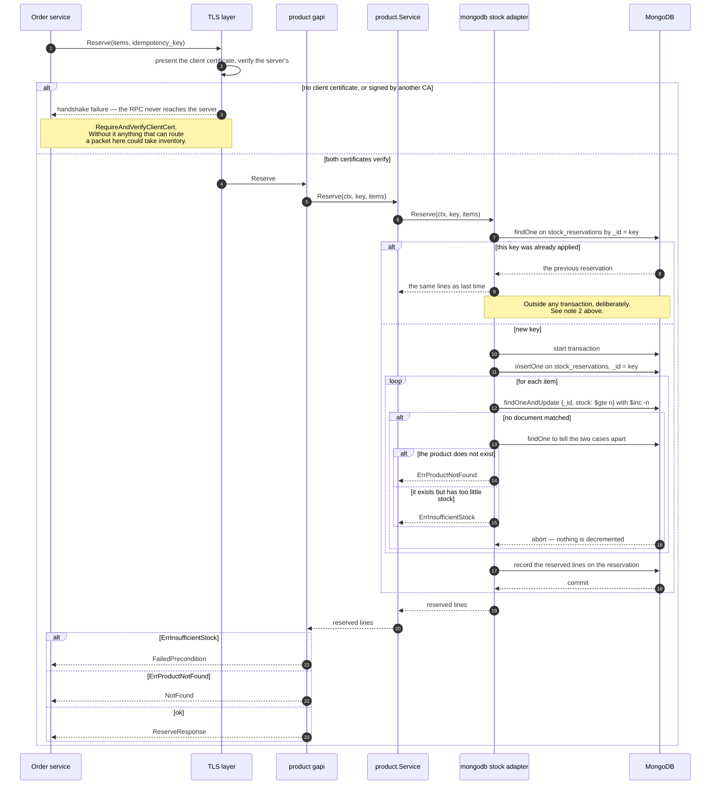
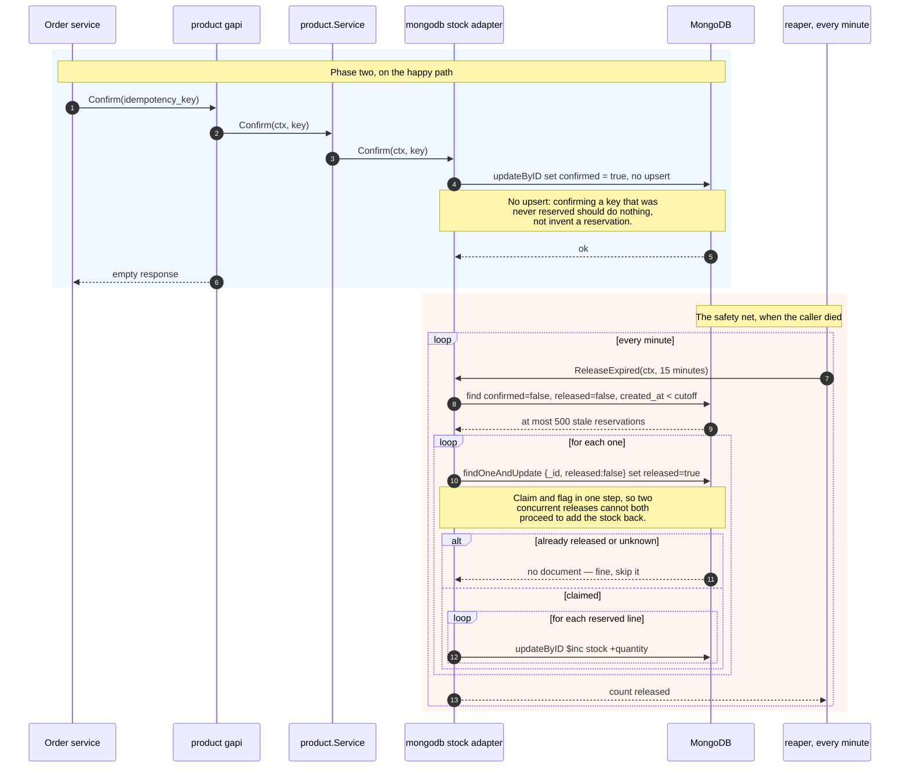

# Product — sequence diagrams

*ภาษาไทย: [product.th.md](product.th.md) · Index: [README.md](README.md)*

The catalogue, and the most technically dense of the six. It caches through
Redis, builds a read model from Kafka, and serves stock reservation over gRPC
secured by mutual TLS.

| Flow | Endpoint |
|---|---|
| ⭐ [Read a product](#-read-a-product--cache-aside) | `GET /api/v1/products/{id}` |
| [List products](#list-products--deliberately-not-cached) | `GET /api/v1/products` |
| [Create](#create-a-listing) | `POST /api/v1/products` |
| ⭐ [Update](#-update--invalidate-never-rewrite) | `PATCH /api/v1/products/{id}` |
| [Delete](#delete) | `DELETE /api/v1/products/{id}` |
| ⭐ [Consume seller events](#-consuming-the-seller-stream) | Kafka `seller.events` |
| ⭐⭐ [Reserve stock](#-reserve-stock-grpc--mutual-tls) | gRPC `StockService/Reserve` |
| ⭐ [Confirm and the reaper](#-confirm-and-the-reaper) | gRPC `StockService/Confirm` |

---

## ⭐ Read a product — cache-aside

The cache is a **decorator implementing the `Repository` port**, not a branch
inside the service. The service is written as though no cache exists, and
removing it is one line in `main`.

Note the failure branch: when Redis is unavailable the request **falls through to
MongoDB** rather than failing. A cache that fails the request when it is down has
stopped being a cache and become a dependency — it has made availability worse,
which is the opposite of the reason it was added.

## List products — deliberately not cached

Paged lists are **not** cached, and that is a decision rather than an omission:
every filter and page combination is a separate key, and one write would have to
invalidate an unknown number of them.

## Create a listing

The shop must already be known **locally**. Product does not call Seller to find
out; it consults the read model built from the seller event stream. When the
event has not arrived yet the answer is **409, not 404** — because the account
may well have a shop and retrying is the right response, which a conflict says
and a not-found does not.

## ⭐ Update — invalidate, never rewrite

Two rules are visible here.

**Writes invalidate; they do not rewrite.** Rewriting the cached value lets two
racing writers leave the older one cached indefinitely — whoever writes to Redis
last wins, and that is not necessarily whoever wrote to MongoDB last.

**Invalidation is exact, never a scan.** The repository returns the affected IDs
so the decorator deletes precisely those keys. Scanning Redis for keys that might
match is `O(keyspace)` and gets slower exactly as the system gets busier.

## Delete

## ⭐ Consuming the seller stream

Three rules that come from things that have already gone wrong elsewhere.

**Commit after handling, never before.** `FetchMessage` + `CommitMessages`
rather than `ReadMessage`, so a crash mid-handler replays the message instead of
losing it.

**Handlers must be idempotent.** Delivery is at-least-once and the commit happens
after the handler succeeds, so a repeat is certain, not possible.

**A permanently undecodable message returns nil**, not an error. Retrying it
forever blocks its partition for every message queued behind it.

## ⭐⭐ Reserve stock (gRPC + mutual TLS)

The only synchronous call between services in the whole system, and the densest
diagram in this folder. Four separate ideas are load-bearing:

1. **Mutual TLS, not a bearer token.** There is no user in this call — the
   question is *which service is asking*, and only a client certificate answers
   that.
2. **The idempotency check happens outside the transaction.** Catching the
   duplicate-key error inside it and returning success asks the driver to commit
   a transaction that already contains a failed write; the commit fails with a
   retryable label, `WithTransaction` retries, the duplicate is still there, and
   the call spins until its context expires. That bug hung a test for 90 seconds.
3. **The decrement is a conditional update, not a lock.** `{_id, stock: {$gte: n}}`
   with `$inc` — the server matches and decrements in one step, so two buyers
   racing for the last unit cannot both succeed.
4. **The transaction is what makes it all-or-nothing across lines.** Per item the
   conditional update is already atomic; the transaction is there so a failure on
   the third line does not leave the first two decremented.

## ⭐ Confirm and the reaper

Two-phase reservation. `Reserve` takes the stock; `Confirm` says an order was
actually written against it. Anything still unconfirmed after the grace period
belongs to a caller that died between the two — and no amount of compensation
logic in that caller helps, because the caller is the thing that died.

The grace period is generous on purpose: reclaiming stock from an order that was
actually placed is a far worse failure than holding it a little longer.

