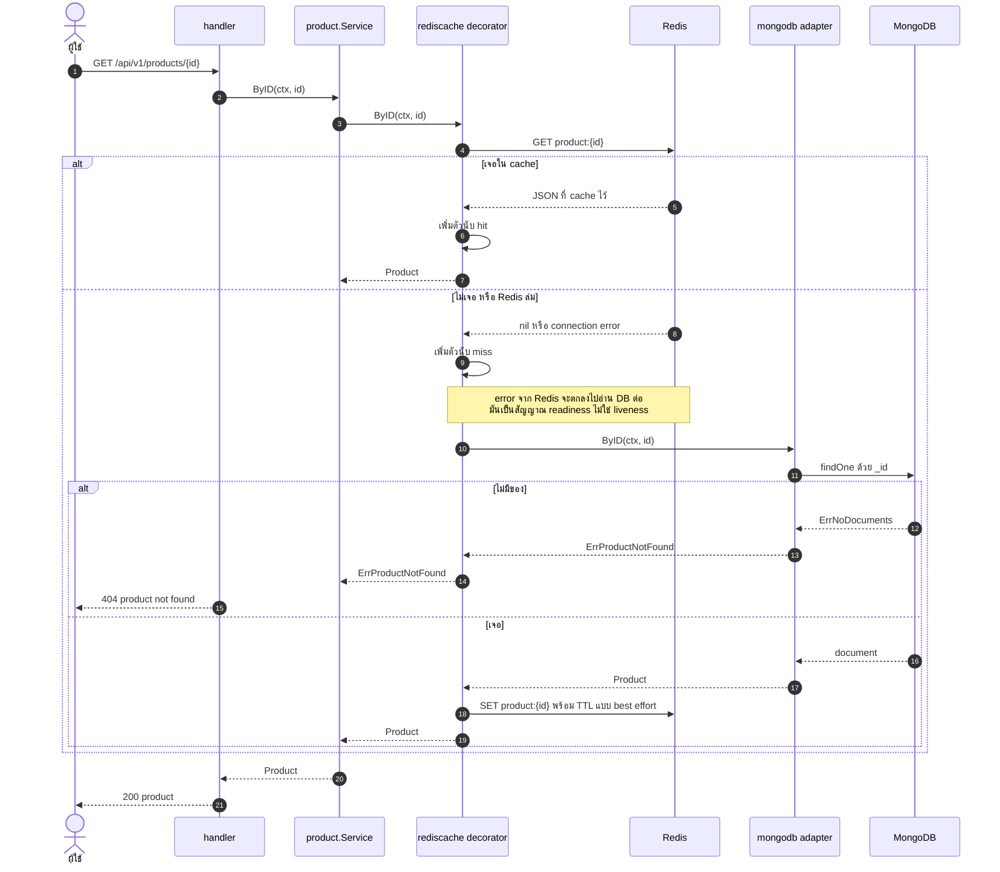
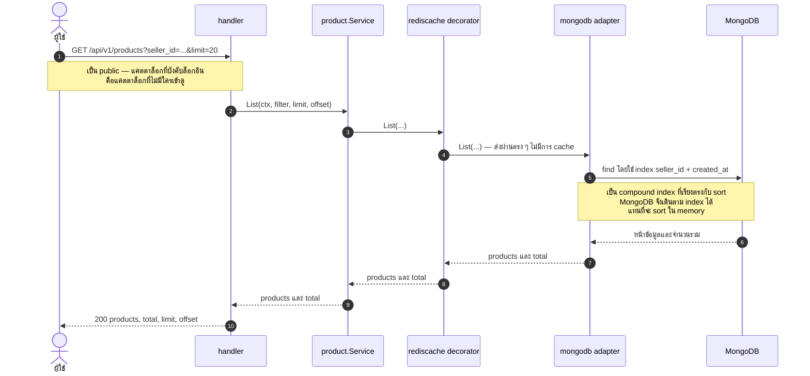
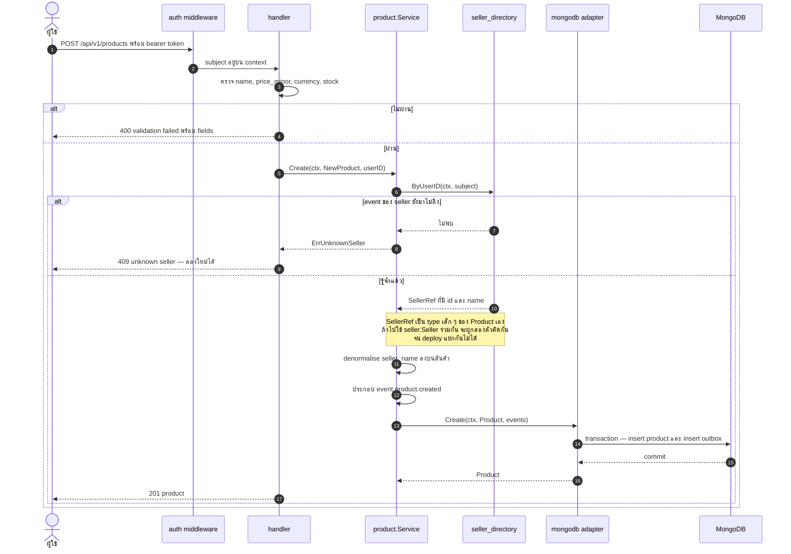
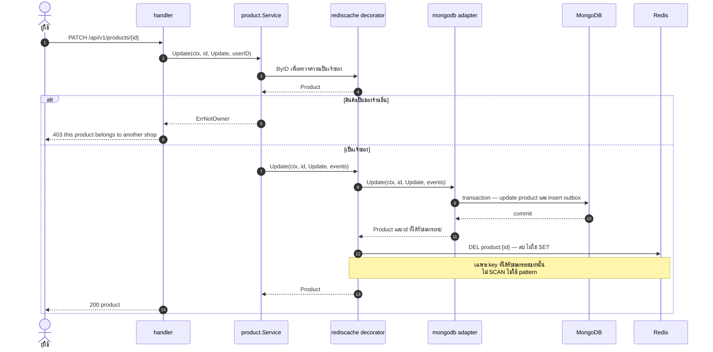
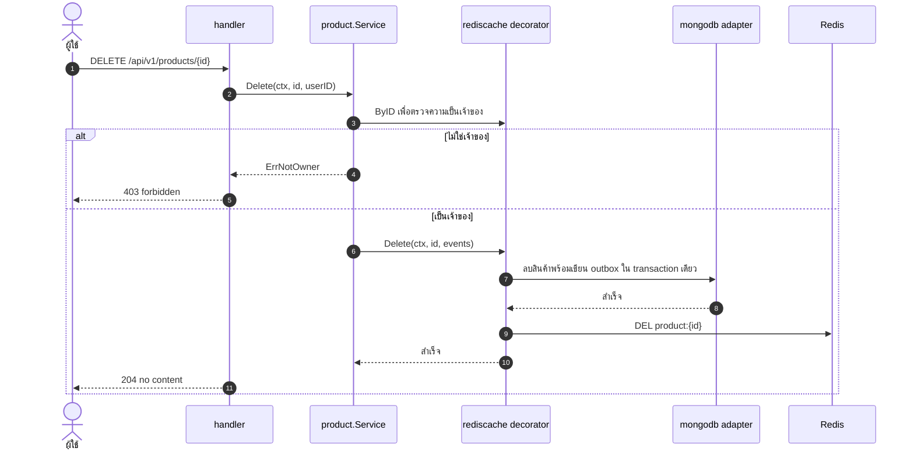
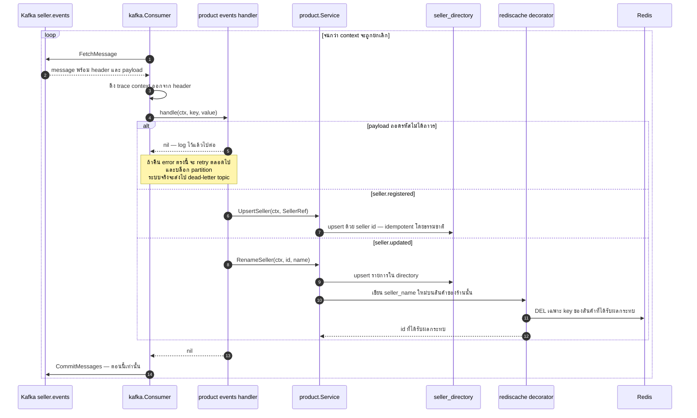
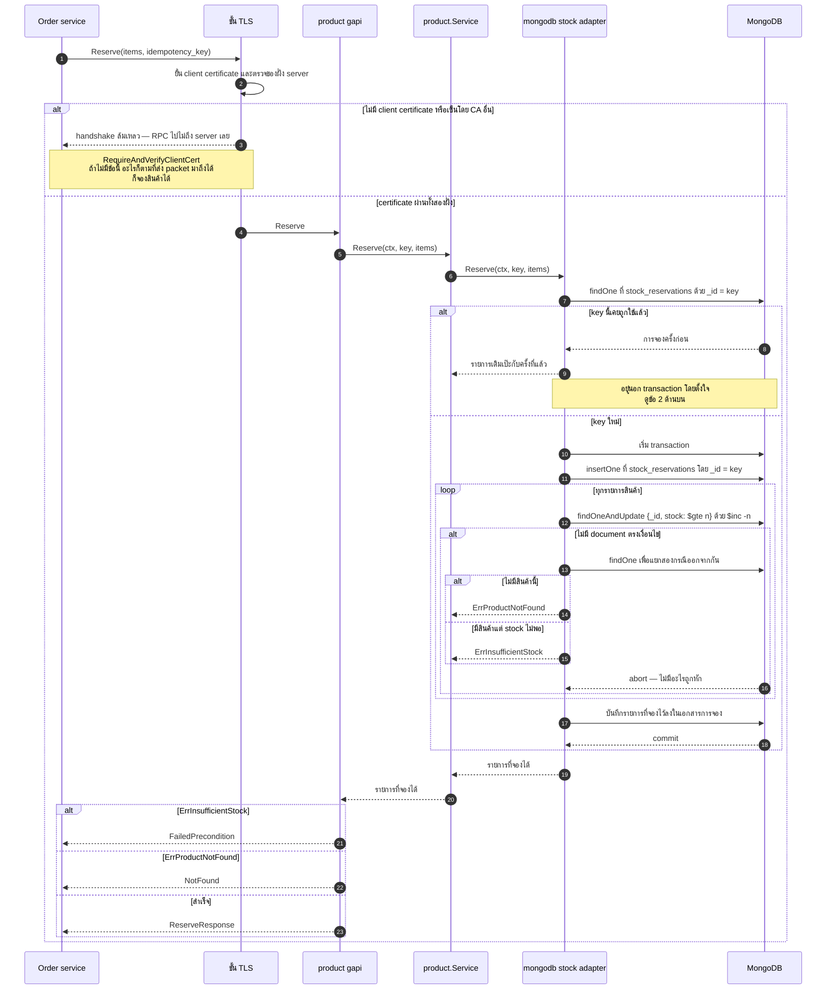
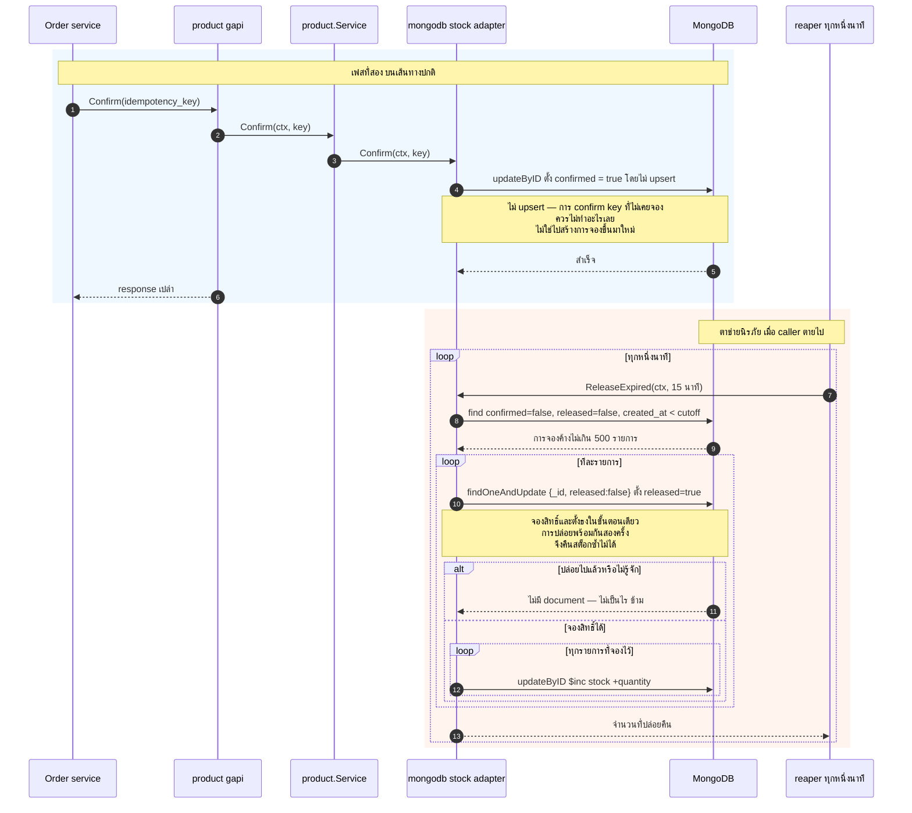

# Product — UML Sequence Diagram

*English: [product.md](product.md) · สารบัญ: [README.th.md](README.th.md)*

แคตตาล็อกสินค้า และเป็น domain ที่มีเนื้อเทคนิคแน่นที่สุดในหกตัว มันทำ cache ผ่าน Redis
สร้าง read model จาก Kafka และให้บริการจอง stock ผ่าน gRPC ที่ป้องกันด้วย mutual TLS

| Flow | Endpoint |
|---|---|
| ⭐ [อ่านสินค้ารายชิ้น](#-อ่านสินค้ารายชิ้น--cache-aside) | `GET /api/v1/products/{id}` |
| [รายการสินค้า](#รายการสินค้า--ตั้งใจไม่-cache) | `GET /api/v1/products` |
| [สร้างสินค้า](#สร้างสินค้า) | `POST /api/v1/products` |
| ⭐ [แก้ไข](#-แก้ไข--ล้าง-cache-ไม่ใช่เขียนทับ) | `PATCH /api/v1/products/{id}` |
| [ลบ](#ลบ) | `DELETE /api/v1/products/{id}` |
| ⭐ [consume event จาก seller](#-consume-stream-ของ-seller) | Kafka `seller.events` |
| ⭐⭐ [จอง stock](#-จอง-stock-grpc--mutual-tls) | gRPC `StockService/Reserve` |
| ⭐ [Confirm และ reaper](#-confirm-และ-reaper) | gRPC `StockService/Confirm` |

---

## ⭐ อ่านสินค้ารายชิ้น — cache-aside

cache เป็น **decorator ที่ implement `Repository` port** ไม่ใช่ if-else ใน service
ตัว service เขียนเหมือนไม่มี cache อยู่เลย และถ้าจะเอา cache ออกก็แก้บรรทัดเดียวใน `main`

สังเกตกิ่งที่ fail: เมื่อ Redis ใช้ไม่ได้ request จะ **ตกไปอ่าน MongoDB** แทนที่จะพัง
เพราะ cache ที่ทำให้ request พังตอนมันล่ม ไม่ใช่ cache แล้ว แต่กลายเป็น dependency
มันทำให้ availability แย่ลง ซึ่งตรงข้ามกับเหตุผลที่ใส่มันเข้ามาตั้งแต่แรก

## รายการสินค้า — ตั้งใจไม่ cache

รายการที่แบ่งหน้า **ไม่** ถูก cache และเป็นการตัดสินใจ ไม่ใช่การลืม
เพราะทุกชุด filter และทุกหน้าคือ key คนละอัน การเขียนครั้งเดียวจะต้องล้าง key
จำนวนที่ไม่รู้ล่วงหน้า

## สร้างสินค้า

ร้านค้าต้องเป็นที่รู้จัก **ในเครื่องนี้** อยู่แล้ว Product ไม่ได้เรียกไปถาม Seller
แต่ดูจาก read model ที่สร้างจาก event stream ของ seller
ถ้า event ยังมาไม่ถึง คำตอบคือ **409 ไม่ใช่ 404** เพราะบัญชีนั้นอาจมีร้านอยู่จริง
และการลองใหม่คือสิ่งที่ควรทำ ซึ่ง conflict สื่อความนั้น ส่วน not-found ไม่สื่อ

## ⭐ แก้ไข — ล้าง cache ไม่ใช่เขียนทับ

ตรงนี้เห็นกฎสองข้อ

**การเขียนจะล้าง cache ไม่ใช่เขียนทับ** เพราะถ้าเขียนทับ เมื่อมีคนเขียนพร้อมกันสองคน
ค่าเก่ากว่าอาจค้างใน cache ตลอดไป — ใครเขียนลง Redis ทีหลังคนนั้นชนะ
ซึ่งไม่จำเป็นต้องเป็นคนเดียวกับที่เขียนลง MongoDB ทีหลัง

**การล้างทำแบบเจาะจง ไม่ใช่การ scan** repository คืน ID ที่ได้รับผลกระทบมาให้
decorator ลบเฉพาะ key เหล่านั้น การ scan Redis หา key ที่อาจตรงคือ `O(keyspace)`
และจะยิ่งช้าลงพอดีตอนที่ระบบยิ่งมีงานเยอะ

## ลบ

## ⭐ consume stream ของ seller

กฎสามข้อที่มาจากสิ่งที่เคยพังมาแล้วจริง ๆ

**commit หลังจากจัดการเสร็จ ห้ามก่อน** ใช้ `FetchMessage` + `CommitMessages`
แทน `ReadMessage` เพื่อให้การ crash กลาง handler ทำให้ข้อความถูกส่งซ้ำ ไม่ใช่หายไป

**handler ต้อง idempotent** เพราะการส่งเป็นแบบ at-least-once และ commit เกิดหลัง
handler สำเร็จ การได้รับซ้ำจึงเป็นเรื่องที่ต้องเกิดแน่ ๆ ไม่ใช่แค่อาจเกิด

**ข้อความที่ถอดรหัสไม่ได้ถาวร ให้คืน nil** ไม่ใช่ error เพราะการ retry มันตลอดไป
จะบล็อก partition นั้นสำหรับทุกข้อความที่ต่อคิวอยู่ข้างหลัง

## ⭐⭐ จอง stock (gRPC + mutual TLS)

เป็น synchronous call เดียวระหว่าง service ในระบบทั้งหมด และเป็นรูปที่แน่นที่สุดใน folder นี้
มีสี่แนวคิดที่เป็นแกนหลัก

1. **ใช้ mutual TLS ไม่ใช่ bearer token** เพราะ call นี้ไม่มี user อยู่เลย
   คำถามคือ *service ไหนเป็นคนถาม* ซึ่งมีแต่ client certificate ที่ตอบได้
2. **การเช็ค idempotency เกิดขึ้นนอก transaction** ถ้าดัก duplicate-key error
   ไว้ข้างในแล้วคืน success เท่ากับสั่งให้ driver commit transaction ที่มี write
   ที่ fail อยู่ข้างในแล้ว commit จะ fail แบบ retryable แล้ว `WithTransaction`
   จะ retry ตัวซ้ำก็ยังอยู่ วนจน context หมดอายุ bug นี้เคยทำ test ค้าง 90 วินาที
3. **การหักสต็อกเป็น conditional update ไม่ใช่ lock** — `{_id, stock: {$gte: n}}`
   คู่กับ `$inc` server จับคู่และหักในขั้นตอนเดียว ผู้ซื้อสองคนที่แย่งชิ้นสุดท้าย
   จึงสำเร็จพร้อมกันไม่ได้
4. **transaction คือสิ่งที่ทำให้ได้ทั้งหมดหรือไม่ได้เลยข้ามหลายรายการ** เพราะต่อรายการนั้น
   conditional update atomic อยู่แล้ว transaction มีไว้เพื่อไม่ให้การพังที่รายการที่สาม
   ทิ้งรายการที่หนึ่งกับสองที่หักไปแล้วค้างไว้

## ⭐ Confirm และ reaper

การจองแบบสองเฟส `Reserve` หักสต็อกไว้ ส่วน `Confirm` บอกว่ามี order ถูกเขียนจริงแล้ว
อะไรก็ตามที่ยังไม่ confirm หลังพ้นช่วงผ่อนผัน แปลว่าเป็นของ caller ที่ตายไประหว่างสองขั้นตอน
และตรรกะการชดเชยใน caller ก็ช่วยไม่ได้ เพราะ caller คือสิ่งที่ตายไป

ช่วงผ่อนผันตั้งไว้เผื่อเยอะโดยตั้งใจ เพราะการไปยึดสต็อกคืนจาก order ที่สั่งจริง
เป็นความล้มเหลวที่แย่กว่าการถือสต็อกไว้นานอีกหน่อยมาก

