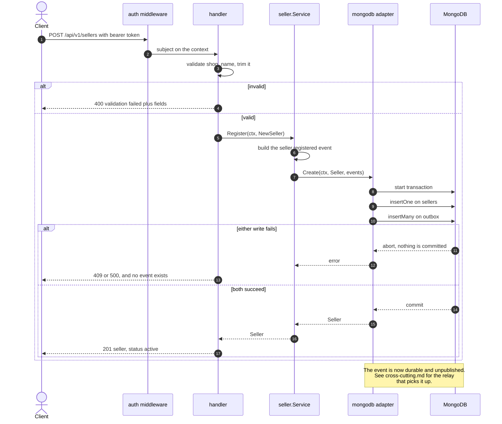
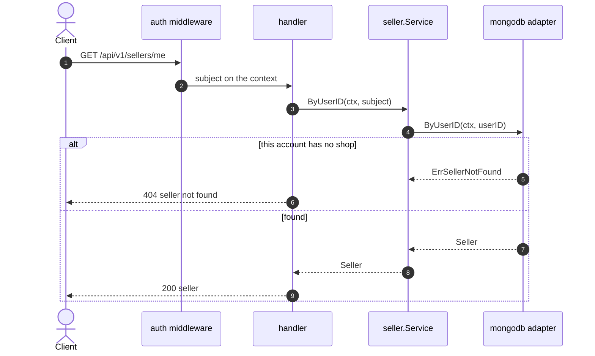
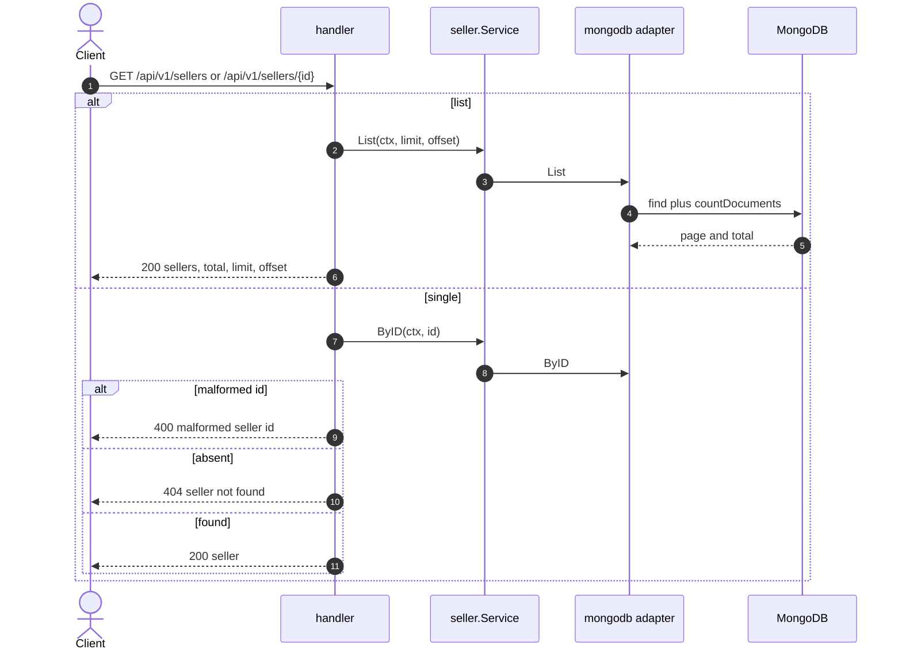
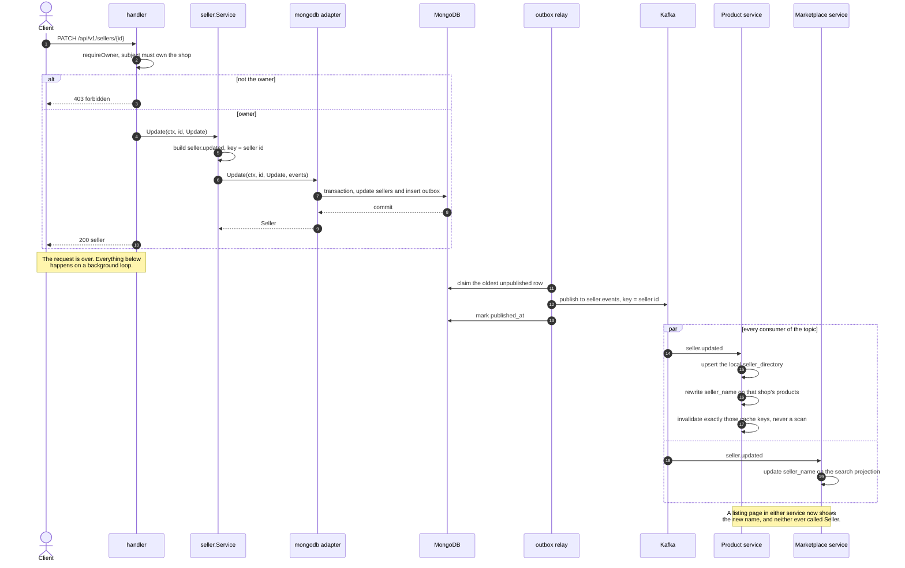

# Seller — sequence diagrams

*ภาษาไทย: [seller.th.md](seller.th.md) · Index: [README.md](README.md)*

Shops. Every write here publishes an event that Product and Marketplace consume
— this is where the event-driven half of the system starts.

| Flow | Endpoint |
|---|---|
| [Open a shop](#open-a-shop) | `POST /api/v1/sellers` |
| [My shop](#my-shop) | `GET /api/v1/sellers/me` |
| [List and get](#list-and-get) | `GET /api/v1/sellers`, `GET /api/v1/sellers/{id}` |
| ⭐ [Rename a shop](#-rename-a-shop--the-one-worth-running) | `PATCH /api/v1/sellers/{id}` |

---

## Open a shop

The shop row and its event are written in **one transaction**. The event is not
published here — a background relay does that afterwards. Publishing from the
request path leaves a window: the write commits, the publish fails, and the shop
exists while nobody was told. Returning an error would not help, because the
write already happened.

## My shop

Resolves the shop from the token's subject rather than a path parameter. There is
no ID to get wrong, and no way to ask for somebody else's.

## List and get

## ⭐ Rename a shop — the one worth running

This is the diagram that shows the architecture. Renaming a shop changes rows in
**two other services** without either of them being called.

Product never calls Seller. It keeps its own read model built from this stream,
so rendering a listing page costs zero outbound calls — and a Seller service that
is down does not stop the catalogue from rendering.

The event is keyed by seller ID because Kafka orders **per partition**: two
renames of one shop must share a key or they can be applied backwards.

