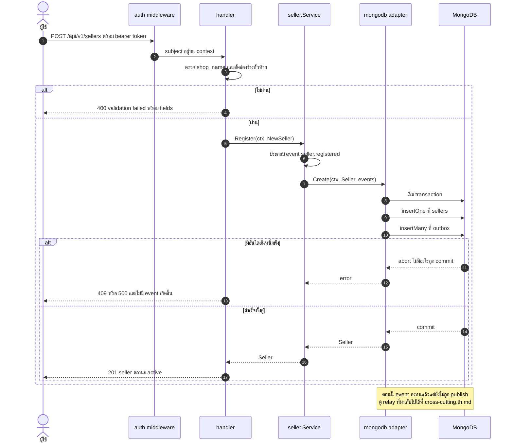
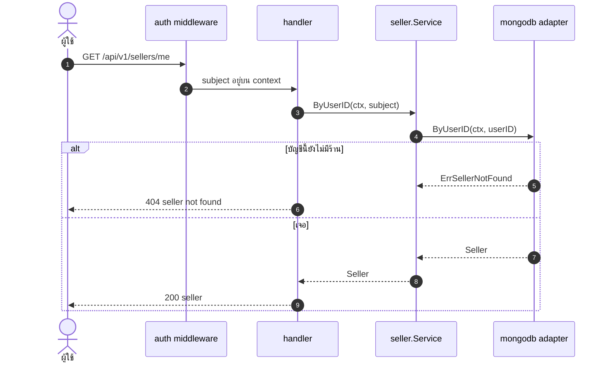
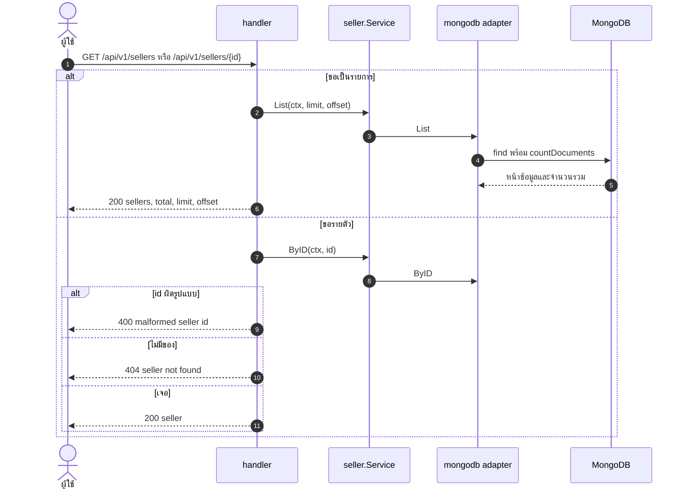
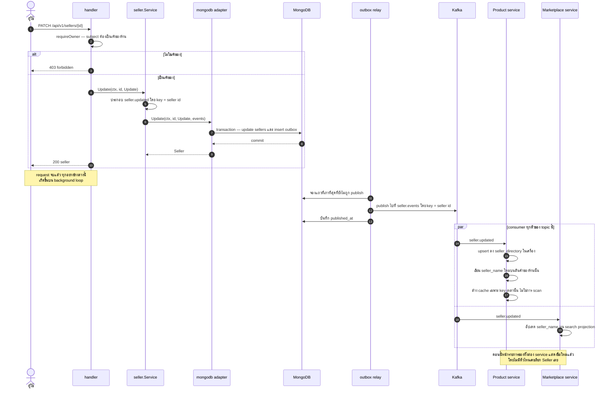

# Seller — UML Sequence Diagram

*English: [seller.md](seller.md) · สารบัญ: [README.th.md](README.th.md)*

ร้านค้า — ทุกการเขียนในนี้จะ publish event ที่ Product และ Marketplace consume
นี่คือจุดเริ่มต้นของฝั่ง event-driven ของระบบ

| Flow | Endpoint |
|---|---|
| [เปิดร้าน](#เปิดร้าน) | `POST /api/v1/sellers` |
| [ร้านของฉัน](#ร้านของฉัน) | `GET /api/v1/sellers/me` |
| [รายการและรายตัว](#รายการและรายตัว) | `GET /api/v1/sellers`, `GET /api/v1/sellers/{id}` |
| ⭐ [เปลี่ยนชื่อร้าน](#-เปลี่ยนชื่อร้าน--รูปที่ควรลองรันจริง) | `PATCH /api/v1/sellers/{id}` |

---

## เปิดร้าน

row ของร้าน กับ event ของมัน ถูกเขียนใน **transaction เดียวกัน** และ event
ไม่ได้ถูก publish ตรงนี้ — มี relay เบื้องหลังมาทำทีหลัง
เพราะการ publish จาก request path จะเหลือช่องว่างไว้: write commit สำเร็จ
แต่ publish พัง แล้วร้านมีอยู่จริงโดยไม่มีใครรู้ และการคืน error ก็ไม่ช่วย เพราะ write เกิดไปแล้ว

## ร้านของฉัน

หาร้านจาก subject ของ token แทนที่จะรับ ID ทาง path — ไม่มี ID ให้ใส่ผิด
และไม่มีทางถามหาร้านของคนอื่น

## รายการและรายตัว

## ⭐ เปลี่ยนชื่อร้าน — รูปที่ควรลองรันจริง

นี่คือรูปที่ทำให้เห็นสถาปัตยกรรมชัดที่สุด การเปลี่ยนชื่อร้านจะไปเปลี่ยนข้อมูลใน
**service อีกสองตัว** โดยไม่มีการเรียก service ทั้งสองนั้นเลยสักครั้ง

Product ไม่เคยเรียก Seller เลย มันสร้าง read model ของตัวเองจาก stream นี้
การ render หน้ารายการสินค้าจึงไม่มี outbound call เลย และถ้า Seller service ล่ม
ก็ไม่ได้ทำให้ดูแคตตาล็อกไม่ได้

event ใช้ seller ID เป็น key เพราะ Kafka เรียงลำดับ **ต่อ partition**
ถ้าเปลี่ยนชื่อร้านเดียวกันสองครั้งแล้วไม่ใช้ key เดียวกัน ลำดับอาจสลับกันได้

