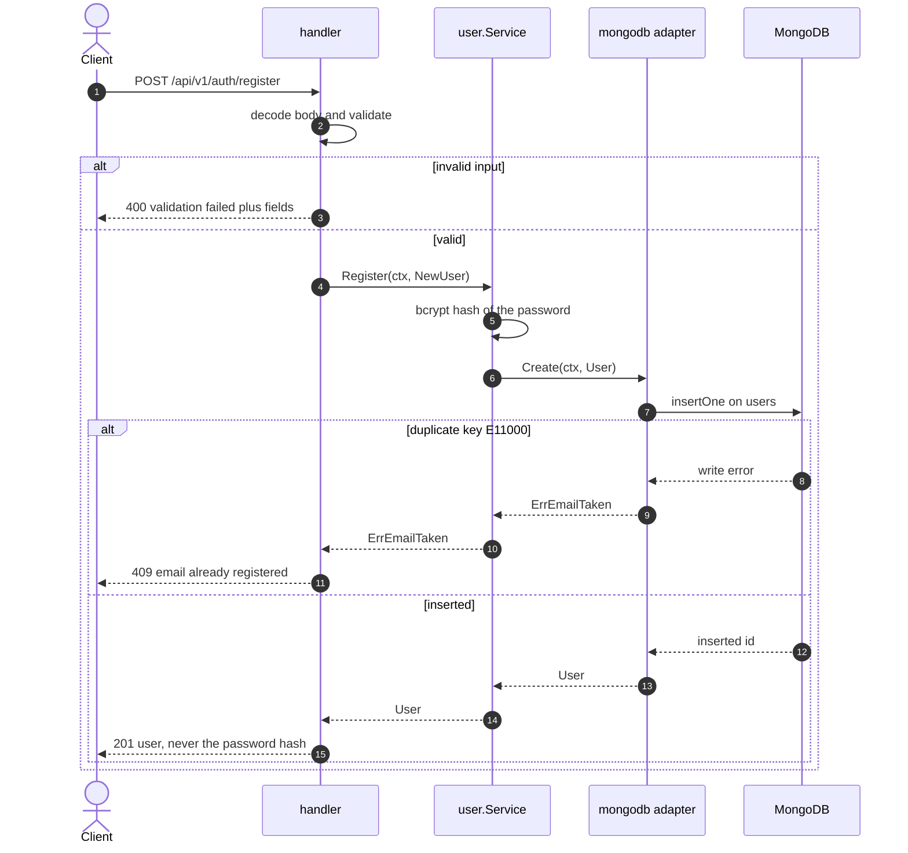
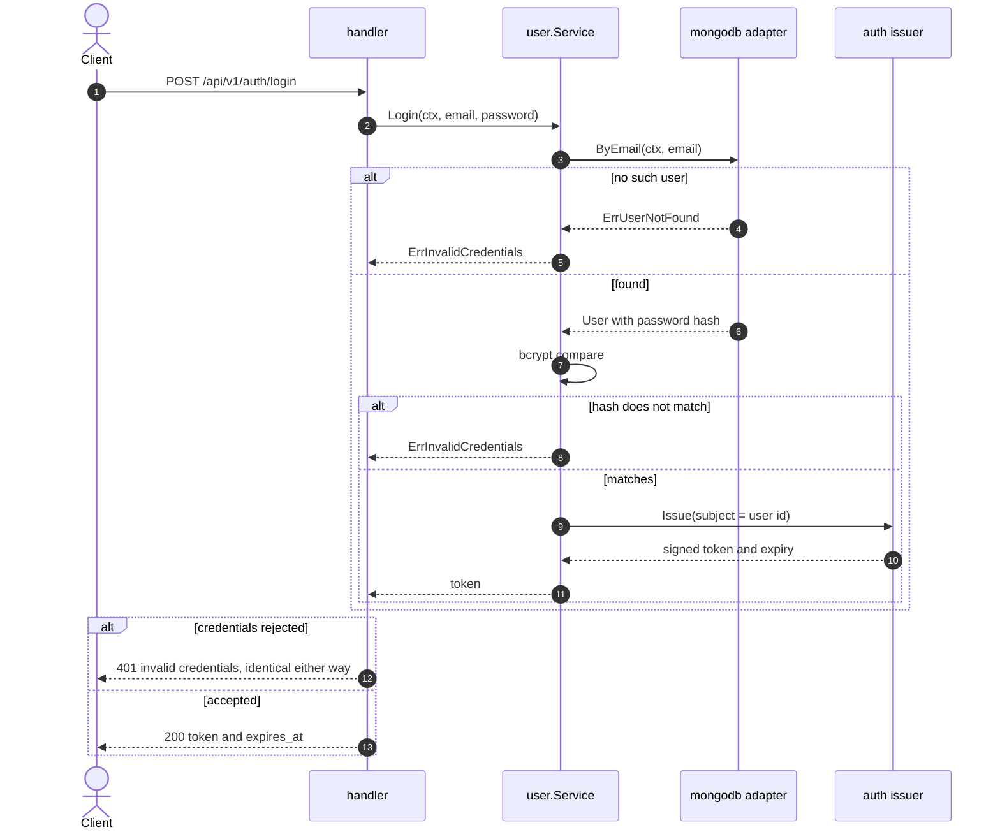
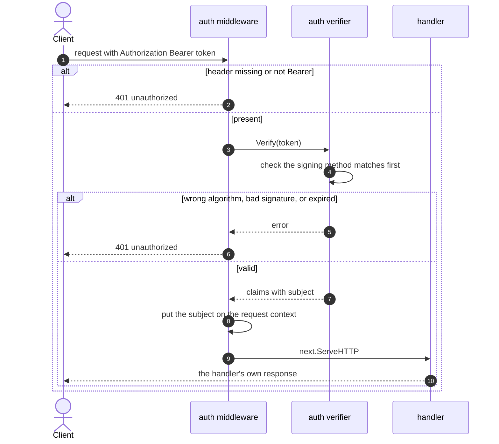
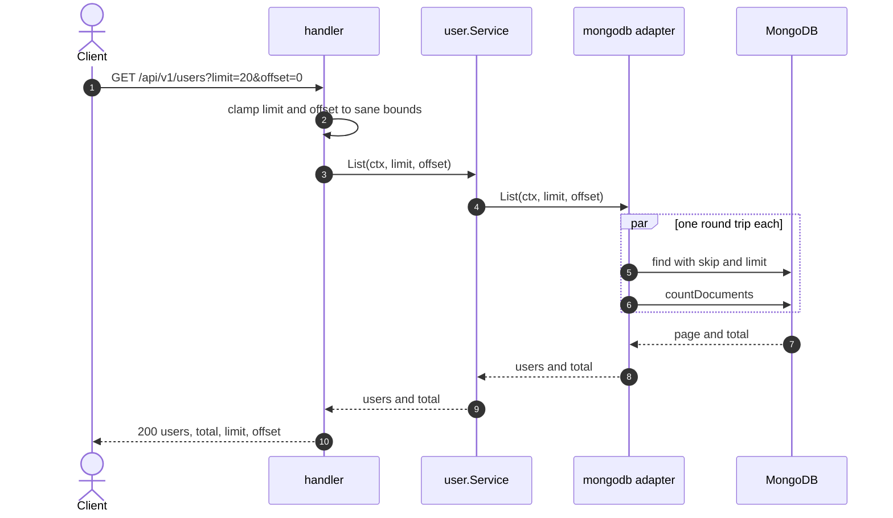
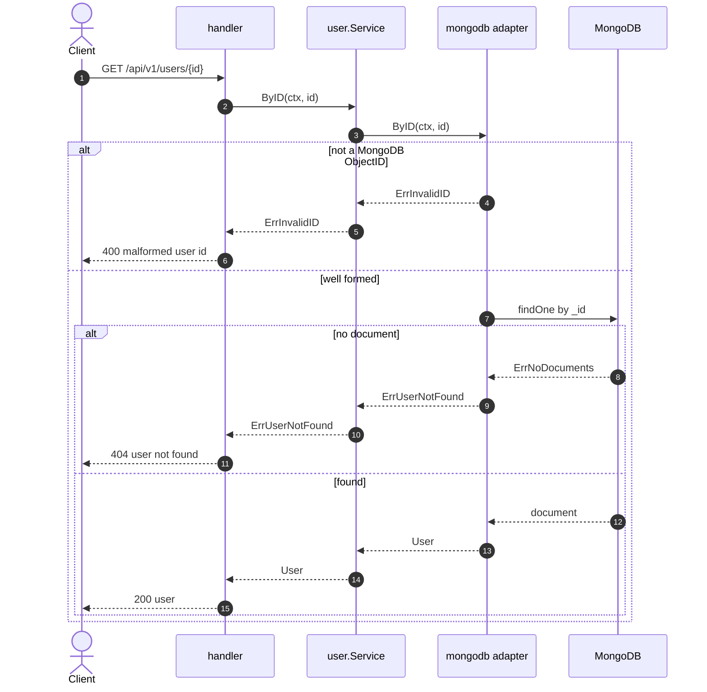
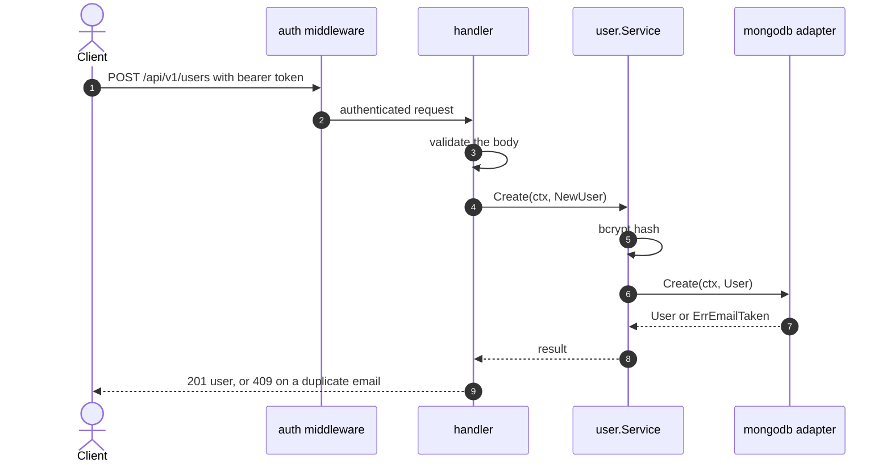
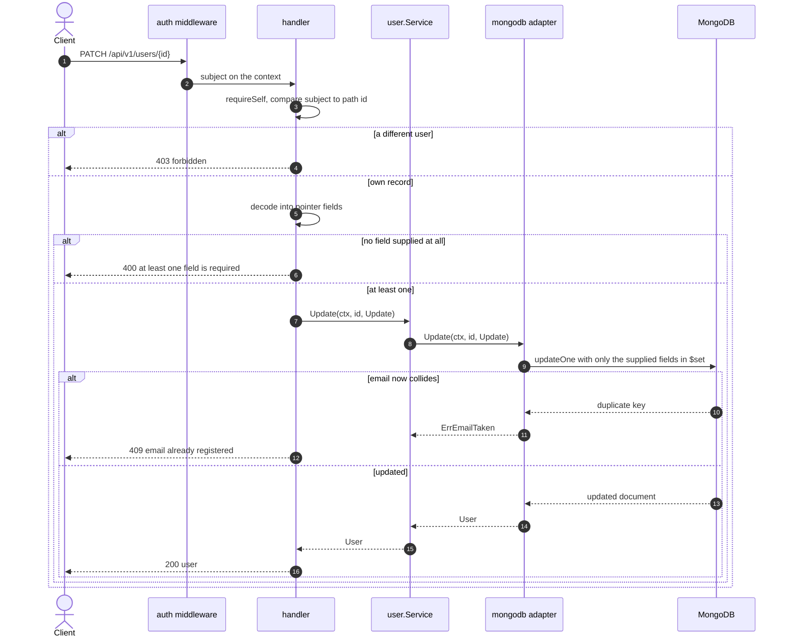
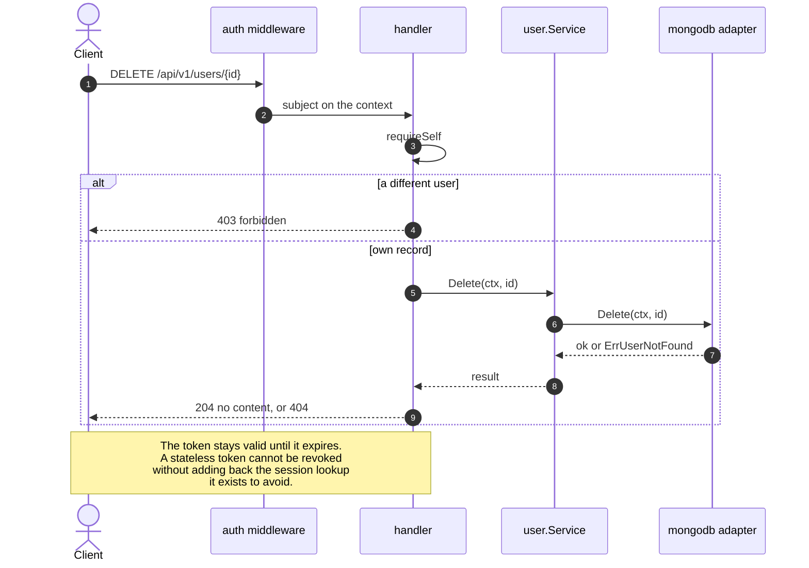
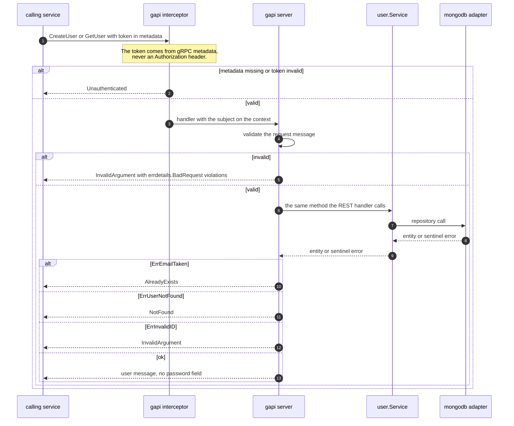

# User — sequence diagrams

*ภาษาไทย: [user.th.md](user.th.md) · Index: [README.md](README.md)*

The first domain, and the template every other one copies. Two driving adapters
— REST and gRPC — over one service, with no branching inside it.

| Flow | Endpoint |
|---|---|
| [Register](#register) | `POST /api/v1/auth/register` |
| [Login](#login) | `POST /api/v1/auth/login` |
| [Bearer authentication](#bearer-authentication-every-protected-route) | every protected route |
| [List users](#list-users) | `GET /api/v1/users` |
| [Get one user](#get-one-user) | `GET /api/v1/users/{id}` |
| [Create a user](#create-a-user) | `POST /api/v1/users` |
| [Update](#update-patch-not-put) | `PATCH /api/v1/users/{id}` |
| [Delete](#delete) | `DELETE /api/v1/users/{id}` |
| [gRPC](#grpc-createuser-and-getuser) | `user.v1.UserService/*` |

---

## Register

The interesting part is the failure branch. Uniqueness is enforced by a **unique
index in MongoDB**, not by an application-level "does this email exist?" query
before the insert — that check races, and two concurrent registrations would
both pass it and both insert.

## Login

An unknown email and a wrong password take different internal paths and produce
the **same** 401, so login cannot be used to discover which addresses are
registered. The bcrypt comparison is deliberately slow — it is the reason the
login endpoint benchmarks at 63 req/s against the catalogue's 13,818.

## Bearer authentication (every protected route)

Verification pins the signing algorithm **before** trusting any claim. Without
that, a token declaring `none` verifies with no signature at all, and one
declaring `RS256` can be signed using the public key as an HMAC secret.

## List users

## Get one user

A **malformed** ID is 400 and a well-formed one that names nothing is 404. They
are different mistakes, and collapsing them loses information the caller needs.

## Create a user

Same write as Register, different authorization: this one requires a token.
"Sign me up" and "add a user to the system" are different operations even though
they produce the same row.

## Update (PATCH, not PUT)

The brief asks to update a name **or** an email, so an omitted field must be left
alone. A struct of plain strings cannot express that — an absent field and an
empty one look identical — so the request type uses `*string`: `nil` means "not
supplied", `""` means "set it to empty".

## Delete

## gRPC: CreateUser and GetUser

Two adapters over one service is the point of the hexagon: `gapi` and `handler`
call the identical `user.Service`, and the service knows about neither HTTP
status codes nor gRPC codes. **Each adapter owns its own error mapping.**

The gRPC surface is deliberately only these two. `ListUsers` and `Login` are
anti-patterns there: a service must never authenticate *as* a user, it
propagates the user's token.

