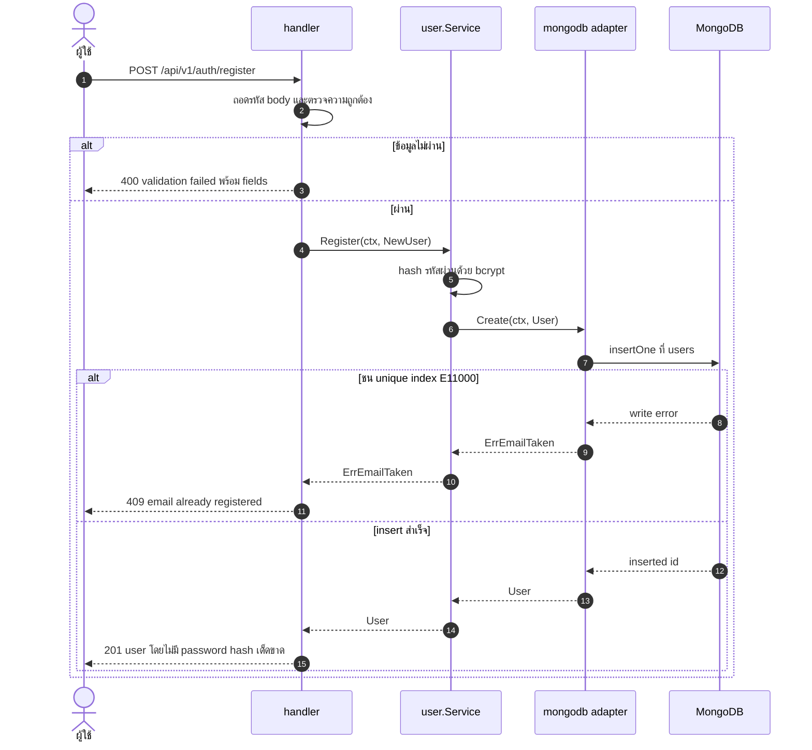
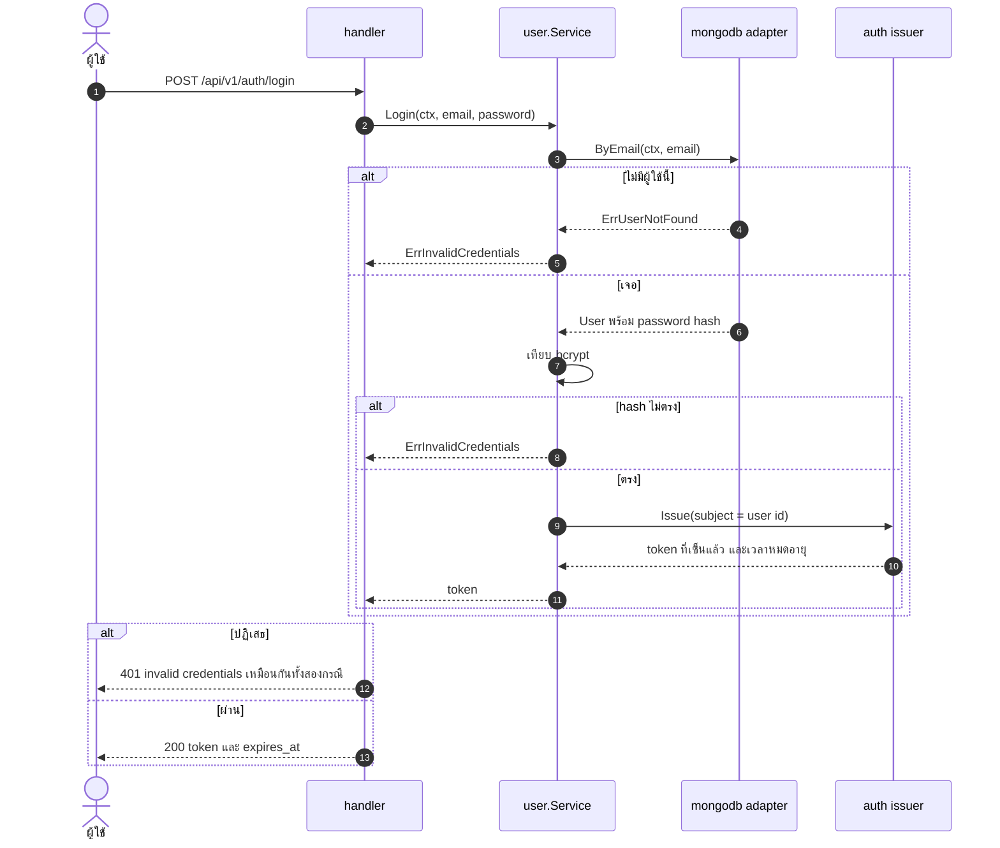
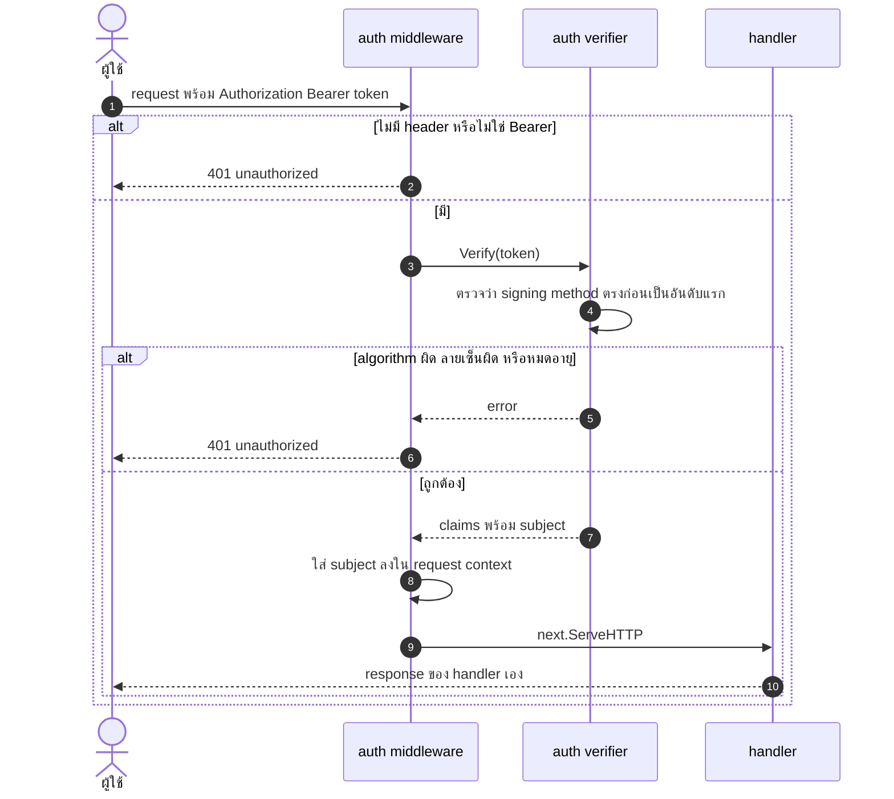
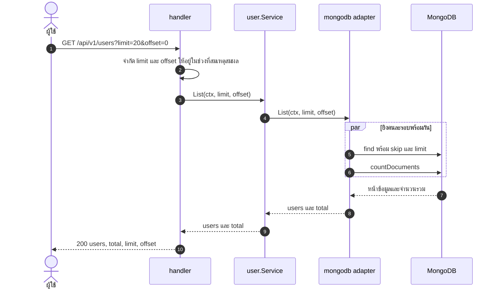
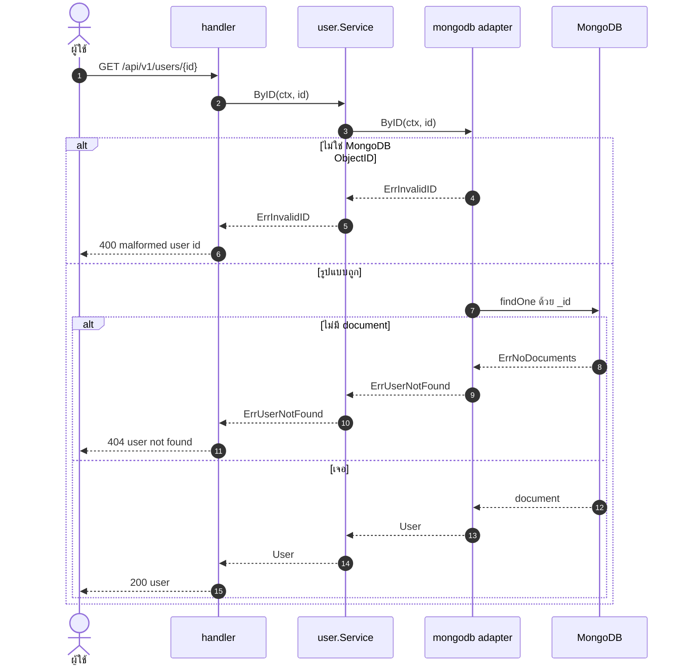
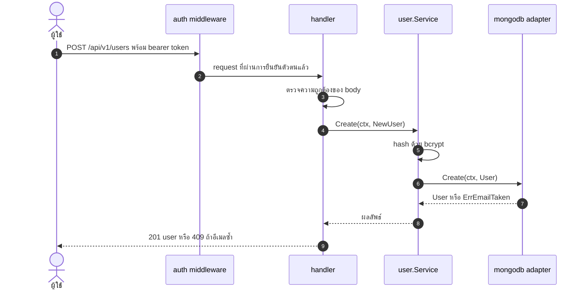
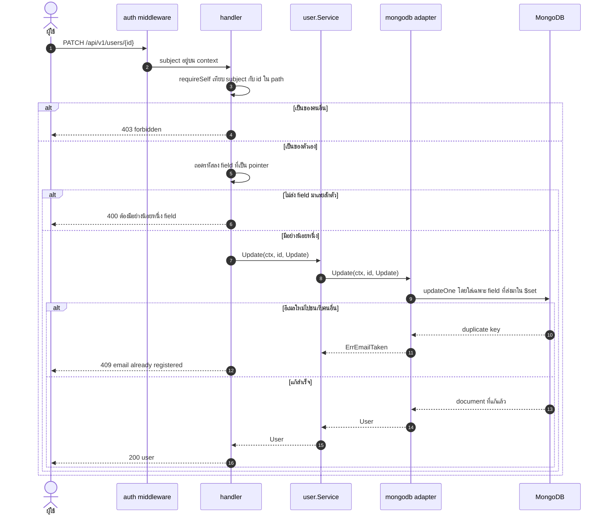
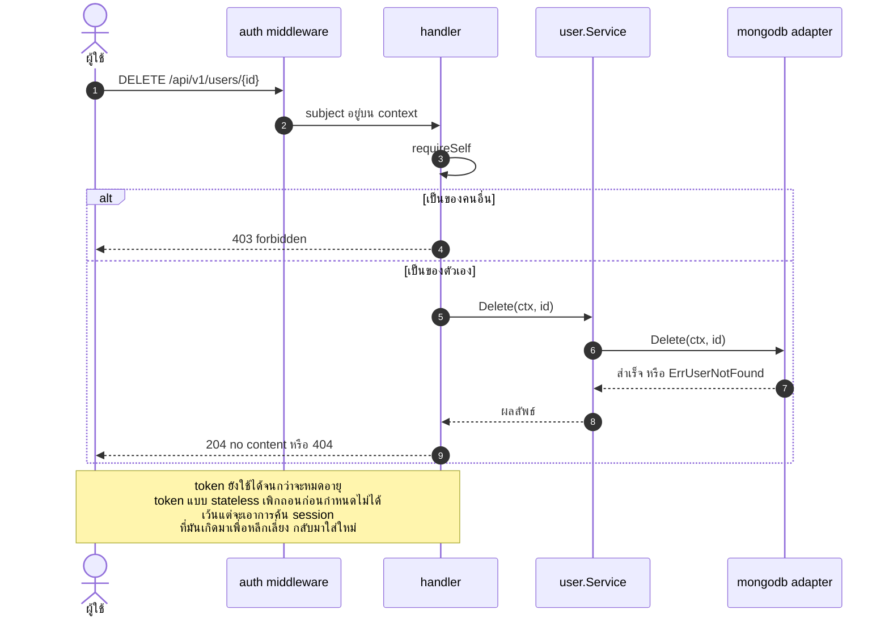
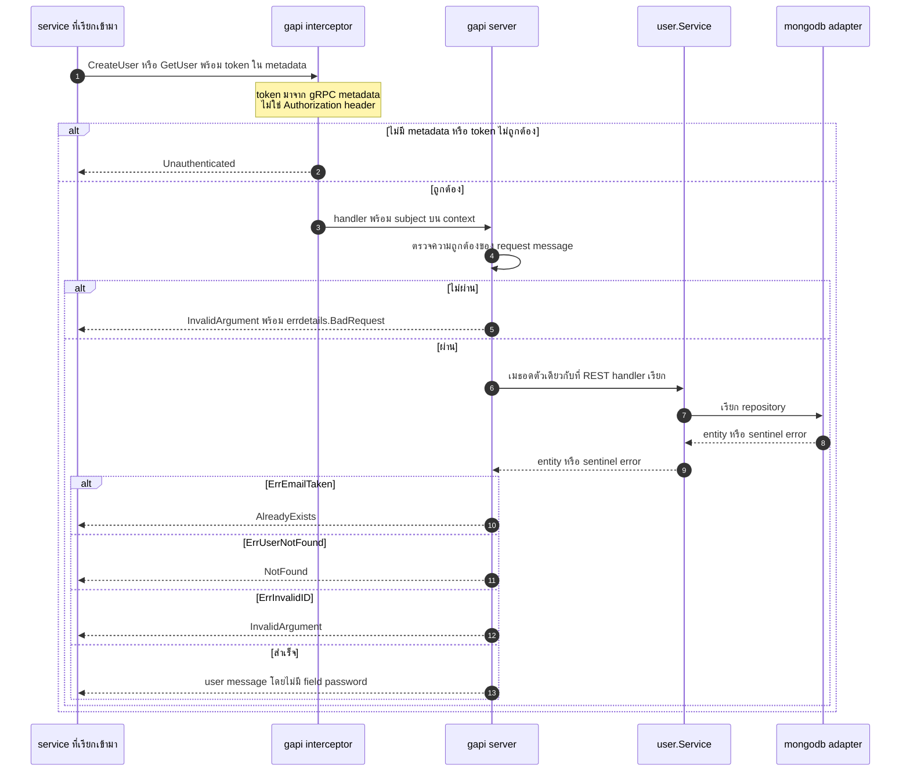

# User — UML Sequence Diagram

*English: [user.md](user.md) · สารบัญ: [README.th.md](README.th.md)*

domain แรก และเป็นแม่แบบที่ domain อื่นลอกตามทั้งหมด มี driving adapter สองตัว —
REST และ gRPC — ครอบ service ตัวเดียว โดยไม่มีการแตก if ข้างใน service เลย

| Flow | Endpoint |
|---|---|
| [สมัครสมาชิก](#สมัครสมาชิก) | `POST /api/v1/auth/register` |
| [เข้าสู่ระบบ](#เข้าสู่ระบบ) | `POST /api/v1/auth/login` |
| [ตรวจ Bearer token](#ตรวจ-bearer-token-ทุกเส้นที่ต้องล็อกอิน) | ทุกเส้นที่ต้องล็อกอิน |
| [รายการผู้ใช้](#รายการผู้ใช้) | `GET /api/v1/users` |
| [ดูผู้ใช้รายเดียว](#ดูผู้ใช้รายเดียว) | `GET /api/v1/users/{id}` |
| [สร้างผู้ใช้](#สร้างผู้ใช้) | `POST /api/v1/users` |
| [แก้ไข](#แก้ไข-patch-ไม่ใช่-put) | `PATCH /api/v1/users/{id}` |
| [ลบ](#ลบ) | `DELETE /api/v1/users/{id}` |
| [gRPC](#grpc-createuser-และ-getuser) | `user.v1.UserService/*` |

---

## สมัครสมาชิก

จุดที่น่าสนใจคือกิ่งที่ fail — ความไม่ซ้ำของอีเมลถูกบังคับด้วย **unique index ใน MongoDB**
ไม่ใช่การ query ระดับ application ว่า "อีเมลนี้มีแล้วหรือยัง" ก่อน insert เพราะการเช็คแบบนั้น race
ถ้าสมัครพร้อมกันสองคน ทั้งคู่จะผ่านการเช็คและ insert ทั้งคู่

## เข้าสู่ระบบ

อีเมลที่ไม่มีในระบบ กับ รหัสผ่านผิด เดินคนละเส้นทางข้างใน แต่คืน 401 ที่ **เหมือนกันเป๊ะ**
เพื่อไม่ให้ใช้หน้า login ไล่เดาว่าอีเมลไหนสมัครไว้แล้ว ส่วนการเทียบ bcrypt ช้าโดยตั้งใจ
และเป็นเหตุผลที่ endpoint login วัดได้ 63 req/s เทียบกับแคตตาล็อกที่ 13,818 req/s

## ตรวจ Bearer token (ทุกเส้นที่ต้องล็อกอิน)

การ verify จะ **ล็อก algorithm ก่อน** ที่จะเชื่อ claim ใด ๆ ถ้าไม่ทำ token ที่ประกาศว่า `none`
จะผ่านโดยไม่มีลายเซ็นเลย และ token ที่ประกาศ `RS256` สามารถถูกเซ็นด้วย public key
ในฐานะ HMAC secret ได้

## รายการผู้ใช้

## ดูผู้ใช้รายเดียว

ID ที่ **ผิดรูปแบบ** ได้ 400 ส่วน ID ที่รูปแบบถูกแต่ไม่มีของ ได้ 404
มันคนละความผิดพลาด และการยุบรวมกันทำให้ caller เสียข้อมูลที่ต้องใช้ตัดสินใจ

## สร้างผู้ใช้

เขียนลง database เหมือนการสมัครทุกอย่าง ต่างกันที่สิทธิ์: เส้นนี้ต้องมี token
"สมัครให้ฉัน" กับ "เพิ่มผู้ใช้เข้าระบบ" เป็นคนละ operation ถึงจะได้ row หน้าตาเดียวกัน

## แก้ไข (PATCH ไม่ใช่ PUT)

โจทย์บอกให้แก้ชื่อ **หรือ** อีเมล แปลว่า field ที่ไม่ส่งมาต้องไม่ถูกแตะ
struct ที่เป็น string ธรรมดาแสดงออกไม่ได้ เพราะ "ไม่ส่งมา" กับ "ส่งมาเป็นค่าว่าง"
หน้าตาเหมือนกัน จึงใช้ `*string`: `nil` = ไม่ได้ส่ง, `""` = ตั้งใจให้เป็นค่าว่าง

## ลบ

## gRPC: CreateUser และ GetUser

adapter สองตัวครอบ service ตัวเดียวคือหัวใจของ hexagon: `gapi` และ `handler`
เรียก `user.Service` ตัวเดียวกันเป๊ะ และ service ไม่รู้จักทั้ง HTTP status code
และ gRPC code — **adapter แต่ละตัวเป็นเจ้าของการแปลง error ของตัวเอง**

gRPC มีแค่สองเส้นนี้โดยตั้งใจ `ListUsers` และ `Login` เป็น anti-pattern ตรงนี้
เพราะ service ต้องไม่ยืนยันตัวตน *ในฐานะ* ผู้ใช้ แต่ต้องส่งต่อ token ของผู้ใช้ไป

