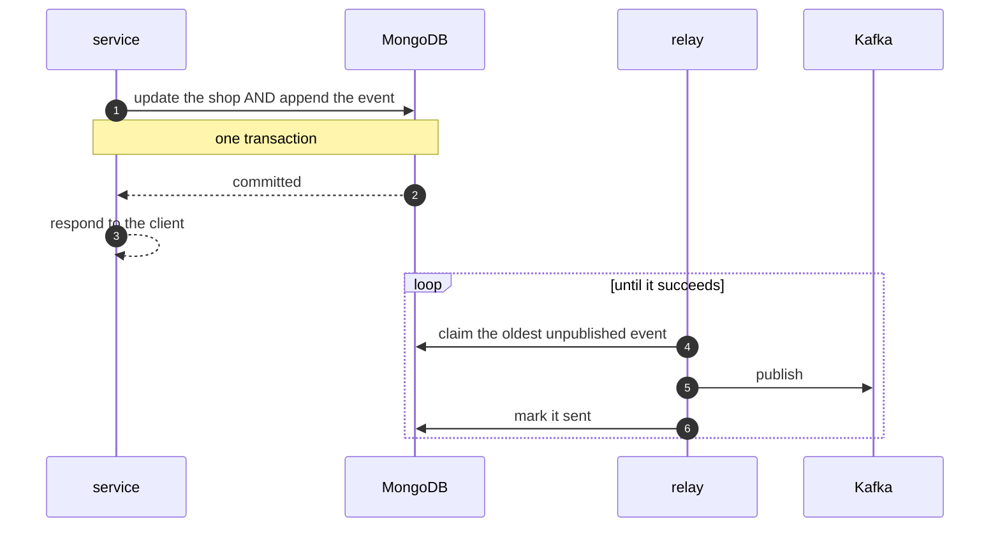

# The transactional outbox

*Drawn: [the outbox and its relay](sequence-diagrams/cross-cutting.md#-the-outbox-and-its-relay), and [a trace that survives it](sequence-diagrams/cross-cutting.md#-a-trace-that-survives-the-outbox).*

*[อ่านฉบับภาษาไทย](transactional-outbox.th.md)*

Why this codebase never publishes an event from a request path, and what it cost
to arrange that.

## The problem

Here is the code every one of these services used to contain. It looks fine.

```go
updated, err := s.repo.Update(ctx, id, upd)     // 1. write to the database
if err != nil {
    return err
}
s.events.Publish(ctx, topic, id, event)         // 2. publish to Kafka
```

**Those two lines are not one unit.** Line 1 can succeed and line 2 fail —
the broker is down, the network drops, the process is killed in between — and
the result is:

> The shop has been renamed in the database, and nobody was told.

The Product service goes on showing the old name for ever. So does Marketplace,
so does Live Commerce. **Nothing will ever repair it**, because nothing knows
anything was lost.

```mermaid
sequenceDiagram
    autonumber
    participant Svc as service
    participant DB as MongoDB
    participant K as Kafka
    participant C as consumers

    Svc->>DB: update the shop
    DB-->>Svc: committed
    Svc--xK: publish (broker unreachable)
    Note over Svc,C: the change is real and permanent;<br/>the fact of it is gone
    C-->>C: still showing the old name, for ever
```

## Why returning an error does not help

This is the part people expect to solve it, and it does not.

**The write has already committed.** Reporting a failure means the client
believes nothing happened, retries, and either renames again or hits a
conflict — while the change it was told failed is sitting in the database. You
have described a success as a failure, and the event is still lost.

There is no error handling that fixes this, because the problem is not the
error. The problem is that two systems were changed and only one of them is
allowed to fail.

## The fix

Write the event into **the same database, in the same transaction** as the
change that produced it.

```go
event, err := s.event(sellerv1.EventSellerUpdated, apply(current, upd))
if err != nil {
    return Seller{}, err
}
return s.repo.Update(ctx, id, upd, []OutboxEvent{event})
//                                  └── travels with the write
```

Inside the adapter:

```go
out, err := r.inTransaction(ctx, func(sc context.Context) (any, error) {
    if _, err := r.coll.FindOneAndUpdate(sc, …).Decode(&doc); err != nil {
        return nil, err
    }
    if err := outbox.Append(sc, r.outbox, toOutboxEvents(events)); err != nil {
        return nil, err
    }
    return doc.toDomain(), nil
})
```

Both rows commit or neither does. There is no longer a state where the shop
changed and the event vanished, because they are two rows in one database and a
transaction genuinely covers that. *(This is what the single-node replica sets
are for: standalone MongoDB has no transactions.)*

A **relay** then does the publishing, in the background, out of the request path:



## But does that not just move the problem to the relay?

No, and this is the whole point.

**A relay failure delays delivery. It does not lose anything.**

| What happens | Result |
|---|---|
| The relay crashes | The row is still in the database; the next run claims it |
| Kafka is down for three hours | Events queue in MongoDB and drain when it returns |
| Published, then died before marking | It is sent again after the lease expires |

The last row is the price: **at-least-once instead of at-most-once**. A consumer
may see the same event twice.

That is not a new burden. Kafka already guarantees at-least-once, so every
consumer here had to be idempotent regardless — which is why
`ApplySellerEvent` upserts, and why `RecordSale` refuses to count an order ID
more than once.

## The comparison

| | Publish directly | Outbox |
|---|---|---|
| Broker unavailable | **Event lost for ever** | Queued, delivered later |
| Process dies mid-way | **Event lost for ever** | Retried |
| Duplicate delivery | No | Possible — consumers must be idempotent |
| Request path touches Kafka | Yes; it waits | **No** |
| Extra moving part | None | A relay to run and watch |

The fourth row is a side effect worth naming: **checkout no longer depends on
Kafka at all**. A broker outage slows nothing and fails nothing.

## What it looks like in the code

The clearest evidence is what disappeared from the constructor:

```go
// NewService wires the domain to its adapters.
//
// There is no publisher here any more. Events are handed to the repository with
// the write and committed alongside it; publishing is the relay's job, and this
// package no longer has a way to lose an event by succeeding at one and failing
// at the other.
func NewService(repo Repository, log *slog.Logger) Service
```

**The service cannot lose an event, because it no longer has the tool to do it.**
That is the part worth taking away — not that a bug was fixed, but that the bug
became impossible to write.

One test went with it. `TestUpdateSucceedsWhenPublishingFails` asserted the best
behaviour available when a service published directly: swallow the error,
because it has nowhere useful to go. With the outbox the question does not
arise, so it was replaced by
`TestTheEventIsWrittenWithTheChangeRatherThanPublished`, which asserts what now
holds instead.

Verified end to end by `TestTheOutboxRelayPublishesAndMarksSent`: place an
order, subscribe a real consumer, run the relay, assert the event arrives and
the row is marked so it is not published for ever.

## What it costs

Stated plainly, because a pattern with no cost is a pattern being oversold.

- **A relay per service to run and watch.** It lives in the same process here,
  because it is coupled to one database and a separate binary would be one more
  thing to notice had stopped. `outbox.PendingCount` is the number to alert on:
  a stopped relay looks exactly like an idle one until it climbs.
- **Duplicate delivery.** Every consumer must be idempotent.
- **Ordering is per key, not global.** The relay claims oldest-first, but two
  relay instances can publish concurrently. Events about one entity share a key
  and therefore a partition, which is the ordering that matters; a global order
  across entities was never promised.
- **A little latency.** Publication happens on the next relay tick rather than
  inline. Under a second here, and it buys the request path not waiting on a
  broker.
- **Rows to expire.** Published events are kept briefly for debugging and then
  removed by a TTL index. An outbox that grows for ever is a table nobody reads
  and everybody backs up.

## When not to bother

If losing the event is acceptable, do not pay for this.

`internal/live` publishes to Redis pub/sub directly, with no outbox, on purpose:
a purchase notification from thirty seconds ago is worth nothing, so a delivery
guarantee would be machinery in service of an event that should be dropped
anyway. The rule is not "always use an outbox" — it is **match the guarantee to
what the event is worth**.

## Where it is used here

| Service | Publishes | Outbox |
|---|---|---|
| seller | `seller.events` | yes |
| product | `product.events` | yes |
| order | `order.events` | yes |
| live | Redis pub/sub | no, deliberately |

`internal/outbox` is generic: an `Event`, an `Append` that must be called inside
a transaction, and a `Relay` that takes any collection and any publisher.
