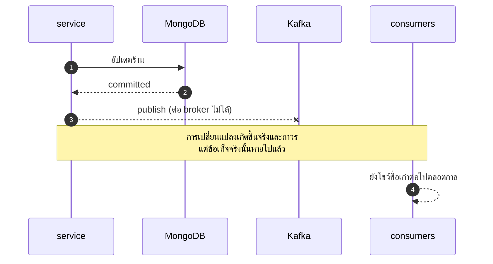
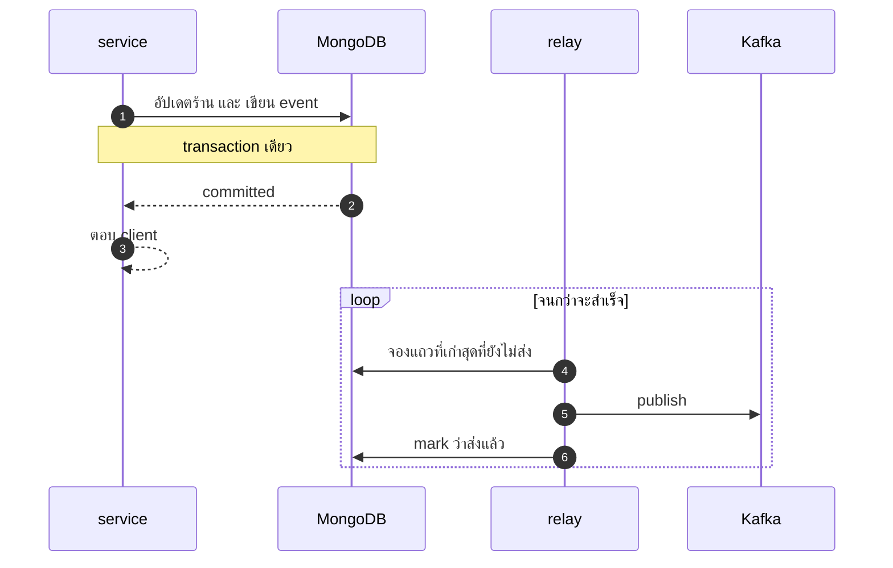

# Transactional outbox

*[Read this in English](transactional-outbox.md)*

ทำไมไม่มี service ไหนในโปรเจคนี้ publish event จาก request path เลย และการทำแบบนั้นแลกมาด้วยอะไร

## ปัญหา

โค้ดข้างล่างคือสิ่งที่ทุก service ในนี้เคยเขียนไว้ มันดูไม่มีอะไรผิด

```go
updated, err := s.repo.Update(ctx, id, upd)     // 1. เขียน database
if err != nil {
    return err
}
s.events.Publish(ctx, topic, id, event)         // 2. ส่ง Kafka
```

**สองบรรทัดนี้ไม่ใช่หน่วยเดียวกัน** บรรทัด 1 สำเร็จแล้วบรรทัด 2 พังได้ — broker ล่ม,
network ขาด, หรือ process โดนฆ่าตรงกลางพอดี — แล้วผลคือ:

> ร้านเปลี่ยนชื่อไปแล้วในฐานข้อมูล แต่ไม่มีใครรู้เลย

Product จะโชว์ชื่อเก่าไปตลอดกาล Marketplace ก็เหมือนกัน Live Commerce ก็เหมือนกัน
และ **ไม่มีอะไรจะมาซ่อมให้** เพราะไม่มีใครรู้ว่ามีอะไรหายไป



## ทำไม return error ถึงไม่ช่วย

นี่คือจุดที่คนส่วนใหญ่คิดว่าแก้ได้ แต่มันแก้ไม่ได้จริง

**write มัน commit ไปเรียบร้อยแล้ว** ถ้ารายงานกลับไปว่าล้มเหลว client จะเชื่อว่าไม่มีอะไรเกิดขึ้น
แล้วลองใหม่ — ซึ่งจะกลายเป็นเปลี่ยนชื่อซ้ำ หรือไม่ก็ชน conflict — ทั้งที่การเปลี่ยนแปลงที่บอกว่า
"ล้มเหลว" นั่นนอนอยู่ในฐานข้อมูลเรียบร้อยแล้ว คุณกำลังบอกว่าความสำเร็จคือความล้มเหลว
และ event ก็ยังหายอยู่ดี

ไม่มีวิธี handle error แบบไหนที่แก้เรื่องนี้ได้ เพราะปัญหาไม่ได้อยู่ที่ error
ปัญหาคือ**มีสองระบบถูกเปลี่ยน แต่มีระบบเดียวเท่านั้นที่ได้รับอนุญาตให้ล้มเหลว**

## วิธีแก้

เขียน event ลง **ฐานข้อมูลเดียวกัน ใน transaction เดียวกัน** กับการเปลี่ยนแปลงที่ทำให้เกิด event นั้น

```go
event, err := s.event(sellerv1.EventSellerUpdated, apply(current, upd))
if err != nil {
    return Seller{}, err
}
return s.repo.Update(ctx, id, upd, []OutboxEvent{event})
//                                  └── เดินทางไปพร้อมกับ write
```

ข้างใน adapter:

```go
out, err := r.inTransaction(ctx, func(sc context.Context) (any, error) {
    if _, err := r.coll.FindOneAndUpdate(sc, …).Decode(&doc); err != nil {
        return nil, err
    }
    if err := outbox.Append(sc, r.outbox, toOutboxEvents(events)); err != nil {
        return nil, err
    }
    return doc.toDomain(), nil
})
```

ทั้งสองแถว commit พร้อมกัน หรือไม่ commit เลยทั้งคู่ ไม่มีสถานะที่ร้านเปลี่ยนแล้วแต่ event หายอีกต่อไป
เพราะมันคือสองแถวในฐานข้อมูลเดียวกัน ซึ่ง transaction ครอบได้จริง
*(นี่คือเหตุผลที่ทุก instance ต้องเป็น single-node replica set — MongoDB แบบ standalone ไม่มี transaction)*

จากนั้น **relay** เป็นคนส่งออก ทำงานเบื้องหลัง อยู่นอก request path:



## แล้วไม่ใช่แค่ย้ายปัญหาไปที่ relay เหรอ

ไม่ใช่ และนี่คือหัวใจของทั้งเรื่อง

**relay ล้มเหลว = ส่งช้าลง ไม่ใช่ข้อมูลหาย**

| เกิดอะไรขึ้น | ผลลัพธ์ |
|---|---|
| relay crash | แถวยังอยู่ในฐานข้อมูล รอบหน้าหยิบไปส่ง |
| Kafka ล่ม 3 ชั่วโมง | event กองอยู่ใน MongoDB แล้วไหลออกไปเองตอน Kafka กลับมา |
| publish สำเร็จแต่ตายก่อน mark | ส่งซ้ำอีกครั้งหลัง lease หมดอายุ |

แถวสุดท้ายคือราคาที่ต้องจ่าย: **at-least-once แทนที่จะเป็น at-most-once**
consumer อาจเห็น event เดิมสองครั้ง

แต่นี่ไม่ใช่ภาระใหม่ Kafka รับประกัน at-least-once อยู่แล้ว consumer ทุกตัวในระบบนี้จึง
ต้อง idempotent ตั้งแต่แรก — ซึ่งเป็นเหตุผลที่ `ApplySellerEvent` ใช้ upsert
และ `RecordSale` ปฏิเสธการนับ order ID เดิมซ้ำ

## เปรียบเทียบ

| | publish ตรง ๆ | outbox |
|---|---|---|
| broker ใช้ไม่ได้ | **event หายถาวร** | ค้างไว้ ส่งทีหลัง |
| process ตายกลางทาง | **event หายถาวร** | ส่งใหม่ |
| ส่งซ้ำ | ไม่มี | มีได้ — consumer ต้อง idempotent |
| request path แตะ Kafka | ใช่ และต้องรอ | **ไม่แตะเลย** |
| ของที่ต้องดูแลเพิ่ม | ไม่มี | relay ที่ต้องรันและเฝ้า |

แถวที่สี่เป็นผลพลอยได้ที่ควรพูดถึง: **ตอนนี้ checkout ไม่ได้ขึ้นกับ Kafka เลย**
broker ล่มก็ไม่ทำให้อะไรช้าหรือพัง

## หน้าตาในโค้ดจริง

หลักฐานที่ชัดที่สุดคือสิ่งที่ **หายไป** จาก constructor:

```go
// NewService wires the domain to its adapters.
//
// There is no publisher here any more. Events are handed to the repository with
// the write and committed alongside it; publishing is the relay's job, and this
// package no longer has a way to lose an event by succeeding at one and failing
// at the other.
func NewService(repo Repository, log *slog.Logger) Service
```

**service ทำ event หายไม่ได้อีกแล้ว เพราะมันไม่มีเครื่องมือที่จะทำแบบนั้น**
นี่คือสิ่งที่ควรจดจำจากเรื่องนี้ — ไม่ใช่แค่ว่าบั๊กถูกแก้ แต่บั๊กนั้น **เขียนออกมาไม่ได้อีกต่อไป**

มีเทสต์หนึ่งที่หายไปพร้อมกัน `TestUpdateSucceedsWhenPublishingFails` เคยยืนยันพฤติกรรมที่ดีที่สุด
เท่าที่ทำได้ตอนที่ service publish ตรง ๆ คือกลืน error ไว้ เพราะมันไม่มีที่ให้ส่งกลับ
พอมี outbox แล้วคำถามนี้ไม่เกิดขึ้นอีก จึงเปลี่ยนเป็น
`TestTheEventIsWrittenWithTheChangeRatherThanPublished` ที่ยืนยันคุณสมบัติใหม่แทน

ยืนยันครบวงจรด้วย `TestTheOutboxRelayPublishesAndMarksSent` — สั่งซื้อ, subscribe consumer จริง,
รัน relay, แล้ว assert ว่า event มาถึงและแถวถูก mark ว่าส่งแล้วเพื่อไม่ให้ส่งซ้ำตลอดกาล

## ต้นทุนที่ต้องจ่าย

พูดตรง ๆ เพราะ pattern ที่ไม่มีต้นทุนคือ pattern ที่กำลังถูกขายเกินจริง

- **ต้องมี relay ต่อ service ที่ต้องรันและเฝ้า** ในโปรเจคนี้อยู่ใน process เดียวกัน เพราะมันผูกกับ
  ฐานข้อมูลตัวเดียว และแยกเป็น binary ต่างหากก็จะเป็นอีกหนึ่งอย่างที่ต้องคอยสังเกตว่าหยุดไปหรือยัง
  ตัวเลขที่ควรตั้ง alert คือ `outbox.PendingCount` — **relay ที่หยุดไปแล้วหน้าตาเหมือน relay ที่ว่างอยู่เป๊ะ ๆ
  จนกว่าตัวเลขนี้จะไต่ขึ้น**
- **ส่งซ้ำได้** consumer ทุกตัวต้อง idempotent
- **ลำดับเป็นราย key ไม่ใช่ทั้งระบบ** relay หยิบเก่าสุดก่อน แต่ relay สองตัวส่งพร้อมกันได้
  event ของ entity เดียวกันใช้ key เดียวกันจึงอยู่ partition เดียวกัน ซึ่งเป็นลำดับที่มีความหมายจริง
  ส่วนลำดับข้าม entity ไม่เคยรับปากไว้ตั้งแต่แรก
- **latency เพิ่มนิดหน่อย** event ออกตอน relay tick รอบถัดไปแทนที่จะออกทันที ในนี้ต่ำกว่าหนึ่งวินาที
  และแลกมากับการที่ request path ไม่ต้องรอ broker
- **แถวที่ต้องหมดอายุ** event ที่ส่งแล้วเก็บไว้สั้น ๆ เผื่อ debug แล้วให้ TTL index ลบทิ้ง
  outbox ที่โตไปเรื่อย ๆ คือตารางที่ไม่มีใครอ่านแต่ทุกคนต้อง backup

## เมื่อไหร่ที่ไม่ต้องใช้

ถ้า event หายแล้วไม่เป็นไร ก็ไม่ต้องจ่ายค่านี้

`internal/live` publish เข้า Redis pub/sub ตรง ๆ ไม่มี outbox **โดยตั้งใจ** — การแจ้งเตือนว่ามีคนซื้อ
เมื่อ 30 วินาทีที่แล้วไม่มีค่าอะไรเลย การรับประกันการส่งจึงเป็นเครื่องจักรที่สร้างมาเพื่อ event
ที่ควรถูกทิ้งอยู่แล้ว กฎไม่ใช่ "ใช้ outbox เสมอ" แต่เป็น **จับคู่การรับประกันให้ตรงกับมูลค่าของ event นั้น**

## ใช้ที่ไหนบ้างในโปรเจคนี้

| Service | ส่งอะไร | outbox |
|---|---|---|
| seller | `seller.events` | ใช้ |
| product | `product.events` | ใช้ |
| order | `order.events` | ใช้ |
| live | Redis pub/sub | ไม่ใช้ โดยตั้งใจ |

`internal/outbox` เป็น generic: มี `Event`, `Append` ที่ต้องเรียกจากใน transaction เท่านั้น
และ `Relay` ที่รับ collection ไหนกับ publisher ตัวไหนก็ได้
