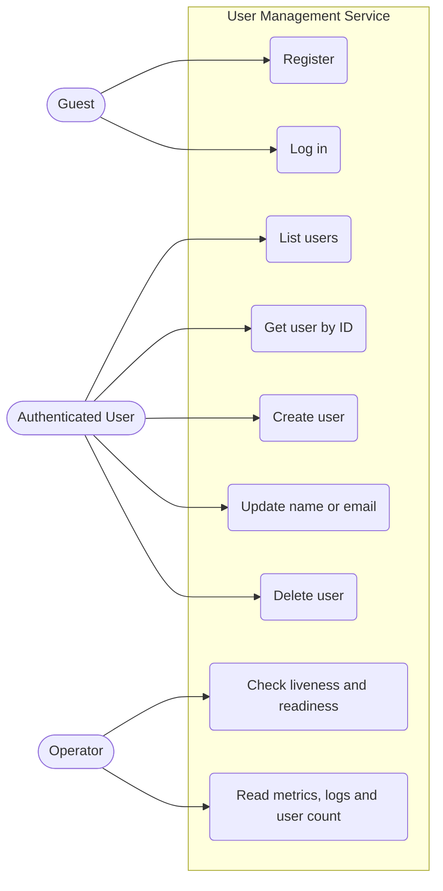
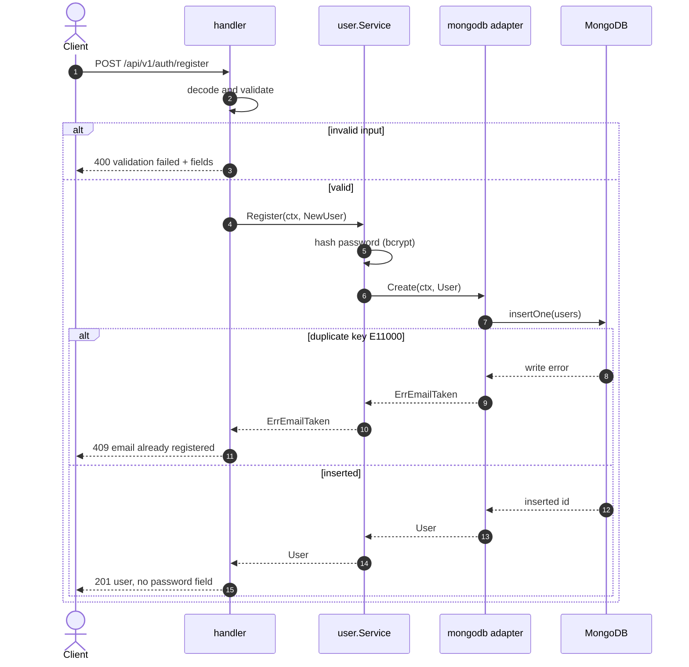
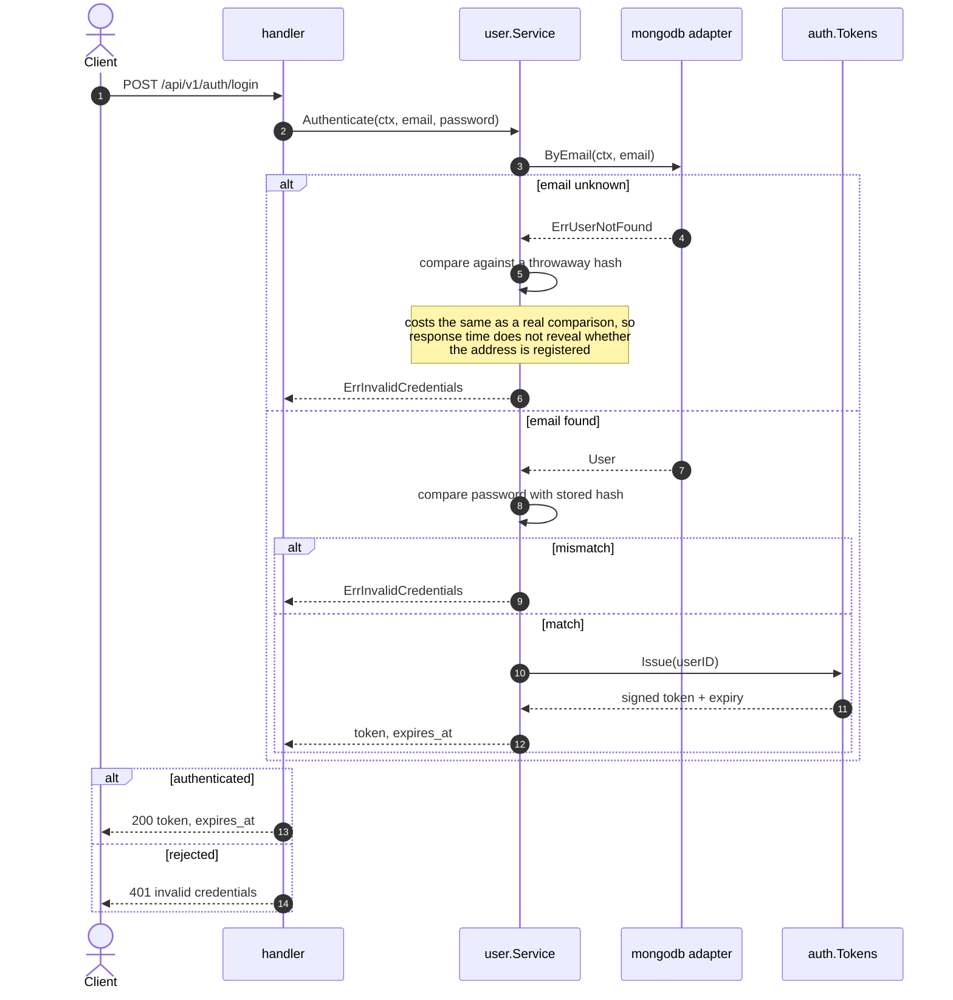
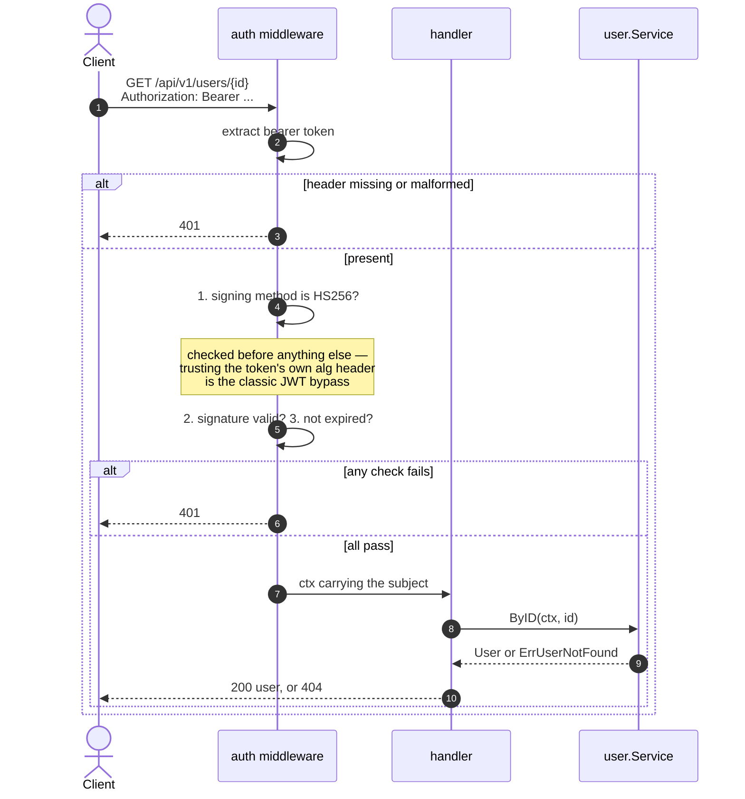
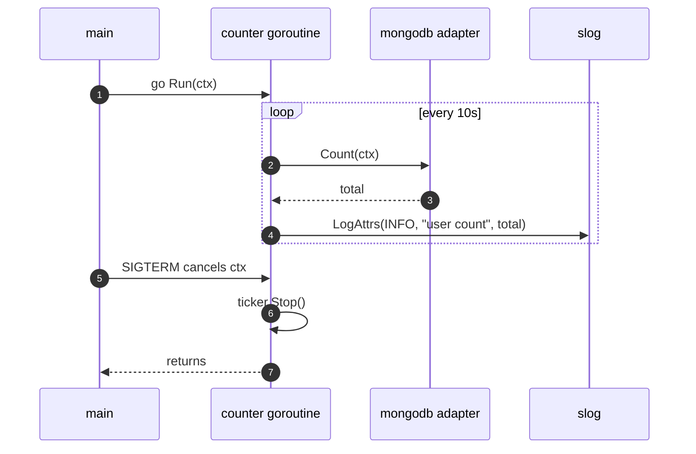

# User domain — design

Design artefacts for the User domain, written before the code so the
implementation follows them rather than the other way round. Requirements come
from [README-2.md](../README-2.md).

If an implementation and a diagram here disagree, one of them is wrong — fix the
disagreement, do not quietly build something else.

## Contents

1. [Entity](#entity)
2. [Actors and use cases](#actors-and-use-cases)
3. [User stories](#user-stories)
4. [Sequence diagrams](#sequence-diagrams)
5. [Design decisions](#design-decisions)
6. [Resulting package shape](#resulting-package-shape)
7. [Open question](#open-question)

## Entity

| Field | Type | Notes |
|---|---|---|
| `ID` | string (ObjectID) | generated by MongoDB |
| `Name` | string | required, non-blank |
| `Email` | string | required, **unique**, stored lowercased |
| `PasswordHash` | string | bcrypt; never leaves the process |
| `CreatedAt` | time.Time | set on insert, never updated |

Email is stored lowercased so that `A@b.com` and `a@b.com` cannot both register.
The unique index is on the stored, normalised value — normalising on read would
not prevent the duplicate.

`PasswordHash` is the field name rather than `Password`, so that any code
reaching for a plaintext password fails to compile instead of leaking one.

## Actors and use cases



The Operator is a real actor here, not decoration: the brief's logging middleware
and ten-second user-count goroutine exist to serve someone watching the system,
and naming that actor is what makes those two requirements make sense.

## User stories

**US-1 — Register.** As a guest, I want to create an account with my name, email
and password, so that I can use the service.

- Given a valid name, email and password, a new user is created and returned
  without any password field, with status 201.
- Given an email that already exists, the request fails with 409 and no second
  user is created, **even if two such requests arrive at the same instant**.
- Given a blank name or a malformed email, the request fails with 400 and names
  the offending fields.

**US-2 — Log in.** As a registered user, I want to exchange my email and password
for a token, so that I can call protected endpoints.

- Given correct credentials, a signed HS256 token and its expiry are returned.
- Given a wrong password *or* an unknown email, the response is an identical 401,
  so the endpoint cannot be used to discover which emails are registered.

**US-3 — Read a user.** As an authenticated user, I want to fetch a user by ID,
so that I can display their profile.

- A well-formed ID that exists returns 200 with the user, and no password field.
- A well-formed ID that does not exist returns 404.
- A malformed ID returns 400 — a different failure from "not found", and worth
  distinguishing.

**US-4 — List users.** As an authenticated user, I want a page of users, so that
I can browse them without pulling the whole collection.

- Returns users plus the total count, honouring `limit` and `offset`.
- Bounded by a maximum page size so a single request cannot ask for everything.

**US-5 — Update.** As an authenticated user, I want to change a name or an email,
so that I can correct my details.

- Sending only `name` leaves the email untouched, and vice versa.
- Changing to an email another user holds fails with 409.

**US-6 — Delete.** As an authenticated user, I want to delete an account, so that
the data is removed.

- Returns 204. Deleting the same user again returns 404.

**US-7 — Observe traffic.** As an operator, I want every request logged with
method, path, status and duration, so that I can diagnose a problem after it
happened. *(Implemented — `internal/middleware`.)*

**US-8 — Watch growth.** As an operator, I want the total user count logged every
ten seconds, so that I can see the collection changing without querying it.

- The goroutine stops when the service shuts down, and does not delay shutdown.

**US-9 — Health.** As an operator, I want liveness and readiness separately, so
that a database blip removes an instance from the load balancer instead of
restarting it. *(Implemented — see [tech-stack.md](tech-stack.md).)*

## Sequence diagrams

### Registration

The interesting part is what is **absent**: there is no "does this email exist?"
query before the insert. Two concurrent registrations would both pass such a
check and both proceed. The unique index is the only thing that actually holds,
so the design leans on it and translates its error.



### Login



### Authenticated request



### Background user count



A `time.Ticker` rather than `time.Sleep`, so a slow count does not drift the
schedule, and a `select` on `ctx.Done()` so shutdown is immediate rather than
waiting out the remaining seconds.

## Design decisions

**No pre-check before insert.** Covered above: the unique index is the only
race-free guard, so the code goes straight to the insert and maps `E11000`.

**Email is normalised to lowercase on write.** Normalising only on read leaves
duplicates already in the database.

**Identical 401 for unknown email and wrong password**, backed by a constant-cost
comparison on the unknown-email path. Either alone leaks the answer — the
message through the body, or the timing through the clock.

**PATCH with pointer fields.** `Update{Name, Email *string}`: nil means "leave
alone", which is what "update a user's name *or* email" requires. A struct of
plain strings cannot distinguish "not supplied" from "set to empty".

**The service depends on interfaces for hashing and tokens**, not on bcrypt and a
JWT library directly. That keeps `internal/user` free of infrastructure, and it
means the service test suite runs with three hand-written fakes and no bcrypt
cost per test case.

**Pagination on list**, with a maximum page size. The brief says "list all
users"; an unbounded list endpoint is a denial-of-service waiting for the
collection to grow, so `limit`/`offset` are added with a documented default.

## Resulting package shape

Design only — signatures, not implementations.

```go
// internal/user/user.go
type User struct {
    ID           string
    Name         string
    Email        string
    PasswordHash string
    CreatedAt    time.Time
}

var (
    ErrUserNotFound       = errors.New("user not found")
    ErrEmailTaken         = errors.New("email already registered")
    ErrInvalidCredentials = errors.New("invalid credentials")
)

// internal/user/repository.go — the port, declared by the consumer.
type Repository interface {
    Create(ctx context.Context, u User) (User, error)
    ByID(ctx context.Context, id string) (User, error)
    ByEmail(ctx context.Context, email string) (User, error)
    List(ctx context.Context, limit, offset int) (users []User, total int, err error)
    Update(ctx context.Context, id string, upd Update) (User, error)
    Delete(ctx context.Context, id string) error
    Count(ctx context.Context) (int64, error)
}

// Update carries only the fields the caller supplied; nil means "leave alone".
type Update struct {
    Name  *string
    Email *string
}

// internal/user/service.go
//
// Hasher and TokenIssuer are declared here and implemented in internal/auth, so
// this package imports neither bcrypt nor a JWT library.
type Hasher interface {
    Hash(plain string) (string, error)
    Compare(hash, plain string) error
}

type TokenIssuer interface {
    Issue(subject string) (token string, expiresAt time.Time, err error)
}

func NewService(repo Repository, hasher Hasher, tokens TokenIssuer) *Service
```

Everything the service needs arrives through those three interfaces, which is
what makes `service_test.go` a pure unit test.

## Open question

**Authorization has no model to stand on.** The brief's user entity has no role
field, yet it asks for list, update and delete as authenticated operations. Two
readings, and the choice changes observable behaviour:

| | Behaviour | Argument |
|---|---|---|
| **A. Flat** | Any authenticated user may act on any user | Matches the brief literally; a reviewer testing `DELETE /users/{someone-else}` gets 204 as they may expect |
| **B. Self-only mutations** | Read and list open to any authenticated user; update and delete restricted to the token's own subject | Needs no new field — compare the `sub` claim to `{id}` — and is the behaviour expected of someone who thinks about authorization |

**Recommendation: B**, with the limitation documented in the README — "there is
no role model, so there is no administrator; a user may only modify themselves".
It costs one comparison and turns an obvious security hole into a stated,
deliberate boundary.

The risk is that a reviewer reads a 403 as the delete requirement being
unimplemented. That is why whichever is chosen must be stated plainly in the
README rather than left to be discovered.

The sequence diagrams above put the authorization check in its own step so
either option drops into the same place. **Confirm this before the handlers are
written** — it is cheap now and touches every endpoint later.
